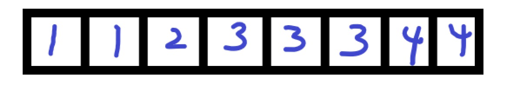

# Data Structures

**author：陈碧辉**

**time:2023-05-16**

## 1. 栈与队列

### 1.1 顺序栈的实现（Sequential Stack）

#### 1.1.1 **栈的定义**

 ```c
 #define MaxSize 1000
 
 typedef struct {
     int data[MaxSize];
     int top;
 }SqStack;
 ```

#### 1.1.2 **六个操作**

**初始化栈（InitStack）** 

```c
void InitStack(SqStack *&s)
{
    s = (SqStack *)malloc(sizeof(SqStack));
    s -> top = -1;
}
```

**销毁栈（DestoryStack）**

```c
void DestroyStack(SqStack *&s)
{
    free(s);
}
```

**判断空栈（StackEmpty）**

```c
int StackEmpty(SqStack *&s)
{
    return s -> top == -1;
}
```

**进栈（Push）**

```c
bool Push(SqStack *&s, int e)
{
    if (s -> top == MaxSize - 1) return false;
    ++ s -> top = e;
    return true;
}
```

**出栈（Pop）**

```c
bool Pop(SqStack *&s, int $e)
{
    if (s -> top == -1) return false;
    e = s -> data[s -> top --];
    return true;
}
```

**取栈顶元素（GetTop）**

```c
bool GetTop(SqStack *&s, int &e)
{
    if (s -> top == -1) return false;
    e = s -> data[s -> top];
    return true;
}
```


> **细节**：
>
> 1. 引用传参与输出参数：**引用栈（初始化栈，栈未初始化时指向随机的地址），引用元素（出栈，取栈顶元素）**
> 2. $malloc$函数的参数与返回值：参数是所需要的空间字节数，返回指向开辟的指针，指针类型为$void *$
> 3. $free$函数的参数表示什么意思：释放参数指向的空间内存
> 5. 是否一定需要SqStack指针？

### 1.2 栈的链式实现（Linked Stack）
#### 1.2.1 **链表结点的定义**
```c
typedef struct linkNode{
    int data;
    linkNode* next;
}LinkedSt;
```

#### 1.2.2 六个操作

**初始化栈**

链表头指针与等效的“头结点”（数据域空着不用，指针域当做头指针用）

```c
void InitStack(LinkedSt *& head)
{
    head = (LinkedSt *)malloc(sizeof(LinkedSt));
}
```

**销毁栈**

递归销毁栈

```c
void DestoryStack1(LinkedSt *& s)
{
    if (s-> next != NULL) DestoryStack1(s -> next);
    free(s);
}
```

双指针销毁栈

```c
void DestoryStack2(LinkedSt *& s)
{
    linkNode* pre = s, *p = s -> next;
    while (p != NULL)
    {
        free(pre);
        pre = p;
        p = p -> next;
    }
    free(pre);
}

```

**判断空栈**

```c
bool StackEmpty(LinkedSt *& head)
{
    if (head -> next == NULL) return true;
    return false;
}
```

**进栈**

```c
bool Push(LinkedSt *& head, int e)
{
    linkNode* node = (linkNode *)malloc(sizeof(linkNode));
    if (node == NULL) return false;  // 节点创建失败
    node -> data = e;
    node -> next = head -> next;
    head -> next = node;
    return true;
}
```

**出栈**

```c
bool Pop(LinkedSt *& head, int &e)
{
    if (head -> next == NULL) return false;
    e = head -> next -> data;
    linkNode* tmp = head -> next;
    head -> next = head -> next -> next;
    free(tmp);
    return true;
}
```

**取栈顶元素**

```c
bool GetTop(LinkedSt *& head, int &e)
{
    if (head -> next == NULL) return false;
    e = head -> next -> data;
    return true;
}
```

**体会与比较：**

教材中代码是将**头指针当做链栈本身**。这与**把头指针当做结构体栈的一个属性**出现，有什么区别？后者**封装性**体现的更好，它真正与顺序栈是同等地位。而头指针是与顺序栈中的两个属性同一地位。**头顶点的实现代码**更简洁。无需对头指针是否为空再做判断。

#### 1.3 课程作业

1. 运行课堂上的程序，《实验教材》第三章实验题1（p.59-61）；用这个顺序栈检查一个字符串中的括号是否配对。例如"a*(b*(c+d)-e)"中的括号是配对的；"a*(b*(c+d)-e"中的括号不是配对的；"(a*)b*(c+d)-e)"中的括号不是配对的。

**answer：**

```c
bool check(const char* str)
{
    LinkedSt* head;
    InitStack(head);
    int tmp;
    while (*str != '\0')
    {
        // 用0表示“（”
        if (*str == '(') Push(head, 0);
        else if (* str == ')')
        {
            // 如果没有 ）则无法配对
            if (head -> next == NULL) return false;
            else Pop(head, tmp);
        }
        str ++;
    }
    // 如果多出了（，则无法配对
    if (head -> next != NULL) return false;
    return true;
}
```

2.阅读程序：《实验教材》第三章实验题7（p.76-78），栈元素排序问题。

### 1.3 顺序队列的实现（Sequential Queue）

#### 1.3.1 顺序队列的定义

```c
typedef struct{
    int data[MaxSize];
    int front, rear;
}SqQueue;
```

#### 1.3.2 五个操作

**初始化队列（InitQueue）**

```c
void InitQueue(SqQueue *& q)
{
    q = (SqQueue *)malloc(sizeof(SqQueue));
    q -> front = q -> rear = -1;  // 两者相同表示队空
}
```

**销毁栈（DestoryQueue）**

```c
void DestoryQueue(SqQueue *& q)
{
    free(q);
}
```

**判断栈是否为空（QueueEmpty）**

```c
bool QueueEmpty(SqQueue *& q)
{
    return q -> front == q -> rear;
}
```

**进队（PushQueue）**

```c
bool PushQueue(SqQueue *& q, int e)
{
    if (q -> rear == MaxSize - 1) return false;
    q -> data[++ q -> rear] = e;
    return true;
}
```

**出栈（PopQueue）**

````c
bool PopQueue(SqQueue *& q, int &e)
{
    if (q -> rear == q -> front) return false;
    e = q -> data[++ q -> front];
    return true;
}
````

#### 1.3.3 循环队列空间优化

只需要改以下三个函数

**初始化队列**

```c
void InitQueue(SqQueue *& q)
{
    q = (SqQueue *)malloc(sizeof(SqQueue));
    q -> front = q -> rear = 0; 
}
```

**进队（PushQueue）**

```c
bool PushQueue(SqQueue *& q, int e)
{
    // 满队条件， 队尾在队头前一个位置
    if ((q -> rear + 1) % MaxSize == q -> front) return false;
    ++ q -> rear %= MaxSize;
    q -> data[q -> rear] = e;
    return true;
}
```

**出栈（PopQueue）**

````c
bool PopQueue(SqQueue *& q, int &e)
{
    if (q -> rear == q -> front) return false;
    ++ q -> front %= MaxSize;
    e = q -> data[q -> front];
    return true;
}
````

### 1.4 链式队列实现

#### 1.4.1 链式队列的定义

```c
typedef struct Node
{
    int data;
    Node* next;
}DataNode;

typedef struct
{
    DataNode *front;
    DataNode *rear;
}LinkedQueue;
```

#### 1.4.2 五个操作

**初始化队列**

```c
void InitQueue(LinkedQueue *& q)
{
    q = (LinkedQueue *)malloc(sizeof(LinkedQueue));
    q -> front = q -> rear = NULL;
}
```

**销毁队列**

非递归销毁

```c
void DestoryQueue(LinkedQueue *& q)
{
    DataNode* pre = q -> front, *p;
    if (pre != NULL)
    {
        p = pre -> next;
        while (p != NULL)
        {
            free(pre);
            pre = p;
            p = pre -> next;
        }
        free(pre);
    }
    free(q);
}
```

递归销毁

```c
void DestoryNode(DataNode* node)
{
    if (node -> next != NULL) DestoryNode(node -> next);
    free(node);
}

void DestoryQueue(LinkedQueue *& q)
{
    DestoryNode(q -> front);
    free(q);
}
```

**判断是否为空队列**

```c
bool QueueEmpty(LinkedQueue *& q)
{
    return q -> rear == NULL;
}
```

**入队**

```c
bool PushQueue(LinkedQueue *& q, int e)
{
    DataNode* node = (DataNode *)malloc(sizeof(DataNode));
    if (node == NULL) return false;
    node -> data = e;
    node -> next = NULL;
    if (q -> rear == NULL)  // 空队
    {
        q -> front = q -> rear = node;
    }
    else
    {
        q -> rear -> next = node;
        q -> rear = node;
    }
    return true;
}
```

**出队**

```c
bool PopQueue(LinkedQueue *& q, int &e)
{
    if (q -> front == NULL) return false;
    e = q -> front -> data;
    if (q -> front == q -> rear) // 一个元素
    {
        free(q -> front);
        q -> front = q -> rear = NULL;
    }
    else
    {   
        DataNode* tmp = q -> front;
        q -> front = q -> front -> next;
        free(tmp);
    }
    return true;
}
```

### 1.5 栈与队列的应用

**表达式求值问题**

**dfs与bfs迷宫问题**

## 2. 线性表

### 2.1 顺序线性表的实现

#### 2.1.1 线性表的定义

顺序表的两个属性【数组data，顺序表目前元素个数length】

```c
typedef struct {
    int data[MaxSize];
    int length;
}SqList;
```

#### 2.1.2 线性表的操作

**建立线性表**

```c++
/**
 * Create SqList
 * @param L SqList
 * @param a array 
 * @param n array's length
 */
void CreateList(SqList *&L, int a[], int n)
{
    L = (SqList *)malloc(sizeof (SqList));
    for (int i = 0; i < n; i ++)
    {
        L -> data[i] = a[i];
    }
    L -> length = n;
}
```

**销毁线性表**

```c
void DestroyList(SqList *L)
{
    free(L);
}
```

**输出线性表**

```c
void DispList(SqList *L)
{
    for (int i = 0; i < L -> length; i ++)
    {
        printf("%d ", L -> data[i]);
    }
    printf("\n");
}
```

**查找某个数据元素**

```c
bool GetElem(SqList *& L, int i, int &e)
{
    if (i < 1 || i > L -> length) return false;
    e = L -> data[i - 1];
    return true;
}
```

**按照元素查找**

```c
int LocateElem(SqList *&L, int e)
{
    for (int i = 0; i < L -> length; i ++)
    {
        if (L -> data[i] == e) return i + 1;
    }
    return 0;
}
```

**插入元素**

```c
bool InsertList(SqList *&L, int i, int e)
{
    if (i < 1 || i > L -> length + 1 || L -> length == MaxSize) 
        return false;
    for (int j = L -> length - 1; j >= i; j --)
    {
        L -> data[j + 1] = L -> data[j];
    }
    L -> data[i] = e;
    L -> length ++;
    return true;
}
```

**删除元素**

```c
bool DeleteList(SqList *&L, int i, int &e)
{
    if (i < 1 || i > L -> length) return false;
    i --;
    e = L -> data[i];
    for (int j = i + 1; j < L -> length; j ++)
    {
        L -> data[j - 1] = L -> data[j];    
    }
    L -> length --;
    return true;
}
```

### 2.2 单链表

实现方式参考链栈

## 3. 查找

以下以顺序表为存储结构做相关的查找算法，顺序表属于静态表，使用下标访问。该顺序表中的元素类型声明如下。

```c
typedef struct {
    int key;   // 关键字
    int data;  // 数据
}RecType;   // 需要查找的元素
```

### 3.1 顺序查找 (Sequential Search)

适用条件：任意

思想：从头到尾匹配元素数组。

时间复杂度：$O(n)$

```c
/**
 * 线性查找
 * @param arr 查找数组 
 * @param n 数组长度
 * @param key 查找关键字
 * @return 
 */
int SeqSearch(RecType arr[], int n, int key) 
{
    for (int i = 0; i < n; i ++)
    {
        if (arr[i].key == key) return i + 1;
    }
    // 匹配不了返回 0
    return 0;
}
```

### 3.2 二分查找

适用条件：有序表

思想：根据序列所有的有序性，折半查找数组。

时间复杂度：$O(log_2^n)$

**基础二分：实现查找的数组中是否有该关键字**

```c
int BinSearch(RecType arr[], int n, int key)
{
    int l = 0, r = n - 1;  // 左边界，有边界
    while (l < r)
    {
        int mid = l + r >> 1;
        if (arr[mid].key == key) return l + 1;
        else if (arr[mid].key > key) l = mid + 1;
        else r = mid;
    }
    if (arr[l].key == key) return l + 1;
    return 0;
}
```

**提高二分：实现查找数组中该关键字的左右边界**



例如上图中关键字$3$的边界为$4$到$6$,关键字$4$的边界为$7$到$8$。

**查找左边界**

```c
int SearchLeft(RecType arr[], int n, int key)
{
    int l = 0, r = n - 1;
    while (l < r)
    {
        int mid = l + r >> 1;
        if (arr[mid].key >= key) r = mid;  //等于还需要查找左边界
        else l = mid + 1;
    }
    if (arr[l].key == key) return l + 1;
    // 未查找到
    return 0;
}
```

**查找有边界**

```c
int SearchRight(RecType arr[], int n, int key)
{
    int l = 0, r = n - 1;
    while (l < r)
    {
        int mid = l + r + 1 >> 1;  // 注意+1，防止死循环
        if (arr[mid].key <= key) l = mid;
        else r = mid - 1;
    }
    if (arr[l].key == key) return l + 1;
    return 0;
}
```

### 3.3 分块查找

适用条件：块内无序，各个块之间有序

基本思想：建立查找索引表，由于索引表是有序表，因此可以采用折半查找的方式查找，确定待找元素在那一块中，最后顺序遍历该块。

**索引表中节点**

```c
typedef struct {
    int key;
    int link;
}IdxType;
```

**建立索引表**

```c
void CreateIdx(IdxType I[], int b, RecType arr[], int n)
{
    int s = (n + b - 1) / b; // 每块中包含的元素数量
    // 用原数组中块中最大值作为索引关键字
    for (int i = 0; i < n; i ++)
    {
        if (I[i / s].key < arr[i].data)
            I[i / s].key = arr[i].data;
        if (i % s == 0) I[i / s].link = i;
    }
}
```

**分块查找**

```c
/**
 * 分块查找
 * @param I 索引表
 * @param b 索引表中块的数量
 * @param RecType  原表
 * @param n 原表中元素数量
 * @param key 待查找关键字
 * @return 待查找元素的逻辑位序
 */
int IdxSearch(IdxType I[], int b, RecType arr[], int n, int key)
{
    int s = (n + b - 1) / b;
    
    // 二分查找块
    int l = 0, r = b - 1;
    while (l < r)
    {
        int mid = l + r >> 1;
        if (I[mid].key >= key) r = mid;
        else l = mid + 1;
    }
    
    // 对第l个块顺序查找
    for (int i = s * l; i < n && i < s * l + s; i ++)
    {
        if (arr[i].key == key) return i;
    }
    
    // 未找到返回0
    return 0;
}
```

### 3.4 Hash映射查找

思想：对可哈希对象，设置哈希值，哈希值的设计要尽量减少哈希冲突的出现。

时间复杂度：$O(1)$

**细节1**：设计`hash`函数中取余法中模长的选取尽量与表长一致

**细节2**：讲清楚模长最好是质数（素数），有利于减少`hash`冲突。

**细节3**：要记住每个关键字插入时的次数【不冲突，1次搞定；冲突n次，需要第（n+1）次搞定】，以此计算成功平均查找长度。注意查找失败情况下的平均查找长度与成功平均查找长度计算规则不一致！

设计`Hash`映射一般有两种。一种是开放寻址法；另一种是拉链法。

#### 3.4.1 开放寻址法

**hash表的定义**

```c
typedef struct
{
    int key;  // 关键字
    int count;   // 探测次数
} HashTable;
```

**创建Hash表**

```c
/**
 * 创建Hash表
 * @param ha Hash表
 * @param n Hash表中元素数量
 * @param m Hash表长
 */
#define HULLKEY -1
void CreateHT(HashTable ha[], int &n, int m)
{
    n = 0;
    for (int i = 0; i < m; i ++)
    {
        ha[i].key = NULLKEY;
    }
}
```

**插入操作**

```c
/**
 * 插入函数
 * @param ha 哈希表数组
 * @param n  哈希表中已存在元素数量
 * @param m  哈希表表长度
 * @param p  哈希取余函数余项
 * @param key  插入关键字
 */
bool InsertHT(HashTable ha[], int &n, int m, int p, int key)
{
    if (n == m) return false;
    int adr = key % p;
    int cnt = 1;
    while (ha[adr].key == NULLKEY && ha[adr].key != key)
    {
        cnt ++;
        (++ adr) %= p; 
    }
    ha[adr] = {key, cnt};
    n ++;
    return true;
}
```

**查找操作**

```c
bool SearchHT(HashTable ha[], int m, int p, int key)
{
    int cnt = 1, adr = key % p;
    // cnt < m 用于判断满Hash表情况
    while (ha[adr].key != key && ha[adr].key != NULLKEY && cnt < m)
    {
        cnt ++;
        (++ adr) %= p;
    }
    if (ha[adr].key == key) return true;
    return false;
}
```

**删除操作**

```c
bool DeletHT(HashTable ha[], int &n, int m, int p, int key)
{
    int cnt = 1, adr = key % p;
    while (ha[adr].key != NULLKEY && ha[adr].key != key && cnt < m)
    {
        cnt ++;
        (++ adr) %= p;
    }
    // 不存在该元素
    if (ha[adr].key != key) return false;
    n --;
    ha[adr].key = NULLKEY;
    int lastEmpty = adr;
    int probe = (adr + 1) % m;
    while (ha[probe].key != NULLKEY)
    {
        int dist  = (probe - lastEmpty + m) % m;
        if (1 + dist <= ha[probe].count)
        {
            ha[lastEmpty].key = ha[probe].key;
            ha[lastEmpty].count = ha[probe].count - dist;

            ha[probe].key = NULLKEY;
            lastEmpty = probe;
        }
        ++ probe %= m;
    }
    return true;
}
```

#### 3.4.2 拉链法

**hash表的定义**

```c
typedef struct
{
    int key;  // 关键字
    ;   // 探测次数
} Node;

typedef struct
{
    Node* firsttp;
}HashTable;
```

**创建Hash表**

```c
void CreateHT(HashTable ha[], int n, int m, int p)
{
    n = 0;
    for (int i = 0; i < m; i ++)
    {
        ha[i].firsttp = NULL;
    }
}
```

**插入操作**

```c
bool InsertHT(HashTable ha[], int &n, int p, int key)
{
    int adr = key % p;
    Node* node = (Node*)malloc(sizeof(Node));
    node -> key = key;
    node -> next = ha[adr].firsttp;
    ha[adr].firsttp = node;
    n ++;
    return true;
}
```

**查找操作**

```c
bool SearchHT(HashTable ha[], int &n, int p, int key)
{
    int adr = key % p;
    for (Node* q = ha[adr].firsttp; q != NULL; q = q -> next)
    {
        if (q -> key == key) return true;
    }
    return false;
}
```

**删除操作**

```c
bool DeleteHT(HashTable ha[], int &n, int p, int key)
{
    int adr = key % p;
    // 链表为空 节点不存在
    if (ha[adr].firsttp == NULL)
        return false;
    // 第一个节点是key
    if (ha[adr].firsttp -> key == key)
    {
        Node* tmp = ha[adr].firsttp;
        ha[adr].firsttp = ha[adr].firsttp -> next;
        free(tmp);
        n --;
        return true;
    }
    Node* pre = ha[adr].firsttp, *q = pre -> next;
    while (q != NULL)
    {
        if (q -> key != key)
        {
            pre -> next = q -> next;
            free(q);
            n --;
            return true;
        }
        q = q -> next;
        pre = pre -> next;
    }
    return false;
}
```

## 4. 递归

定义【自己调用自己】、调用特征【向终止条件靠近】、好处【解决复杂问题】。

### 4.1 汉诺塔问题

```c
/**
 * @param n 表示hanoi塔有n个盘子
 * @param a n个盘子的起始位置
 * @param b n个盘子转移的中转柱子
 * @param c n个盘子目的地
 */
void Hanoi(int n, char a, char b, char c)
{
    /*
     * hanoi塔问题可以分三步
     * 1. 将 n - 1 个盘子转移到 b
     * 2. 将 剩下的一个盘子转移到 c
     * 3. 将 n - 1 个盘子转移到 c
     */
    if (n == 0) return;
    Hanoi(n - 1, a, c, b);
    printf("%c 转移到 %c\n", a, c);
    Hanoi(n - 1, b, a, c);
}
```

### 4.2 迷宫问题

以下给出一道实际例题，[P1746 离开中山路](https://www.luogu.com.cn/problem/P1746)

AC代码，思想为BFS求最短路

```c++
#include <iostream>
#include <algorithm>
#include <queue>
#include <cstring>

using namespace std;

const int N = 1010;

typedef pair<int,int> PII;

char mp[N][N];
int n, d[N][N];
int dx[4] = {1,0,-1,0};
int dy[4] = {0,1,0,-1};

int bfs(int x1, int y1, int x2, int y2)
{
	d[x1][y1] = 0;
	queue<PII> q;
	q.push({x1, y1});
	while (q.size())
	{
		auto t = q.front();
		int x = t.first, y = t.second;
		q.pop();
		if (x == x2 && y == y2) return d[x][y];
		for (int i = 0; i < 4; i++)
		{
			int xn = x + dx[i], yn = y + dy[i];
			if (xn < 0 || yn < 0 || xn >= n || yn >= n || d[xn][yn] != -1 || mp[xn][yn] == '1') continue;
			d[xn][yn] = d[x][y] + 1;
			q.push({xn, yn});
		}
	}
	return d[x2][y2];
}

int main()
{
	memset(d, -1, sizeof d);
	cin >> n;
	for (int i = 0; i < n; i++) cin >> mp[i];
	int x1, x2, y1, y2;
	cin >> x1 >> y1 >> x2 >> y2;
	x1--; y1--; x2--; y2--;
	cout << bfs(x1, y1, x2, y2) << endl;
	return 0;
}
```

## 5. 二叉树

### 5.1 二叉树的遍历

顺序二叉树结点定义，结点$1$为根节点，结点$i$的左儿子为$2\times i$，右结点为$2 \times i + 1$

```c
struct Node 
{
    int val;
}tree[N];
```

链式二叉树结点定义如下。

```c
struct Node
{
    int val;
    Node* lchild, *rchild;
};
```

#### 5.1.1 DFS

先序，中序，后续遍历，使用递归或栈

**递归遍历**

```c
void PreOrder(Node * u)
{
    if (u == NULL) return;
    printf("%d ", u -> val);
    if (u -> lchild != NULL)
        PreOrder(u -> lchild);
    if (u -> rchild != NULL)
        PreOrder(u -> rchild);
}

void InOrder(Node * u)
{
    if (u == NULL) return;
    if (u -> lchild != NULL)
        InOrder(u -> lchild);
    printf("%d ", u -> val);
    if (u -> rchild != NULL)
        InOrder(u -> rchild);
}

void PostOrder(Node * u)
{
    if (u == NULL) return;
    if (u -> lchild != NULL)
        PostOrder(u -> lchild);
    if (u -> rchild != NULL)
        PostOrder(u -> rchild);
    printf("%d ", u -> val);
}
```

#### 5.1.2 BFS

层序遍历，使用队列

```c
void LevelOrder(Node * root)
{
    if (root != NULL) return;
    queue<Node *> q;
    q.push(root);
    while (!q.empty())
    {
        Node* t = q.front();
        q.pop();
        printf("%d ", t -> val);
        if (t -> lchild != NULL)
            q.push(t -> lchild);
        if (t -> rchild != NULL)
            q.push(t -> rchild);
    }
}
```

#### 5.1.3 根据遍历序建立树

给出某个二叉树遍历的先根序列、中根序列，构造二叉树的方法，唯一。
给出某个二叉树遍历的后根序列、中根序列，构造二叉树的方法，唯一。
给出某个二叉树遍历的先根序列、后根序列，构造二叉树的方法，可能不唯一。

建树思想：子树的序列在中根，前根，后根中连续。

以下代码以前序，中序为已知条件建树。

```c
/**
 * 根据前序遍历结点和中序结点得到树
 * @param preOrder 前序序列
 * @param inOrder 中序序列
 * @param lp 当前子树起点在前序序列的lp位置
 * @param rp 当前子树终点在前序序列的rp位置
 * @param li 当前子树起点在中序序列的li位置
 * @param ri 当前子树终点在中序序列ri位置
 * @return 返回树的根节点
 */
Node* BuildTree(int preOrder[], int inOrder[], int lp, int rp, int li, int ri)
{
    Node * u = (Node *)malloc(sizeof (Node));
    // 子树的根节点为preOrder的第一个结点
    u -> val = preOrder[lp];
    // 获取子树根节点在inOrder的位置
    int p;
    for (p = li; p <= ri; p ++)
        if (u -> val == inOrder[p]) break;
    // 计算左右子树的大小
    int lsize = p - li, rsize = ri - p;
    if (lsize > 0)
        u -> lchild = BuildTree(preOrder, inOrder, lp + 1, lp + lsize, li, p - 1);
    else 
        u -> lchild = NULL;
    if (rsize > 0)
        u -> rchild = BuildTree(preOrder, inOrder, lp + lsize + 1, rp, p + 1, ri);
    else 
        u -> rchild = NULL;
    return u;
}
```

### 5.2 BST

当前根的关键字小的值，往左侧插入；比当前根的关键字大的值，往右侧插入；与当前根的关键字相等的值，不再插入。形成二叉查找树。

#### 5.2.1 BST的操作

**插入操作**

```c
```

**查找操作**

```c
```

**删除操作**

```c

```

### 5.3 AVL

在不太平衡的时候，就把树形通过旋转整理一下，调整成平衡的，这样查找效率就会保证在比较高的状态。

### 5.4 哈夫曼树

思路：常用的文字二进制编码短一些、不常用的文字二进制编码长一些

### 5.5 二叉线索树

二叉线索树有什么作用？【对遍历的结果进行存储，使用初始时为空的指针域存储当前结点在遍历结果中“直接前驱”和/或“直接后继”，有助于其后在遍历时效率有一定的提高。】

二叉树中有多少个空指针域？【结点数N+1：N个顶点共有2N个指针域，N-1个顶点的前驱通过指针域指向它们，所以有N-1个非空指针域，因此空指针域是N+1个】

### 5.6 Trie树

Trie树（26叉树）解决编程语言中高效存储保留字的问题。注意与Hash表存储的对比，需要精心设计Hash函数：算法简单且Hash冲突小，因此实现Hash函数算法的设计可能门槛较高。但是Trie树比较直观。

### 5.7 并查集

用于维护集合，包括2个主要操作：子集树的合并、查找某个结点所属的子集树；1个附属操作是：并查集的初始化（每个结点各自为政）。

