## Part1 神经网络和深度学习（Neural Networks and Deep Learning）

>[1.1 什么是神经网络](#1.1)
>
>[1.2 逻辑回归](#1.2) 
>
>[1.3 浅层神经网络](#1.3)
>
>[1.4 深层神经网络](#1.4)


<h3 id = "1.1">
1.1 什么是神经网络
</h3>


“深度学习”指的是训练神经网络。以下介绍直观的基础知识。

假设我们要根据房屋的面积，去预测价格，根据目前的数据，我们可以对这些点做线性回归，由于价格不可能为`0`，因此需要对直线做修正，这样的函数称为“修正线性单元”（ReLU）。

<div align=center>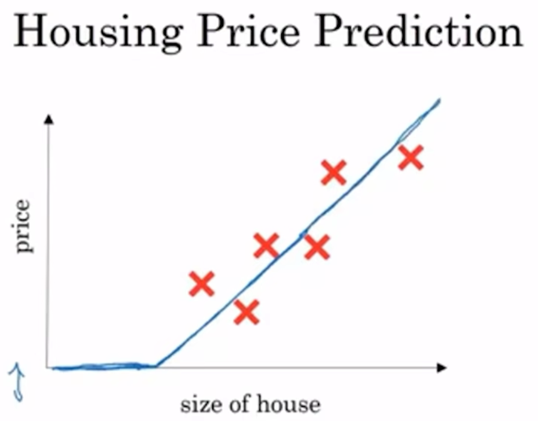
</div>

实际上的神经网络，就是在大量训练集下，通过计算从x到y的精准映射函数。

<div align=center>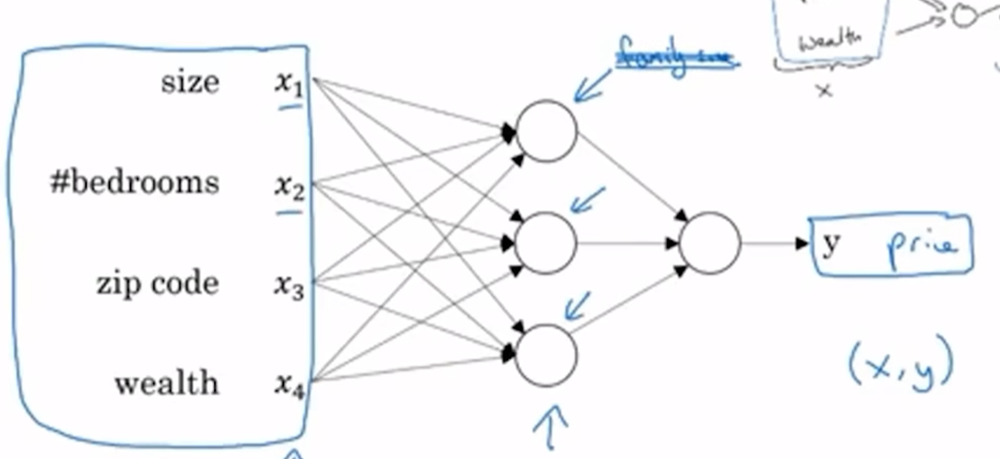
</div>


<h3 id = "1.2">
1.2 逻辑回归
</h3>

逻辑回归是一个用于二分分类(Binary Classification)的算法。

例如给出一张图片，你要得到这张图片是否是一只猫。

<div align=center>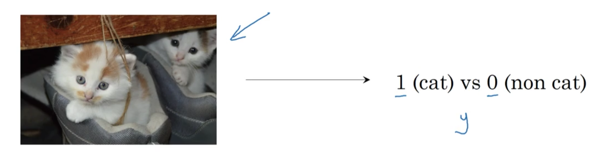</div>


#### 1.2.1 训练样本

在计算机中，保存一张图片，要保存三个独立矩阵，分别对应红、绿、蓝三个颜色通道。

<div align=center>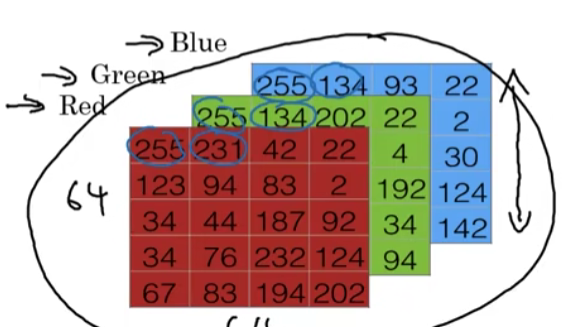</div>


假设计算机张每个独立矩阵是$64 \times 64$,现在将图片中所有的数据放入一个特征矩阵之中，那么这个特征矩阵就有$64 \times 64 \times 3=12288$个元素单元，因此输入的特征向量的维度为`12288`。

我们用一对`(x,y)`来表示一个单独的样本，其中$x\in R^{n_x},y\in  \{ 0,1  \} $。

那么`m`个训练样本就是:$\{(x^{(1)},y^{(1)}),(x^{(2)},y^{(2)}),...,(x^{(m)},y^{(m)})\}$

我们通常用小写`m`来表示训练样本个数，有时候为了强调训练样本的数量，可以写作$m=m_{train}$；我们用$m_{test}$来表示测试集的样本数。

最后，用更紧密的符号表示训练集，定义一个矩阵$X$,将训练集分别放到每一列中，要主要这个训练矩阵式行向量堆叠还是列向量堆叠。同理建立结果输出矩阵$Y$。

#### 1.2.1 映射函数

对于给出的$x$，我们想要预测$\widehat{y}=P(y=1|x)$能告诉你这张图片是猫的概率，那么已知逻辑回归的参数是$w$也是一个$n_x$维度的向量，而$b$是一个常数。然后得到输出函数:

$$
\hat{y} = w^{T}x+b
$$

因为最终要将概率定到0~1，所以需要一个映射函数将概率作用到这个量上，那就是`sigmoid`函数。

$$
\hat{y} = \sigma(w^Tx+b)
$$

<div align=center>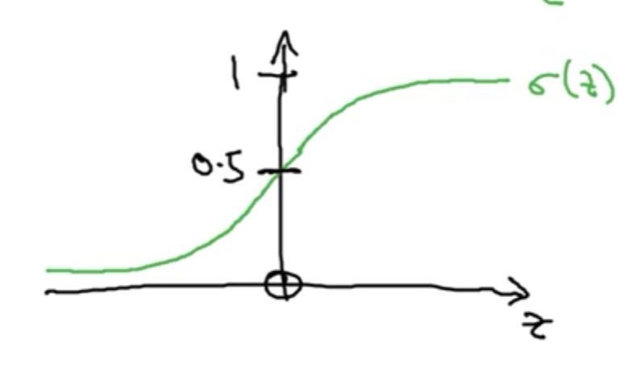</div>


$$
\sigma(z)=\frac{1}{1 + e^{-z}}
$$

当参数$z$趋向正无穷时，函数值趋向于$1$。当参数$z$趋向负无穷时，函数值趋向于$0$。

因此在做逻辑回归的时候，实际上就是去学习训练参数$w，b$。直到将$\hat{y}$训练成一个较好的估计。

我们通常会把参数$w$和参数$b$分开，这里的$b$对应一个拦截器。

#### 1.2.3 损失函数

[损失函数本质](https://www.bilibili.com/video/BV1Y64y1Q7hi/?spm_id_from=333.337.search-card.all.click&vd_source=61c3f696848d48c33298883fd1df4ef0)

*损失函数*也叫做*误差函数*，可以用来衡量算法的运行情况。通俗的讲法就是通过$L$函数来衡量你的预测输出值$\hat{y}$和$y$的实际值有多接近。*损失函数衡量的是在单个训练样本上的表现。*

这里使用的损失函数如下所示：

$$
L(\hat{y},y)=-(ylog\hat{y}+(1-y)log(1-\hat{y}))
$$

为了更好的来理解，为什么这个函数能够起到作用，我们举以下两个例子：

如果我们说$y=1$,那么损失函数就取到前一项，即$L(\hat{y},y)=-log\hat{y}$。效果越好也就是对应着让损失函数越小越好，这就表示让$log\hat{y}$越大越好，也就是让$\hat{y}$越大越好，由于有$\sigma$函数将$\hat{y}$限制在`0~1`之间，因此也就是让$\hat{y}$越接近`1`越好。

#### 1.2.4 成本函数

为了训练逻辑回归模型的参数$w$以及$b$，需要定义一个成本函数。*成本函数衡量的是全体训练样本上的表现*。它的定义式如下：

$$
J(w,b)=\frac{1}{m}\sum^{m}_{i=1}L(\hat{y}^{(i)},y^{(i)})
$$

因此，在训练逻辑回归模型时，需要让成本函数$J$尽可能地小。

#### 1.2.5 梯度下降法

我们将成本函数的对应的图像展示，如下图所示：

<div align=center>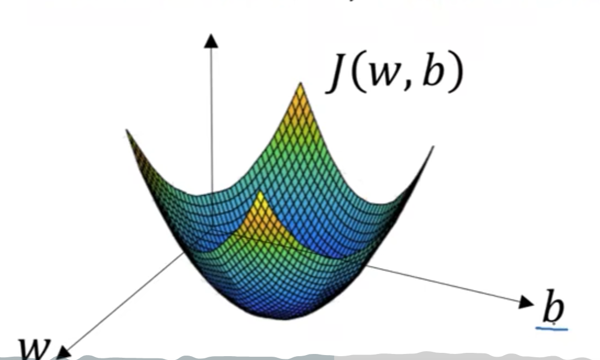</div>


该函数类型为凸函数，凸函数的只存在一个最优解，在其底部。凸函数的这一性质是我们使用逻辑回归的这一特定成本函数$J$的重要原因之一。

为了找到更好的参数值，我们要做的就是用某初始值，初始化$w$和$b$,对于逻辑回归而言，几乎是任意的初始化方法都有效。梯度下降法所做的就是从初始点开始朝最陡的下坡方向走一步。经过多次迭代之后，到达局部最优解或是全局最优解。

<div align=center>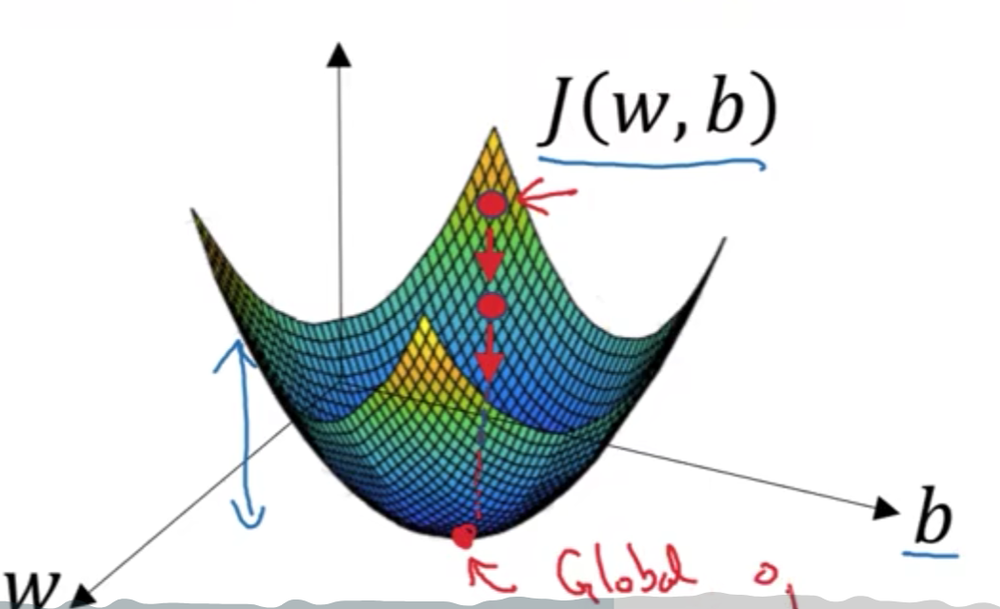</div>


为了更好的说明，我们来看一些函数。如下图所示：

<div align=center>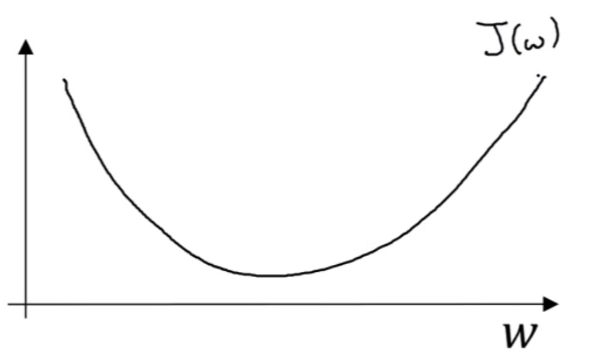</div>


我们将$b$维度舍去，留下了$w$维度，得到如上形式的成本函数，我们的目标是找到成本函数的最小值，通过梯度下降法，我们将重复进行如下操作：

<div align=center>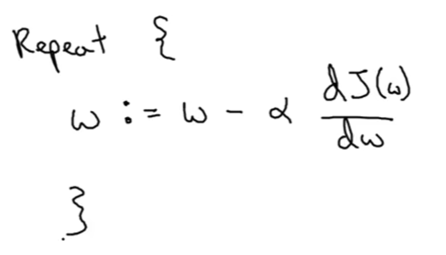</div>


在上述公式中有两点需要注意，首先$\alpha$表示学习率，学习率可以控制每次迭代或者是梯度下降法中的步长，至于$\alpha$如何选择在后文叙述。其次这里的导数，这就是对参数$w$的更新或者变化量，当我们编写代码时，我们用`dw`来表示导数。因此我们用$w:=w-\alpha dw$来表示。同理也可以用这种方式表示$b$。

#### 1.2.6 计算图

假设我们有这样一个函数$J(a,b,c)=3(a+bc)$,那么我们就能画出这样的流程图。

<div align=center>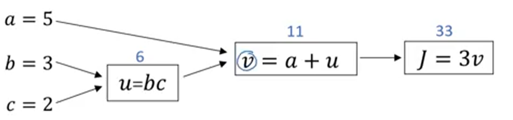</div>


那么如果我们要计算成本函数$J$相对于每个目标函数的变化情况，我们就能使用*微积分中的链式法则*，方向的通过计算图来计算出变化率。

在编写代码时，我们规定对于最终变量$J$的导数，我们用`dvar`来表示$\frac{d_{FindOutputVar}}{d_{Var}}$。

#### 1.2.7 使用计算图实现梯度下降法

现在写出样本的偏导数流程图，假设样本有两个特征$x_1,x_2$,因此我们有参数$w_1,w_2,b$，用来计算`z`的偏导数计算公式:

$$
z=w_1 x_1 + w_2x_2 + b
$$

通过`sigma`函数将`z`函数映射成$\hat{y}$:

$$
\hat{y}=a=\sigma(z)
$$

最后得到损失函数$L$:

$$
L(a,y)=-(yloga+(1-y)log(1-a))
$$

<div align=center>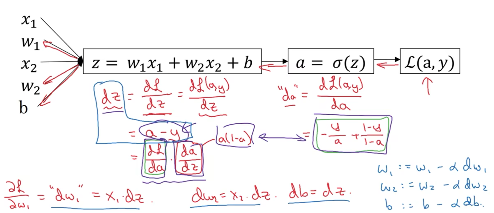</div>

通过反向传播法，得到`da`、`dz`等等。

#### 1.2.8 向量化

假如有$m$个样本，每个样本有$n$个特征，那么如果要计算梯度下降法所需要的算法时间复杂度为$O(nm)$,但是在深度学习中，样本的数量会十分大，那么如果使用`for`循环就会让训练的时间大幅度提升，因此我们使用向量化的方法来加速计算。

举个例子，如果按照常规的代码去计算成本函数，代码的编写如下：

<div align=center>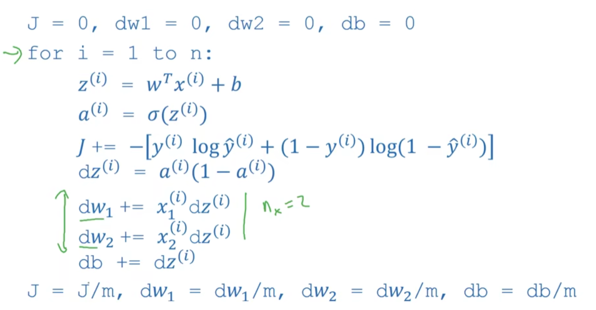</div>

其中能看到外层的`for`循环用来遍历所有的样本，内层的循环用来遍历所有的参数。

为了改进上述代码，我们做出以下修正，为了修正内层的循环，我们不会去显式地把`dw1`、`dw2`等等初始化成`0`。通常采用`dw=np.zeros((n_x, 1))`的方式定义一个矩阵。这样就不用对单个变量进行运算。

<div align=center>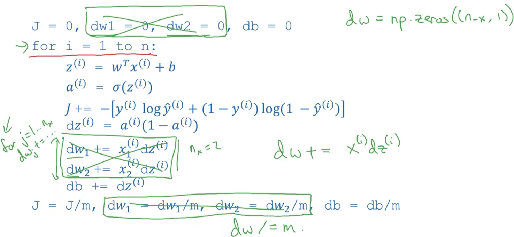</div>

接下来解释如何优化掉第一层循环，之前我们定义过了训练样本矩阵$X$，我们可以通过如下变换得到$Z$:
$$
Z=\left[ z^{\left( 1 \right)}z^{\left( 2 \right)}...z^{\left( m \right)} \right] =w^TX+\left[ b\,\,b\,\,... b \right]
$$
上述的数学公式能在`python`中使用如下代码解决：

```python
z = np.dot(w.T, x) + b
```

在上述代码中，`b`是一个常量，当一个常量与一个矩阵相加，`b`会自动拓展成一个$1 \times m$的矩阵，这种机制叫做`Broadcasting`广播机制。

最后通过激活函数得到$A$。这样的方法十分高效。

<div align=center>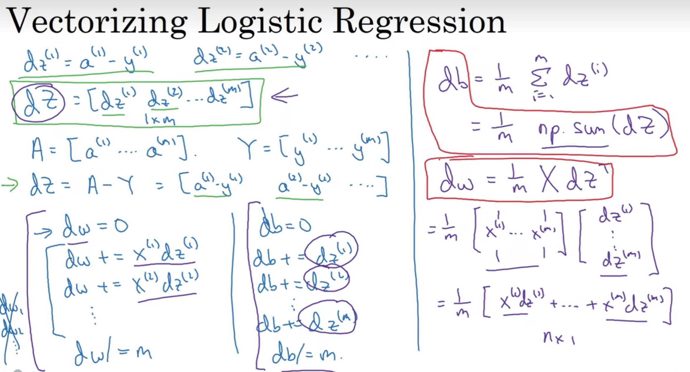</div>


<div align=center>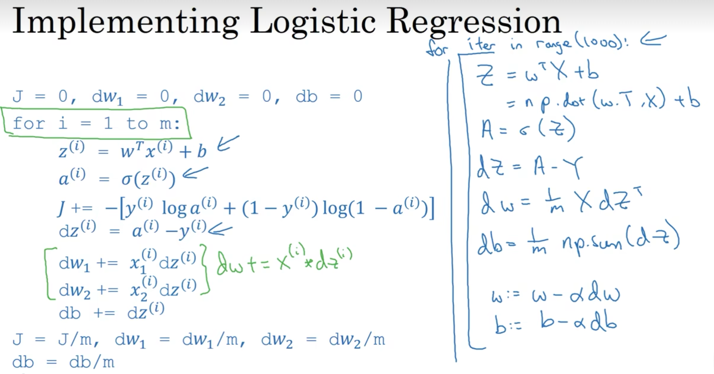</div>

当然在最后迭代时，无法避免使用`for`循环，这里的`for`循环无法优化。

#### 1.2.9 Python中的广播

以下举出一个实际的例子，通过使用`python`的广播功能来实现。比如给出如下一个矩阵，为了计算得出每个食物中的卡路里来自各个成分的比例。 

<div align=center>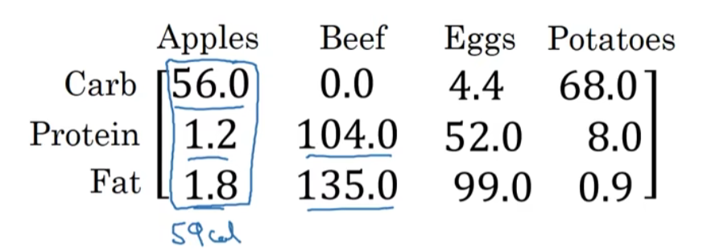</div>

计算代码如下：

```python
# 使用python中的广播功能
import numpy as np
A = np.array([[56.0, 0.0, 4.4, 68.0],
            [1.2, 104.0, 52.0, 8.0],
            [1.8, 135.0, 99.0, 0.9]])

cal = A.sum(axis = 0)
# axis 参数 0表示按照列， 1表示按照行

percentage = 100 * A / cal.reshape(1, 4)
# 实际上不需要reshape，reshape算法O(1) 效率很高 
percentage
```

因此能得出`python`广播机制，如下图所示：

<div align=center>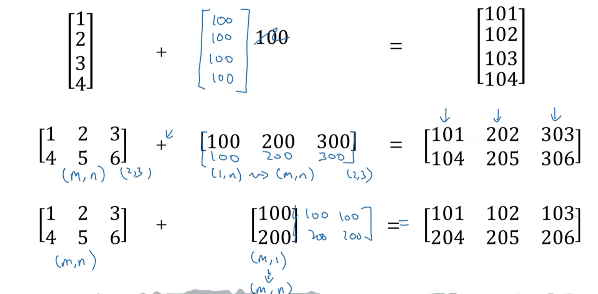</div>

#### 1.2.10 关于成本函数的证明

对于单个样本来说，损失函数的推导过程如下所示，由于逻辑回归得到的结果是`0`或者`1`，因此可以将结果表示成：$p(y|x) = \hat{y}^{y}(1-\hat{y})^{1-y}$。

由于$log$函数是单调递增函数，因此最大化$log(p(y|x))$等价于最大化上个式子，最终得到的式子如下，即为损失函数：

$$
log(p(y|x))=(ylog\hat{y}+(1-y)log(1-\hat{y}))
$$

<div align=center>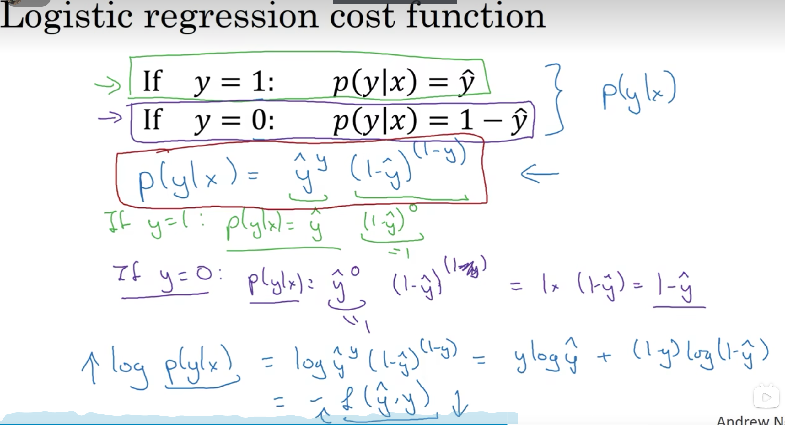</div>

由于逻辑回归中，我们需要最小化损失函数，因此需要在$log(p(y|x))$前添加一个符号，用来表示数值越小越好，即最小化下面这个式子：

$$L(\hat{y},y)=-(ylog\hat{y}+(1-y)log(1-\hat{y}))$$

<div align=center>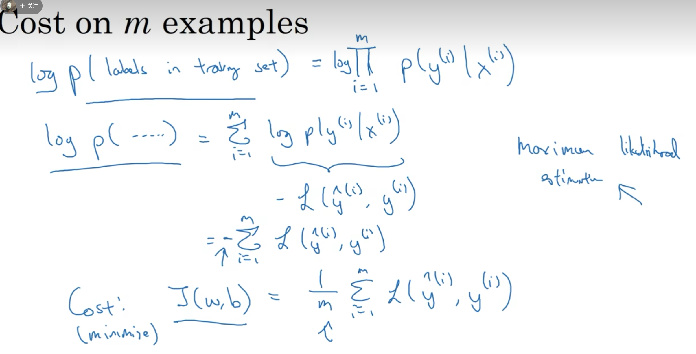</div>

<h3 id = "1.3">
1.3 神经网络
</h3>
首先申明对于`(1)`这样的上标，表示训练样本的编号；对于`[1]`这样的上标，表示神经网络的第几层。在神经网络中关键要掌握这样一种直觉，就是在计算完`z`之后，就要直接使用激活函数计算`a`。如下这个神经网络系统实际上就是运用了两次逻辑回归。

<div align=center>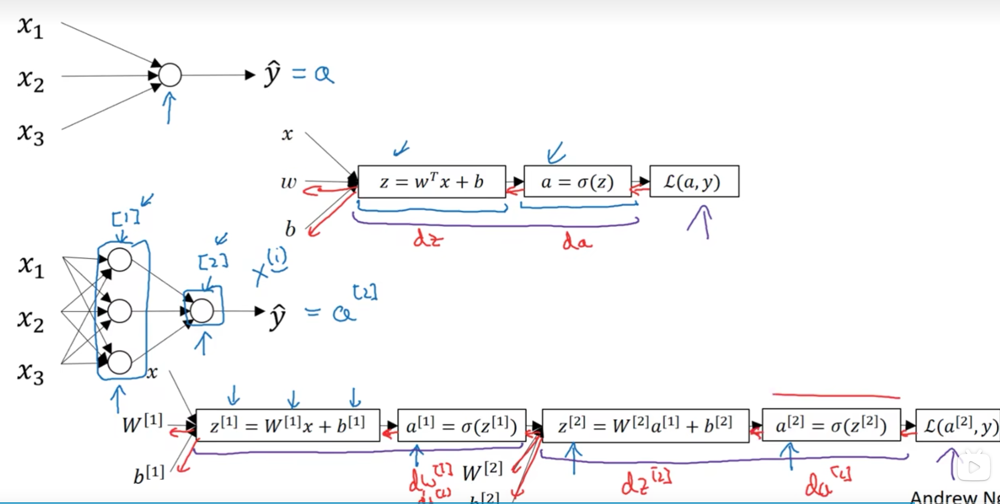</div>

#### 1.3.1 神经网络的表示

如下图所示的是一个”双层神经网络“，在计算神经网络层数的时候，我们一般不讲输入层加入计算，因此，图中的神经网络由一层隐藏层和一层输出层组成。输入层是第`0`层，隐藏层是第`1`层，输出层是第`2`层。在隐藏层中`w`是一个$4\times 3$的矩阵，`4`表示该层有四个结点或是四个隐藏单元，`3`则代表该样本有三个特征。同理其他的参数矩阵也是这样计算的。

<div align=center>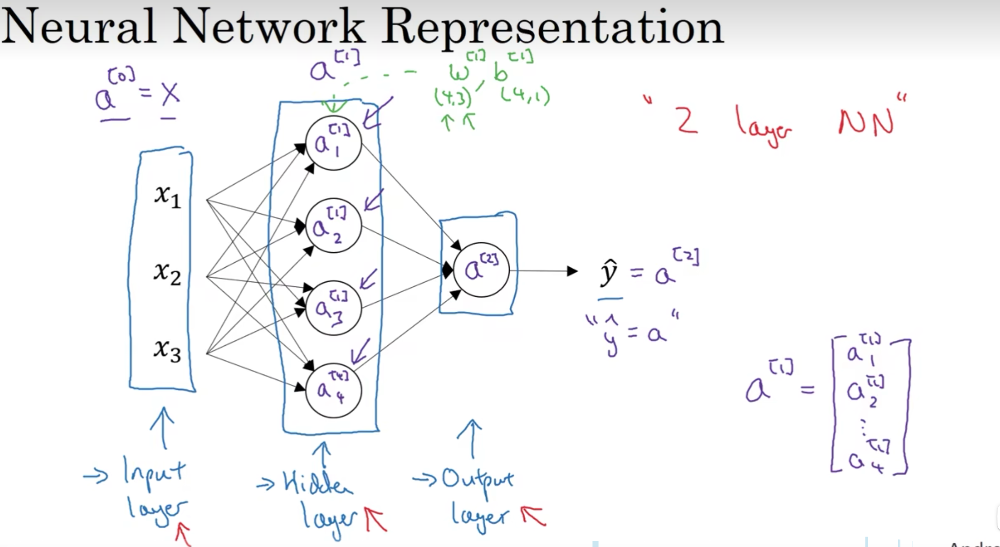</div>

#### 1.3.2 神经网络的计算

对于每个隐藏层的结点，都需要进行如下的操作：

$$
z_{1}^{[1]}=w_{1}^{[1]T}x+b_1^{[1]}, a_1^{[1]} = \sigma(z_1^{[1]})
$$

其他隐藏结点同理可得：

<div align=center>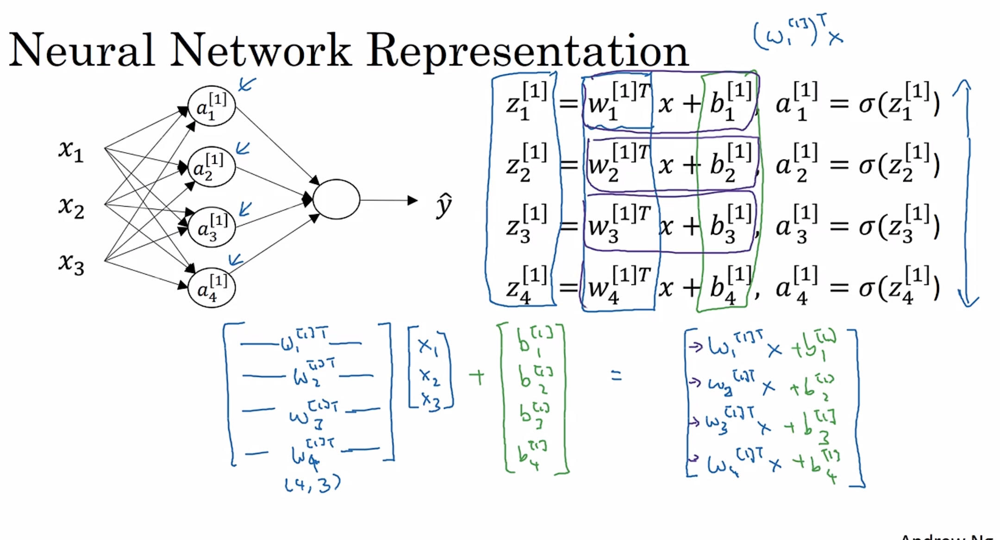</div>

列出这些式子可以得到，`4`行等式，可以通过矩阵相乘的方式来计算所有的结果。

<div align=center>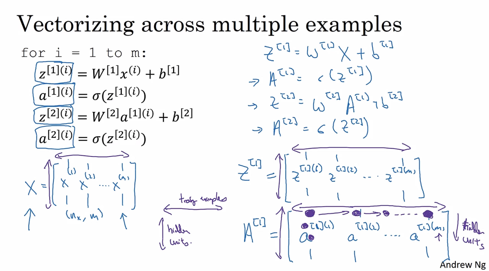</div>

#### 1.3.3 激活函数

1. `Sigmoid`和`tanh`激活函数

除了`Sigmoid`激活函数之外，还有一种激活函数叫做`Tanh`，其定义式子如下：
$$tanh(x) = \frac{e^x-e^{-x}}{e^x + e^{-x}}$$

相比较于`Sigmoid`，上述这种函数的值域范围更大。`Tanh`也可以作为开关调节输入信息。这种函数通常比`Sigmoid`函数效果要好。这有类似数据重心化的效果，`tanh`函数几乎在所有场合都更优越，因此我们不再使用`Sigmoid`激活函数。使用`Sigmoid`函数，只用于二分类的模型，这种情况下，可以使用`Sigmoid`激活函数做为输出层。

<div align=center>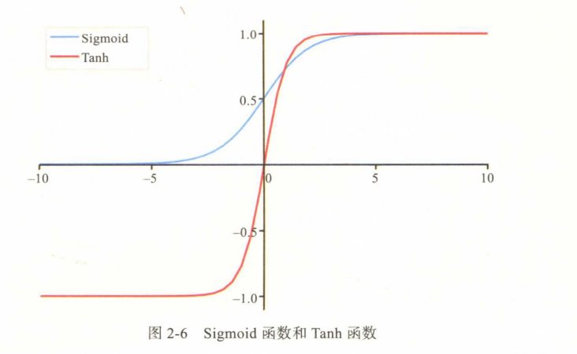</div>

但是从上图可以看出，`Sigmoid`和`tanh`函数都存在着些缺点就是如果`z`非常大或者非常小，那么导数的梯度或者说这个函数的斜率可能就很小。这样会拖慢梯度下降法的效率。

2. `ReLU`激活函数

它的函数形式如下所示：

$$
a = max(0, z)
$$

只要`z`为正，导数就是`1`。当`z`为负，导数为`0`。

#### 1.3.4 为何需要激活函数

要让你的神经网络能够计算出有趣的函数，就必须使用非线性激活函数。

#### 1.3.5 神经网络的梯度下降法

神经网络的计算中，与逻辑回归十分类似，但中间会有多层的计算，下面以一个双层神经网络，有一个输22入层，一个隐藏层和一个输出层。

1. 前向传播：

计算$z^{[1]},a^{[1]}$，再计算$z^{[2]},a^{[2]}$,最后得到`loss function`。

2. 反向传播

向后推算出$da^{[2]}$，然后推算出$dz^{[2]}$，接着推算出$da^{[1]}$，然后推算出$dz^{[1]}$

反向传播推导是机器学习邻域最难的数学推导之一，矩阵的导数要用链式法则来求。所以我直接放弃，以后再战。

#### 1.3.6 随机初始化

对于逻辑回归，把权重初始化为`0`当然是可以的，但是对于一个神经网络，如果你把权重或者参数全部设置为`0`，那么梯度下降法就会不在起作用。

这是因为如果将每一层的参数都设置为`0`，那么多层的隐藏单元就没有意义了，它们计算的都是同样的东西。因为你需要两个不同的隐藏单元，去计算不同的函数。这个问题的解决方式是使用随机初始化所有参数。可以使用如下代码对第一层的$w^{[1]}$进行初始化。

```python
w1 = np.random.randn((2, 2)) * 0.01;
```

这样就能将参数初始化成很小的随机数。因为参数`b`不存在对称性的问题，所以可以把`b`初始化为零矩阵。

为何要将参数设置一个很小的随机数？这是因为激活函数在`0`附近处梯度大，这样学习速度就会相对较快。如果`w`很大，那么你很可能最终停在`z`很大的值，这回造成激活函数饱和在龟速的学习上，如果你没有激活函数在你整个神经网络里，那就不成问题。但是如果你做二分类并且你的输出函数是`Sigmoid`函数，那么你不会想让参数太大，因此这就是乘上`0.01`或是小数是合理的尝试。

>**为什么在神经网络中不能将`w`全部初始化为`0`,但是在逻辑回顾中可以用零初始化？**
>
>**答案**：在逻辑回归，中没有隐藏层，所以不算神经网络，逻辑回归的全职初始化可以是任意初始化方法，包括全`0`初始化方式。

<h3 id = "1.4">
1.4 深层神经网络
</h3>
#### 1.4.1 深层神经网络

相比较于逻辑回归以及浅层神经网络，深层神经网络有更多的隐藏层。在不同层所拥有的神经元的数目，对于每层$l$都用$a^{[L]}$来记作$l$层激活的结果，我们会在后面看到正向传播时，最终能计算出$a^{[l]}$。

#### 1.4.2 前向传播和反向传播

先讲前向处传播，输入$a^{[l-1]}$，输出是$a^{[l]}$，缓存为$z^{[l]}$；从实现的角度来说可以缓存$w^{[l]}$和$b^{[l]}$,这样更容易在不同的环节中调用函数。

前向传播的步骤可以写成如下表示：

$$
z^{[l]} = W^{[l]} a^{[l-1]} + b^{[l]} 
$$

$$
a^{[l]} = g^{[l]}(z^{[l]})
$$

向量化实现就是用$Ｚ$和$A$来计算。前向传播需要喂入$A^{[0]}$也就是$X$，来初始化：初始化的第一层的输入值。$a^{[0]}$对应于一个训练样本的输入特征，$A^{[0]}$对应一整个训练样本的输入特征，所以这就是这条链的第一个前向函数的输入，重复这个步骤就可以从左到右计算前向传播。

下面讲反向传播的步骤：

输入为$da^{[l-1]}$，输出为$da^{[l - 1]},dw^{[l]},db^{l}$.所以反向传播的步骤可以写成：

$$
(1) dz^{[l]} = da^{[l]} * g^{[l]’}(z^{[l]}) = w^{[l+1]T}dz^{[l+1]} *g^{[l]’}(z^{[l]})
$$

$$
(2) dw^{[l]} = dz^{[l]} a^{[l-1]} 
$$

$$
(3) db^{[l]} = dz^{[l]}
$$

$$
(4) da^{[l - 1]} = w^{[l] T} dz^{[l]}
$$

向量化实现过程可以写成：

$$
(5) dZ^{[l]} = dA^{[l]} * g^{[l]’}(Z^{[l]}) 
$$

$$
(6) dW^{[l]} = \frac{1}{m} dZ^{[l]} A^{[l - 1]T}
$$

$$
(7) db^[l] = \frac{1}{m} np.sum(dZ^{[1]}, axis = 1, keepdims = True)
$$

$$
(8) dA^{[l - 1]} = W^{[l]T}dZ^{[l]} 
$$

#### 1.4.3 核对矩阵的维度

在实现深度神经网络的时候，其中一个常用的检查代码是否有错的方法就是拿出一张纸过一遍算法中矩阵的维度。

$w$的维度是（下一层的维度，前一层的维度），即$w^{[l]}:(n^{[l]},n^{[l-1]})$

$b$的维度是（下一层代维度，1），即$b^{[l]}:(n^{[l]}, 1)$

$z^{[l]},a^{[l]}:(n^{[l]}, 1)$;

$dw^{[l]}$和$w^{[l]}$维度相等，$db^{[l]}$和$b^{[l]}$维度相同，且$w$和$b$向量化维度不变，但$z,a$以及$x$的维度会向量化后发生变化。

向量化后，可以看作每个样本堆叠而成。

在做深度神经网络的反向传播时，一定要确认所有的矩阵维数h是前后一致的。

#### 1.4.4 为什么使用深层表示？

深度神经网络能解决好多问题，其实并不需要很大的神经网络，但是得有深度，得有比较多的隐藏层。

深度网络究竟在计算什么？如果你在建一个人脸识别或是人脸检测系统，深度神经网络所做的事就是，当你输入一张脸部的照片，可以把神经网络的第一层，当成一个特征探测器或者边缘探测器，然后去找这张图片的各个边缘。把照片里组成边缘的像素放在一起看，然后它可以把被探测到的边缘组合成遍布的不同部分。

直觉上，神经网络的前几层当作探测简单的函数，比如边缘，之后把它们跟后几层结合起来，那么总体上就能学习更多复杂的函数。

深层的网络隐藏单元数量相对较少，隐藏层数目较多，如果浅层的网络想要到达相同的计算结果则需要指数级增长的单元数量才能够达到。

#### 1.4.5 参数与超参数

比如算法中的`learning rate` $\alpha$（学习率）,`iterations`（梯度下降发法循环的数量），`L`（隐藏层数量），$n^{[l]}$（隐藏层单元数目），`choice of activation function`（激活函数的选择）都需要设置，这些数字实际上控制了左后的参数$W$和$b$的值，所以它们被称为超参数。

如何寻找超参数的最优值？走`ideas - code - experiment - idea`这个循环，尝试各种不同的参数，实现模型并观察是否成功，然后再迭代。
