## 第2章 改善神经网络：超参数调试，正则化及其优化

> [2.1 深度学习的实践方面](#2.1)
>
> [2.2 优化算法](#2.2)
>
> [2.3 超参数调试、Batch正则化和程序框架]()

<h3 id = “2.1”>
2.1 深度学习的实践方面
</h3>

#### 2.1.1 训练，验证，测试集

在训练神经网络时，需要做出很多决策。例如：神经网络的层数，每层含有多少个单元，学习率，采用那些激活函数。

创建高质量的训练数据集，验证集和测试机才有助于提高循环效率。

一个训练数据通常会将这些数据划分成几个部分，一部分作为*训练集*，一部分作为*简单交叉验证集*，也称作验证集，最后一部分作为*测试集*。

*训练集*：英爱训练模型内参数的数据集。

*验证集*：用于训练过程中检验模型的状态，收敛情况。常用于调整超参数。还可以用来监控是否发生过拟合，一般来说验证集表现稳定后，若继续训练，训练集表现还会继续上升，但是验证集会出现不升反降的情况。

*测试集*：测试集用来评价模型泛化能力，再确定超参数之后，最后使用一个从没有见过的数据集来判断这个模型是否效果是否可以。

接下来，开始对训练执行算法，通过验证集或简单交叉验证集选择最好的模型，经过充分验证，来确定最终的模型。然后就可以在测试集上进行评估，胃口无偏估计算法的运行结果。

数据规模较小时，适用传统的划分比例，数据集规模较大的，验证集和测试集所占比例很小。

#### 2.1.2 偏方，方差

高偏方表示在训练集中表现不佳。

高方差表示在训练集中表现出过拟合现象，在验证集中的结果欠佳。

最优误差也被称为贝叶斯误差，在假设人眼识别的错误率接近$0\%$时，那么最优误差就接近$0\%$。

#### 2.1.3 机器学习基础

对于不同的神经网络架构，需要找到一个更合适解决次问题的新的网络架构。采用规模更大的网络通常都会有所帮助，延长训练时间不一定有用，但也没坏处。训练算法时，会不断尝试这些方法，直到解决掉偏差问题，直到拟合数据为止，至少能够拟合训练集。

如果网络够大，通常可以很好的拟合训练集，这只少可以拟合或者过拟合训练集。如果方差高，最好的解决方法就是采用更多数据，如果你能做到，会有一定的帮助，但有时候，无法获取更多数据，我们也可以藏式通过正则化来减少过拟合。

#### 2.1.4 正则化（Regularization）

深度学习可能存在过拟合问题———高方差，有两种解决方法，一个是正则化，另一个是准备更多的数据。准备足够多的训练数据可能获取成本较高，但正则化通常有助于避免过拟合或减少你的网络误差。

正则化是指为解决适定性问题或过拟合而加入额外信息的过程。

以逻辑回归为例，在逻辑回归函数中加入正则化，自需要添加参数$\lambda$，也就是正则化参数。添加正则化就是给损失函数加上一些限制，通过这种规则去规范他们接下来的迭代循环。

添加了正则化参数的损失函数如下：

$$
J(w,b) = \frac{1}{m} \sum^{m}_{i=1}L(\hat{y}^{(i)}, y^{(i)}) + \frac{\lambda}{2m}\parallel w^{[l]} \parallel ^2_2
$$

>**L1范数**
>
>`L1`范数是我们常见的一种范数，它的定义如下：
>$$
>\parallel x \parallel_1 = \sum^{n}_{i=1}|x_i|
>$$
>表示向量`x`中非零绝对值的和。
>
>`L1`范数有很多的名字，例如熟悉的哈密顿距离。由于`L1`范数的天然性质，对`L1`优化的解是一个稀疏解，因此`L1`范数也被叫做稀疏规则算子。通过`L1`可以实现特征的稀疏，去点一些没有信息的特征。
>
>**L2范数**
>
>L2范数是最常见最常见的范数，用来度量欧式距离就是用的`L2`范数，它的定义如下：
>$$
>\parallel x \parallel_2 = \sqrt{\sum^{n}_{i = 1}x_i^2}
>$$
>`L2`范数通常会被用来做优化函数的正则化项，防止模型为了迎合训练集而过于复杂造成过拟合的情况，从而提高模型的泛化能力。

这里的正则化省略了`b`，那是因为`w`可能包含了很多参数，我们不可能你和所有参数，而`b`只是单个数字，所以`w`几乎涵盖了所有参数，加上了`b`，其实没有多大的影响，但是通常不略不计。直观来将`b`是一个偏置参数，只会影响拟合结果的偏移程度，但不会影响拟合的形状，因此不需要对其进行正则化。

如果用的是`L1`正则化，`w`最终会是稀疏的，也就是说`w`向量中会有很多`0`。但是，实际上虽然`L1`正则化能使模型变得稀疏，却没有降低太多存储内存，所有并不是`L1`正则化的目的，至少不是为了压缩模型，在训练神经网络时，越来越倾向使用`L2`正则化。

正则化实际上就是在最小化成本函数的同时，保证参数不会太大，参数太大，对模型越敏感，就会使得分类结果越扭曲。

将成本函数加上了正则化系数之后，计算出来的$dw^{[l]}$为$(from \ backprop) + \frac{\lambda}{m} w^{[l]}$，最后用该式子去迭代$w^{[l]}$。
$$
w^{[l]} := w^{[l]} - \alpha dw^{[l]} = w^{[l]} - \alpha [(from\ backpop) + \frac{\lambda}{m}w^{[l]}] = (1 - \frac{\alpha \lambda}{m})w^{[l]} - \alpha (from\ backpop)
$$
再上式子中$w$的权重为$(1 - \frac{\alpha \lambda}{m})$，因此，`L2`正则化也被称为“权重衰减”。

就是通过降低参数$w$的大小范围，从而降低模型复杂度，来解决过拟合问题。

**参考资料：**

- [如何解决过拟合问题？L1、L2正则化及Dropout正则化讲解](https://www.bilibili.com/video/BV18r4y1M71J/?vd_source=61c3f696848d48c33298883fd1df4ef0)

#### 2.1.5 为何正则化有利于预防过拟合？

直观的理解就是如果正则化$\lambda$设置得足够大，权重矩阵$W$被设置为接近于$0$的值，也就是把多隐藏单元的权重设置为$0$,于是基本上消除了这些隐藏单元的许多影响。这会大大简化了神经网络会变成一个很小的网络。

<div align=center>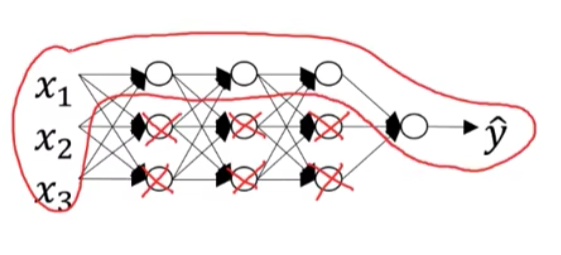</div> 

这会使得模型小到如同一个逻辑回归单元，但是深度却很大，这样会使网络从过拟合状态进入到欠拟合状态，但是如果将$\lambda$的值调节适中，那么会有一个适中的模型结果。

更加直观的方式，为什么正则化可以预防过拟合，假设我们使用的双曲正切激活函数，那么只要$z$很小，那么我们就利用了双曲正切函数的线性状态。当$z$变大或者是变小，那么激活函数开始变得非线性。每层都是线性函数，那么整个网络就是一个线性网络，即使是一个非常深的深层网络，最终也只能计算线性函数，因此它不适用于非常复杂的决策，以及过度拟合数据集的非线性决策边界。

#### 2.1.6 dropout正则化

假设一个神经网络结构存在过拟合，这就是`dropout`要处理的，我们复制这个神经网络，遍历网络的每层，并设置消除神经网络中节点的概率。假设网络中的每一层每个节点都已抛硬币的方式设置概率，每个节点得以保留或者消除的概率都是一半一半，设置完节点的概率，我们会消除一些节点，最后得到一个节点更少，规模更小的网络，然后`backprop`方法训练。

<div align=center>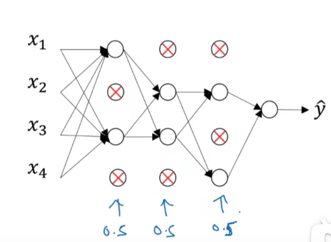</div> 

`dropout`方法有很多中，接下来讲的是最常用的方法，即反向随机失活（inverted dropout），以下用一个三层的网络来举例说明。首先要定义向量$d$，$d^{[3]}$表示一个三层的`dropout`向量：

```python
d3 = np.random.randn(a3.shape[0], a3.shape[1]) < keep_prob
```

然后看它是否小于某个数，这个数叫做`keep_prob`，它表示保留某个隐藏单元的概率。假设我们让`keep_prob = 0.8`，那么就是让`d`中对应为`1`的概率为`0.8`，对应为`0`的概率为`0.2`。再与`a3`相乘就能得到对应位置归零。

```python
a3 = np.multiply(a3, d3)
```

最后，向外拓展$a^{[3]}$，除以`keep_prob`参数。

```python
a3 /= keep_prob
```

这里除去`keep_prob`参数是为了保证无偏估计，期望公式$E(x) = 0.2 \times0+0.8x = 0.8x$，因此只要再除以`keep_prob`就能保证期望不变了。

#### 2.1.7 理解dropout

直观上来理解：不要依赖任何一个特征，因为该单元的输入可能随时被消除，所以不会给任何一个怕输入加上太多的权重，因为它随时都可能被删除，因此该单元通过这种方式传播下去。`dropout`将产生收缩权重的平方范数效果，和之前讲的`L2`正则化类似。

<div align=center>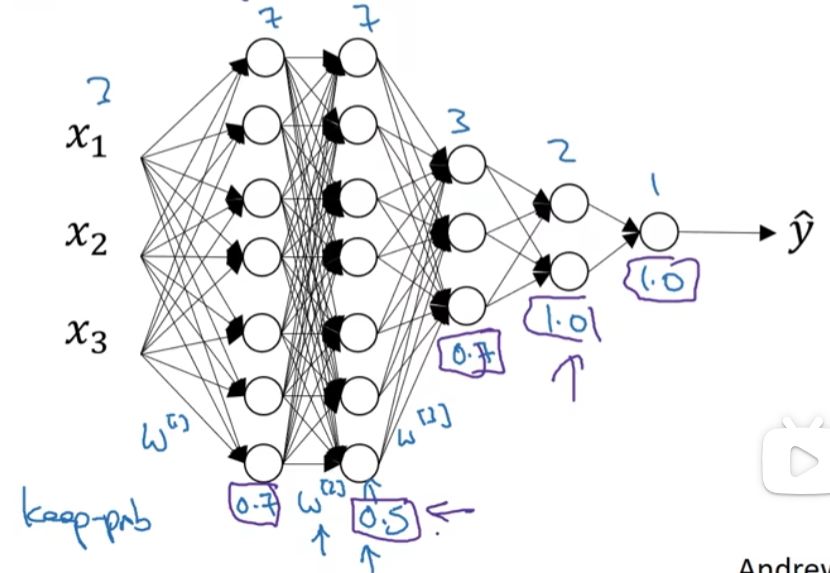</div> 

总之，如果你担心某些层更容易发生过拟合，可以把某些层的`keep_prob`值设置的比其他层更小一点，缺点就是为了使用交叉验证，你需要搜索更多的超级参数。另一种方案就是对某些层使用，某些层不去使用。

牢记一点就是，`dropout`是一种正则化方法，它有助于预防过拟合，因此除非算法出现过拟合现象，不然不用去使用`dropout`，所以它在其他领域用的比较少，主要存在于计算机视觉领域。

#### 2.1.8 其他正则化方法

1. 数据扩增

假设你正在拟合猫咪的数据，如果想通过扩增训练数据来解决过拟合，但扩增数据代价太高，但我们可以通过增加这类图片来增加训练集，例如水平翻转图片，并把它们加入训练集，这可以让训练集增大一倍。除了反转图片。还可以裁剪图片。

2. early stopping

<div align=center>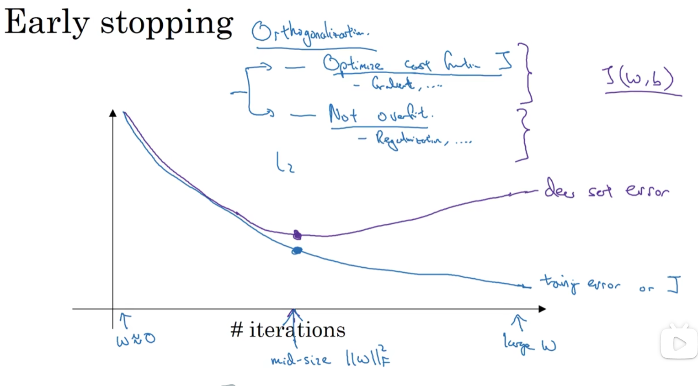</div> 

在训练过程时，希望训练误差，代价函数$J$都在下降，，可以发现，验证集误差通常会先呈下降趋势，然后在某个节点开始上升，`early stopping`的作用就是在神经网络在这个迭代过程中表现的很好了，那几直接停止训练，得到验证集误差。

#### 2.1.9 归一化输入

在神经网络训练中，其中一个加速训练的方法就是归一化输入，假设一个训练集有两个特征，输入特征为$2$维，归一化需要两个步骤：

1. 零均值

2. 归一化方差

第一步是零均值化，$\mu = \frac{1}{m} \sum^{m}_{i = 1}x^{(i)}$，它是一个向量，$x$等于每个训练数据$x$减去$\mu$，意思就是移动训练数据，直到它完成零均值。

<div align=center>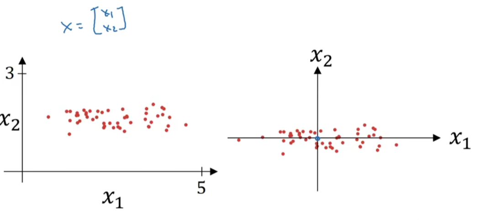</div> 

第二步是归一化方差，注意特征$x_1$的方差要比$x_2$的方差要大的多，我们要做的是给$\sigma$赋值，$\sigma^2 = \frac{1}{m} \sum^{m}_{i = 1}(x^{(i)})^2$，这是节点$y$的平方，样本的每一个特征都有方差，因为第一步中我们保证了样本的均值为$0$，因此样本的元素的平方就是方差，在把所有数据除以向量$\sigma$，最终变成下面图：

<div align=center>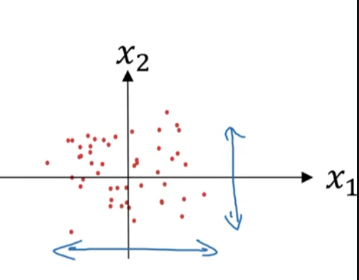</div> 

要注意，$x_1$和$x_2$的方差都等于$1$，如果你用它来调整训练数据，那么用相同的$\mu$和$\sigma$来归一化测试集。所以你要用同样的方法调整测试集，而不是分别去预估。因为我们希望无论是训练数据还是测试数据，都是通过相同$\mu$和$\sigma ^2$定义的相同数据转换，其中的均值方差都是从训练集中计算得到的。

为什么需要归一化输入特征？非归一化的代价函数和归一化的代价函数分别如下所示：

<div align=center>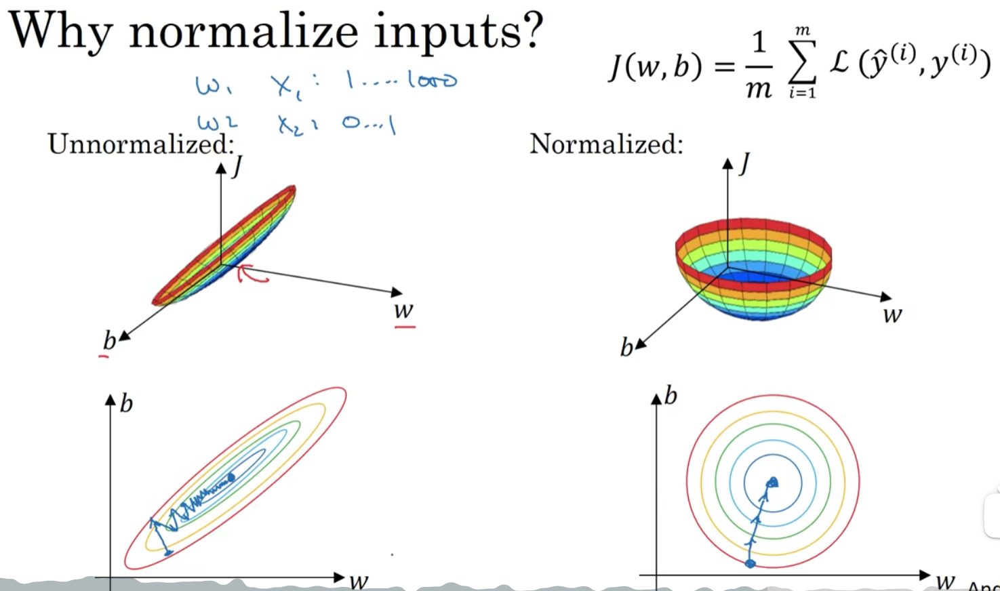</div> 

如果你归一化特征，代价函数平均起来看更对称，如果你在上图这样的代价函数上运行梯度下降法。你必须使用一个非常小的学习率，因此如果是这个位置，梯度下降法可能需要多次迭代过程，直到找到最小值。如果函数是一个更圆的球形轮廓，那么不论从哪个位置开始，梯度下降法都唔那个够更直接找到最小值，你可以子啊梯度下降法中使用更大步长，而不需要向左图那样反复执行。

如果特征值处于不同范围内，可能有些特征值从$0$到$1$，有些从$1$到$1000$，那么归一化特征值就非常重要了。如果特征值处于相似范围内，那么归一化就不是很重要了。执行这类归一化并不会产生什么危害。

#### 2.1.10 梯度消失/梯度爆炸

训练神经网络，尤其是深度神经面临的一个问题就是梯度消失或梯度爆炸，也就是梯度有时会变得非常大，或者非常小，甚至于指数方式变小。直观的理解，权重$W$只要比$1$略大一点，或者比单位矩阵大一点，神经网络的激活函数将爆炸式增长，如果$W$比$1$略小一点，就会指数级递减。对于当前的神经网络，假设$𝐿 = 150$，在这样一个深度神经网络中，如果激活函数或梯度函数以与𝐿相关的指数增长或 递减，它们的值将会变得极大或极小，从而导致训练难度上升，尤其是梯度指数小于𝐿时， 梯度下降算法的步长会非常非常小，梯度下降算法将花费很长时间来学习。

#### 2.1.11 神经网络的权重初始化

一个不完整的解决方案，去解决梯度消失、梯度爆炸，虽然不能彻底解决问题，但很有用，有助于为神经网络更谨慎的选择随机化参数。假设一个只有一个神经原的神经网络，它的输入为四个特征，从$x_1$~$x_4$，经过处理输出$\hat{y}$。

$z = w_1x_1+w_2x_2 + ...+ w_nx_n, \ b = 0$，为了防止$z$太大或太小，你可以看到当$n$越大，你希望$𝑤_𝑖$越小，因为𝑧是$𝑤_𝑖𝑥_𝑖$的和，如果你把很多此类项相加，希望每项值更小，最合理的方法就是设置 $𝑤𝑖 = \frac{1}{𝑛}$，$𝑛$表示神经元的输入特征数量，实际上，你要做的就是设置某层权重矩阵:
$$
w^{[l]} = np.random.randn(shape) * np.sqrt(\frac{1}{n^{[l - 1]}})
$$
如果你是用的是 Relu 激活函数，而不是$\frac{1}{ 𝑛}$，方差设置为$\frac{2}{ 𝑛}$，效果会更好。你常常发现，初始化时，尤其是使用 Relu 激活函数时，$𝑔 [𝑙] (𝑧) = 𝑅𝑒𝑙𝑢(𝑧)$,它取决于你对随机变量的熟悉程度，这是高斯随机变量，然后乘以它的平方根，也就是引用这个方差$\frac{2}{ 𝑛}$。但它确实降低了梯度消失和爆炸问题，因为它给权重矩阵𝑤设置了合理值，你也知道，它不能比 1 大很多，也不能比 1 小 很多，所以梯度没有爆炸或消失过快。

#### 2.1.13 梯度检验

梯度检验能够帮助我们发现`bp`过程中的`bug`，假设你的网络中有以下参数$W^{[1]}$和$b^{[1]}...W^{[l]}$和$b^{[l]}$，为了执行梯度检验，首先要做的就是，吧所有参数转换为一个巨大的向量数据，将所有的参数连接起来，得到一个向量 $\theta$，该向量表示参数$\theta$，代价函数$J$是所有 $W$和 $b$的函数，仙子啊就得到一个$\theta$的代价函数$J(\theta)$。接着，得到与$W$和$b$顺序相同的数据，你同样可以把所有偏导组成一个向量$d\theta$，它与$\theta$有相同的维度。

为了实施梯度检验，要做的就是循环执行，从而对每个 $i$ 也就是每个$\theta$组成的元素计算$d\theta_{approx}[i]$的值，使用双边误差，如下：
$$
d\theta_{approx}[i] = \frac{J(\theta_1, \theta_2,... \theta_i + \epsilon,..) - J(\theta_1, \theta_2,... \theta_i - \epsilon,..)}{2 \epsilon}
$$
只对$\theta_i$增加$\epsilon$，其他项保持不变，因为我们使用的是双边误差，对另一边做同样的操作，只不过是减去$\epsilon$，其他保持不变。
$$
check = \frac{\parallel d\theta_{approx} - d\theta \parallel_2}{\parallel d\theta_{approx} \parallel_2 + \parallel d\theta \parallel_2}
$$


这个值应该是逼近$d\theta_{approx}[i]$，如何定义两个想想是否真的接近彼此，一般做下列原酸，计算这两个向量的距离，$d\theta_{approx}[i] - d\theta[i]$的欧几里得范数，它是误差的平方和，然后求平方和，得到欧式距离。然后用向量长度归一化。使用向量长度的欧几里得范数。分母只是用于预防这些向量太小或太大，分母使得这个方程式编程比率，我们实际指向这个方程，使得这个取值范围内的$\epsilon$,如果计算出来的结果值比它小，就说明导数的逼近有可能是正确的。

#### 2.1.14 梯度检验应用的注意事项

* 不要在训练中使用梯度检验，它只用于调试。
* 如果算法的梯度检验失败，要检查所有项。
* 在实施梯度检验是，如果使用了正则化，要注意包括上这个正则化项。
* 梯度检验不能和$dropout$共同使用。

<h3 id = "2.2">
2.2 优化算法
</h3>

#### 2.2.1 Mini-batch梯度下降

学习优化算法能帮助你快速训练模型。在巨大的数据集基础上进行训练速度很慢。首先介绍`Mini-batch`梯度下降法。

把训练集分割成为小一点的子集训练，这些自己被取名为`mini-batch`。用一个新的符号，将$x^{(1)}$到$x^{(1000)}$称为$x^{\{1\}}$，称其为第一个子训练集。以此类推。

`batch`梯度下降法指的是我们之前讲过的梯度下降法，同时处理整个训练集，这个名字就是来源于能够同时看到整个`batch`训练集的样本被处理。相比之下，`mini-batch`梯度下降法，指就是每次同时处理一小批样本。使用`mini-batch`梯度下降训练样本的一步，我们写下的代码也可被称为进行一代的训练。一代意味这只是一次遍历了训练集。

使用`batch`梯度下降法，一次遍历训练集只能让你做一个梯度下降，使用`mini-batch`梯度下降法，一次遍历训练集有多少批就能梯度下降几次。

#### 2.2.2 理解Mini-batch梯度下降法

使用`bacth`梯度下降法是，每次迭代都需要遍历整个训练集，可以预期每次迭代成本都会下降，如果成本函数`J`是迭代函数的一个函数，它应该会随着迭代而减少。

使用`mini-batch`梯度下降法，做出的成本函数在整个过程中的图，则不是每次迭代都是下降的，特别是在每次迭代中，$J^{\{i\}}$只和$X^{\{i\}}$与$Y{\{i\}}$有，也就是每次迭代都是在训练不同的样本集。

<div align=center>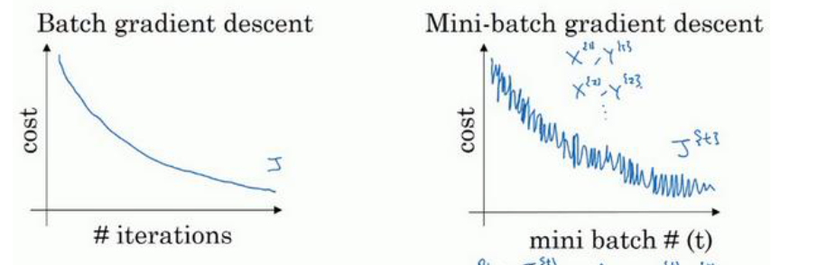</div> 

需要决定的是`mini-batch`的大小，`m`就是训练集的大小，极端情况下如果取`mini-batch`大小等于`m`，其实就是`batch`梯度下降法，在这种极端情况下，就有了`mini-batch`，并且该`mini-batch`等于整个训练集，所以把`mini-batch`大小设置为`m`可以得到`batch`梯度下降法。

另一个极端情况，假设取`mini-batch`大小为`1`，改算法叫做随机梯度下降法，每个样本都是独立的`mini-batch`，当你看第一个`mini-batch`，也就是一个一个样本，每个样本迭代一次。下图是两种极端方式的成本函数优化情况。

<div align=center>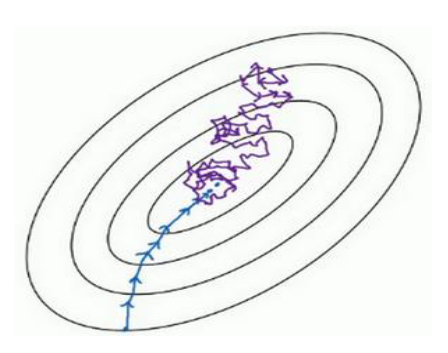</div> 

实际上选择的`mini-batch`大小应该在这两者之间。使用不大不小的尺寸，实际上学习率能够达到最快，因为一方面使用了大量的向量化，另一方面，不需要等待整个训练集被处理完就可以进行后续的工作。

对于如何选择`mini-batch`的大小，考虑到电脑内存这只的使用方式，最好选取的是`2`的`n`次方的大小，通常选取`64`到`512`的`mini-batch`比较常见。

#### 2.2.3 指数加权平均

指数加权平均的计算方式如下：
$$
V_0 = 0
$$

$$
V_1 = \beta V_0 + (1 - \beta) \theta_1
$$

$$
V_2 = \beta V_1 + (1 - \beta) \theta_2
$$

$$
...
$$

$$
V_t = \beta V_{t - 1} + (1 - \beta) \theta_t
$$

对于不同的$\beta$取值，计算出的指数加权平均数也不同，假如将$\beta$设置为接近$1$的一个值，比如$0.98$，计算$\frac{1}{1-0.98}=50$，这就是粗略平均了过去$50$天的温度，这时作图可以得到绿线。取$\beta$为$0.9$，那么就是十天的平均值，也就是红线部分。

<div align=center>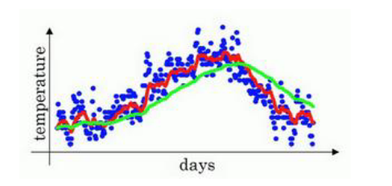</div> 

绿色的曲线要平坦一些，原因在于你多平均了几天的温度，所以这个曲线，波动更小，更加平坦，缺点是曲线进一步右移，因为现在平均的温度值更多，要平均更多的值，指数加权平均公式在温度变化时，适应地更缓慢一些，所以会出现一定延迟。相当于给前一天的值加了太多权重，只有当$\beta$较大时，指数加权平均值适应的更缓慢一些。

#### 2.2.4 理解指数加权平均

回忆上文中计算指数加权平均数的关键方程：
$$
V_t = \beta V_{t - 1} + (1 - \beta) \theta_t
$$
当$\beta=0.9$的时候，得到的结果是红线，如果它更接近$1$，结果就是绿线，如果小一点就是黄线。

<div align=center>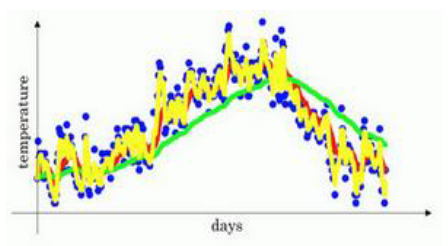</div> 

根据递归定义，将等式拆开：
$$
V_{100} = 0.1 \theta_{100} + 0.9 (0.1 \theta_{99} + 0.9 v_{98})
$$
这是一个加和并平均，计算$V_{100}$是通过，把两个函数对应的元素，然后求和，用这个数值$100$号数据值乘以$0.1$，以此类推，将器与指数衰减函数相乘，求和，得到最终结果。

指数加权平均数的好处之一在于，它占用了极少的内存。电脑内存中只占用一行数字而已，然后把最新数据带入公式，不断覆盖即可。相比于计算移动窗，它需要在电脑中存取过去几天的总和，再除以对应的天数，如此会得到更好的估计，但是缺点就是会占用更多的内存，执行更加复杂，计算成本也更加高昂。

#### 2.2.5 指数加权平均的偏差修复

偏差修正，可以使得平均数运算更加准确。其方法是再估测初期，不用$v_t$，而使用$\frac{v_t}{1- \beta^t}$，$t$就是现在的天数，通过这样的操作可以得到加权平均数，并除去了偏差。随着$t$的增加，$\beta^t$接近于$0$，所以当$t$很大时，偏差修正几乎没有作用，因此当$t$较大的时候，就基本和原本保持一致了。

在机器学习中，计算指数加权平均数的大部分时候，不需要取关注偏差修正，因为大部分人宁愿熬过初始时期，拿到具有偏差的估测，然后继续计算下去。

#### 2.2.6 动量梯度下降法

动量梯度下降法，运行速度几乎总是快于标准的梯度下降算法，简而言之，基本的想法就是计算梯度的指数加权平均数，并利用该梯度更新你的权重。

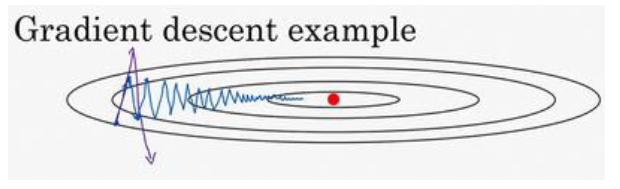

理解动量梯度下降法，其实就与物理中的惯性定律一致，如果当前计算的梯度方向和之前的梯度方向一致，那么就会加快该方向的梯度下降；相反，如果当前位置的梯度方向与之前梯度方向相反，那么就会使该方向的梯度减速。

具体的计算方式就是先计算$v_{d_W} = \beta v_{d_W} + (1 - \beta) d_W$，这跟我们之前的计算相似，同样的方式计算$V_{db}$，然后更新权重，$W:=W-\alpha v_{dW}$，同样$b:=b-\alpha v_{db}$，这样就可以减缓梯度下降的幅度。

#### 2.2.7 RMSprop

$RMSprop$算法，全称是$root\ mean \ square \ prop$算法，它也可以加速梯度下降。

用上一节的作为例子，如果你执行梯度下降，虽然横轴放行正在推进，但纵轴方向会有大幅度的摆动，RMSprop算法能够实现，减缓纵轴方向波动，加速横轴方向。

我们用到新的符号$S_{dW}$，更新的方式：$S_{dW} = \beta S_{dW} + (1 - \beta) dW^2$，同理$b$的更新方式$S_{db} = \beta S_{db} + (1 - \beta)db^2$。

接着$RMSprop$会这样更新参数值，$W := W - \alpha \frac{dW}{\sqrt{S_{dW}}}，\ b:=b - \alpha\frac{db}{\sqrt{S_{db}}}$。

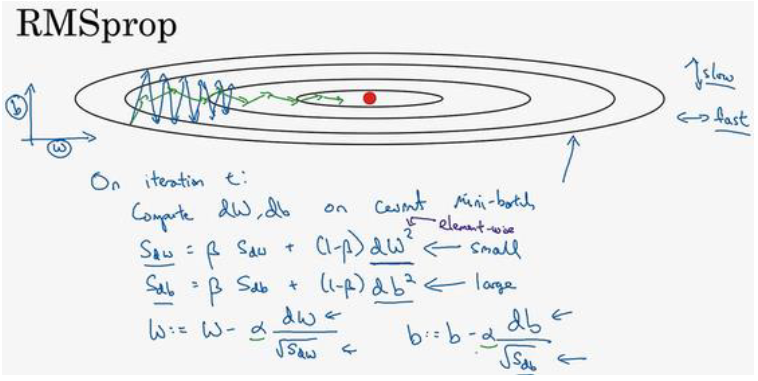

看这些微分，垂直方向的要比水平方向的大得多，所以斜率在$b$方向特别大，所以这些微分中，$db$较大，$dW$较小。那么$S_{db}$也会较大。$S_{dW}$会小一些，结果就是纵轴上更新要被一个较大的数相除，这能消除摆动，水平放下的更新则被较小的数相除。最终的更新曲线为绿线所示，还有一个影响就是，你可以用一个更大的学习率$\alpha$，然后加快学习，而不须在纵轴上垂直方向偏离。

要确保你的算法不会除以$0$，如果$S_{dW}$的平方根趋近于$0$的话，就会导致得到的答案就非常大，为了确保数值的稳定。在实际操练的时候。你要在分母加上一个很小的数 $\epsilon$，一般取$10^{-8}$。

#### 2.2.8 Adam优化算法

`Adam`优化算法基本上就是将`Momentum`和`RMSprop`结合一起。具体的实现流程如下：

1）首先初始化参数，$v_{dw} = 0，S_{dW}=0，v_{db} = 0，S_{db} = 0$。

2）接着计算`Monmentum`指数加权平均数，所以 $v_{dW} = \beta_1v_{dW} + (1 - \beta_1)dW$，参数 $b$ 同理计算。

3）接着使用`RMSprop`进行更新，即用不同的超参数 $\beta_2$,$S_{dw} = \beta_2S_{dW}+(1 - \beta_2)dW^2$，参数 $b$ 同理计算。

4）使用`Adam`算法还需要计算偏差修正，$v_{dW}^{corrected}$，修正也就是偏差修正之后。
$$
v_{dW}^{corrected} = \frac{v_{dW}}{1 - \beta_1^t}，v_{db}^{corrected} = \frac{v_{db}}{1 - \beta_1^t}
$$

$$
S_{dW}^{corrected} = \frac{v_{dW}}{1 - \beta_2^t}，S_{db}^{corrected} = \frac{v_{db}}{1 - \beta_2^t}
$$


5）最后用修正后的参数，更新权重，$W:=W-\frac{\alpha v_{dW}^{corrected}}{\sqrt{S_{dW}^{corrected}} + \epsilon}，b:=b-\frac{\alpha v_{db}^{corrected}}{\sqrt{S_{db}^{corrected}} + \epsilon}$。

本算法中有许多超参数，超参数学习率$\alpha$很重要，也经常需要调试，你可以尝试一系列值，然后看哪个有效。$\beta_1$通常选取$0.9$，$\beta_2$通常选取$0.999$。

#### 2.2.9 学习率衰减

加快学习算法的一个办法就是随时间慢慢减少学习率，称之为*学习率衰减*。

实现学习率衰减，可以拆分不同的`mini-batch`，第一次遍历训练集叫做第一代，第二次叫做第二代，以此类推，你可以将$\alpha$学习率设为$\alpha= \frac{1}{1 + decayrate \times epoch - num}\alpha_0$(dacay-rate称为衰减率，epoch-num为代数，$\alpha_0$为初始学习率)，学习率是另一个需要调整的参数。

根据上述公式，你的学习率呈递减趋势。如果你想用学习率衰减，要做的是要去尝试不同的值，包括超参数$a_0$，以及超参数衰退率。

#### 2.2.10 局部最优问题

事实上，如果你要创建一个神经网络，通常梯度为零的点并不是这个图中的局部最优点，实际上成本函数的零梯度点，通常是鞍点。如果局部最优不是问题，那么问题是什么？结果是平稳段会减缓学习，平稳段是一块区域，其中导数长时间接近于0，如果你在此处，梯度会从曲面从从上向下下降，因为梯度等于或接近0，曲面很平坦，你得花上很长时间慢慢抵达平稳段的这个点，因为左边或右边的随机扰动。

平稳段是一个问题，这样使得学习十分缓慢，这也是像Momentum或是RMSprop，Adam这样的算法，能够加速学习算法的地方。在这些情况下，更成熟的优化算法，如Adam算法，能够加快速度，让你尽早往下走出平稳段。

<h3 id = "2.3">
2.3 超参数调试、Batch正则化和程序框架
</h3>

#### 2.3.1 调试处理

在训练神经网络中调节超参数比其他的更为重要，最广泛的学习应用$\alpha$，学习速率是需要调试的最重要的超参数。

在深度学习领域，通常采用随机取点的方法去调试超参数的选值。在一个网格中随机的选取`25`个点，然后选择那个参数效果最好。

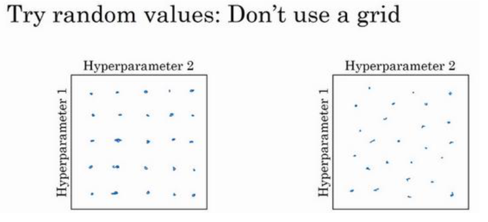

当给定一个超参数时，另一个惯例是采用由粗糙到精细的策略。即如果某块参数的效果很好，那么就圈出这块区域，然后再在这块区域中画点，再递归找效果更好的点。

#### 2.3.2 为超参数选择合适的范围

随机取值并并不是在有效范围内的随机均匀取值，而是选择合适的标尺，用于研究这些超参数。

假设你在搜索超参数$\alpha$，假设你认为它的最小值为 $0.0001$，最大值 $1$。如果你画一条数轴，沿其随机均匀分布，那$90\%$的数据都会在$0.1$~$1$之间，那么取到小于$0.1$的部分概率就很小，这看上去不太对。

这种情况下，使用对数标尺搜索超参数的方式会更合理。在$Python$中使用`r=-4*np.random.rand()`。然后令$a$的值等于$10^r$，所以，第一行可以得出$r \in [-4, 0]$，然后你设置得到的$a$的值。

另一个棘手的例子是调试参数 $\beta$，用于计算指数的加权平均数。假设认为 $\beta$ 是$0.9$~$0.999$之间的某一个值。显然，不能用线性轴去选取值，这个问题最好的办法就是先求出$1 - \beta$，这个值在$0.1$~$0.001$区间内，这时候就把该问题转换成上一个问题。

之所以不用线性轴取值的原因是当$\beta$越接近$1$，所得到的结果灵敏度会变化，即使$\beta$的变化很小。因为它是指数加权平均数。所求的平均数个数为$\frac{1}{1 - \beta}$。

如果没有选取正确的标尺，也没关系，只要选取的数值总量足够多，也会得到不错的效果。

#### 2.3.4 归一化网络的激活函数

$Batch$归一化会使你的参数搜索问题变得很容易，使神经网络对超参数的选择更加稳固，超参数的范围会更加庞大，工作效果也更好，也更好训练，甚至是深层网络。

$Batch$归一化的作用，就是在输入下一层之前，先做归一化处理加快这一层的训练。实践中，通常是在激活函数之前将值$z^{[l]}$做归一化。

采用归一化的方式如下：
$$
\mu = \frac{1}{m} \sum^{m}_{i = 1} z^{(i)}
$$

$$
\sigma^2 = \frac{1}{m} \sum^{m}_{i = 1} (z_i - \mu)^2
$$

$$
z^{(i)}_{norm}= \frac{z^{(i)} - \mu}{\sqrt{\sigma^2 + \epsilon}}
$$

为了保证数值稳定，因此加上一个$\epsilon$常数。此时$z$值的平均值为$0$和标准单位方差。但是我们不想让隐藏单元总是含有平均值$0$和方差$1$，也许隐藏单元有了不同的分布会有意义，所以我们所需要做的计算，我们称之为$\tilde{z}^{(i)}$，$\tilde{z}^{(i)} = \gamma z_{norm}^{(i)} + \beta$，这里$\gamma$和$\beta$是你模型的学习参数，所哟我们所使用的梯度下降或一些其他类似的梯度下降算法，都要去更新这两个值，正如更新神经网络的参数一样。

事实上$\gamma = \sqrt{\sigma^2 + \epsilon}$，对应着就是标准差；$\beta$等于$\mu$，对应的就是均值。

通过合理的设定这两个参数，能够使你构造含其它平均值和方差的隐藏单元值。

#### 2.3.5 将 Batch Norm 拟合进神经网络

