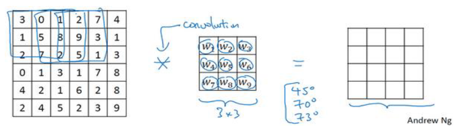
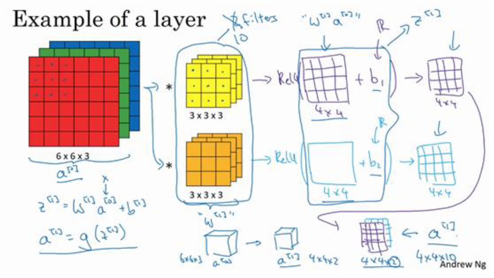

## 第3章 卷积神经网络

> [3.1 卷积神经网络](#3.1)
>
> [3.2 深度卷积网络：实例探究](#3.2)

<h3 id = "3.1">
3.1 卷积神经网络
</h3>

#### 3.1.2 边缘检测示例

假设有一个灰度图像，可以使用一个`3x3`矩阵。在卷积神经网络的术语中，它被称为过滤器。需要构造如下过滤器。在论文中有时也被称为核，而不是过滤器。卷积运算用`*`来表示。如下的卷积核能用来检测垂直边缘。
$$
\left[ \begin{matrix}
	1&		0&		-1\\
	1&		0&		-1\\
	1&		0&		-1\\
\end{matrix} \right]
$$
在`tensorflow`中，二维卷积运算的函数叫做`tf.conv2d`。

#### 3.1.3 更多边缘检测内容

`Sobel`过滤器，它的优点在于增加了中间一行元素的权重，这使得结果的鲁棒性会更高一点。
$$
\left[ \begin{matrix}
	1&		0&		-1\\
	2&		0&		-2\\
	1&		0&		-1\\
\end{matrix} \right]
$$
`Scharr`过滤器，它有着和之前完全不同的特性，实际上也是一种垂直边缘检测。

$$
\left[ \begin{matrix}
	3&		0&		-3\\
	10&		0&		-10\\
	3&		0&		-3\\
\end{matrix} \right]
$$
为了检测复杂图像的边缘，比一定要去选择这9个数字，而是把这9个数字当作餐宿，并且之后可以学习使用反向传播算法，其目标就是去理解这9个参数。

#### 3.1.4 Padding

为了构建深度神经网络，需要使用一个基本的卷积操作就是padding。

直接对图形使用卷积操作，会存在两个缺点，一个缺点是会导致，图像的大小会减小；另一个存在的缺点是边缘部分的图像信息会丢失，因为相比于内部的像素，边缘部分的输出中采用的较少。

为了解决这两个问题，一是输出缩小。在构建一个深层的神经网络时，如果每层都会将图片缩小，那么最终会得到一个很小的图像。另一个问题是大部分信息都丢失了。

为了解决该问题，可以在卷积操作之前，先在图像外层填充`p`层像素。习惯上，可以用0去填充。这就是`padding`卷积。

至于选择填充多少像素（外圈加几层），通常有两种选择，分别叫做`Valid`卷积和`Same`卷积。

前者表示不填充，那么卷积后的图像就会缩小。

后者方法表示你输入与输出的像素是一致的。

#### 3.1.5 卷积步长

`Padding`是`p`，步幅为`s`输出的尺寸如下公式：
$$
\lfloor \frac{n - 2p - f}{s} + 1\rfloor \times \lfloor \frac{n + 2p-f}{s} + 1 \rfloor
$$
事实上在信号处理中和某些数学分支中，在卷积的定义包含翻转，使得卷积运算符拥有这个性质，例如结合律，这对于一些信号处理应用来说是很好的，但对于深度神经网络来说它真的不重要，因此省略了这个双重镜像操作，简化了代码，并使得神经网络也能正常工作。

#### 3.1.6 三维卷积

比如要  检测一个`RBG`彩色图像的特征，对于三维图像，就需要用三维的过滤器来做卷积操作，它的维度`3x3x3`，这样这个过滤器也就有三层，对应三个通道。如果要对某个通道做边缘检测，那就设置该通道，其他层全部改成`0`。

按照计算机视觉的惯例，当输入特定的高度和通道数是，过滤器可以有不同的高度，不同宽度，但是必须保证通道数一致。理论上，过滤器只关注红色通道，或只关注绿色或蓝色通道也是可行的。

立方体卷积可以用它的一小部分直接再三个通道`RGB`图像上进行操作，更重要的是，通过设置多个过滤器，可以得到多个不同的特征，并且输出的通道数等于你要检测的特征数。

#### 3.1.7 单层卷积网络

假设通过两个过滤器卷积处理一个三维图像，并输出两个不同的矩阵。最终形成一个卷积神经网络，然后增加偏差。并应用一个非线性函数，为了说明，它是一个非线性激活函数ReLU，输出结果为同等大小的矩阵。

注意前向传播的一个操作就是$z^{[1]} = W^{[1]}a^{[0]}+b^{[1]}$。执行非线性函数得到激活函数$a^{[1]}$。这些过滤器我们用变量$W^{[1]}$来表示。在卷积过程中，对这27个数操作，其实就是两个27，因为使用了两个过滤器。

上述过程中有两个过滤器，也就是两个特征，如果采用了10个过滤器，那么最终得到的输出图像就会是`4x4x10`的输出图像。

注意一点就是，无论图像有多大，实际的参数数量是始终不变的。即使图片很大，参数却很少，这就是卷积神经网络的一个特征，叫做“避免过拟合”。

#### 3.1.9 卷积池

