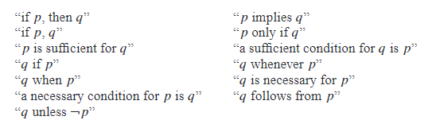
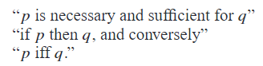
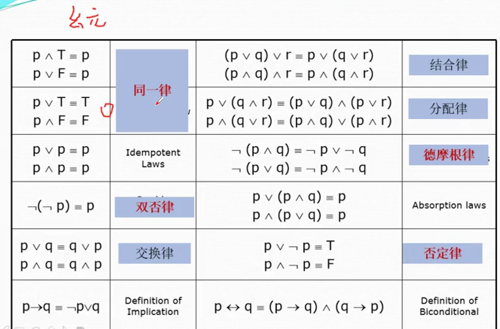
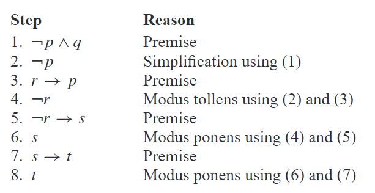

## 第1章 逻辑和证明

> [1.1 命题逻辑](#1.1) 
>
> [1.2 逻辑等价式](#1.2)
>
> [1.3 谓词与量词](#1.3)
>
> [1.4 嵌套量词](#1.4)
>
> [1.5 推理规则](#1.5)
>
> [1.6 证明方法与策略](#1.6)

<h3 id = "1.1">
1.1 命题逻辑
</h3>

#### 1.1.2 命题

逻辑的基本成分——命题。*命题*是一个或真或假的陈述语句，即一个陈述事实的句子，但不能即真即假。

我们使用字母来表示命题变元，代表命题的变量。我们习惯上使用`p,q,r,s,...`表示命题。如果一个命题是真命题，它的真值就是真，用`T`来表示；如果一个命题是假命题，它的真值就是假，用`F`来表示。

定义一：令$p$为一命题，则$p$的否定表示为$\lnot p$,表示"不是$p$所发生的情况"。(Negation)

命题的否定也可以看作非运算符作用在命题上的结果，*非运算符*从一个已有的命题构造出了一个新命题。

定义二：令$p$和$q$为命题，$p$、$q$的合取用$p \land q$表示，即命题“$p$并且$q$”。当两个都是真时，合取命题才为真，否则就是假。(Conjunction)

注意在逻辑中，在一个合取的“但是”一词有时可以用“并且”代替。

定义三：令$p$和$q$为命题，$p$、$q$的析取用$p \lor q$表示，当两个命题都为假时，整个命题为假，否则为真。

连接词“或”在析取中的使用对应于词“或”包含的两种情况之一。(Disjunction)

定义四：令$p$和$q$为命题，$p$和$q$的异或时一个命题，当两个中只有一个为真时命题为真，否则为假。

#### 1.1.3 条件语句

*定义五*：令$p$和$q$为命题，条件语句$p \rightarrow  q$命题“若$p$，则$q$”。当$p$为真而$q$为假时，条件语句为假，否则为真。其中$p$表示条件语句中的假设或前提，$q$表示结论或推论。(Implication)

通常在表达中会有如下的句式：

*逆、倒置与反（converse，contrapositive，inverse）*：

由条件语句$p \rightarrow  q$可以构成一些新的条件语句。命题$q \rightarrow  p$称为$p \rightarrow  q$的逆蕴含，二$p \rightarrow  q$的倒置蕴含是命题$\lnot q \rightarrow \lnot p$。命题$\lnot p \rightarrow \lnot q$ 称为$p \rightarrow  q$的反蕴含。只有倒置蕴含和原来的真值是相等的，即为**等价**的。

*定义六*：令$p$和$q$为命题，*双条件语句*$p \leftrightarrow q$是命题“p当且仅当q”。当$p$和$q$有同样的真值时，双条件语句为真，否则为假。双条件也成为*双蕴含*。

<h3 id = "1.2">
1.2 逻辑等价式
</h3>

定义一：一个复合命题始终为真，称为永真式（tautology）；一个复合命题始终为假，称为永假式或矛盾（contradiction）；其余的都成为可能式（contradiction）。

例子：$p \lor \lnot p$就是永真式，$p \land \lnot p$就是永假式。

#### 1.2.1 逻辑等价

定义二：如果两个复合命题是逻辑等价的，那么$p \leftrightarrow q$是永真式。

常用的逻辑等价式子：

<h3 id = "1.3">
1.3 谓词与量词
</h3>

#### 1.3.1 谓词逻辑

例如语句“$x > 3$”有两部分，第一部分即变量$x$是语句的主语；第二部分**谓词**“$>3$”，表明语句的主语会有的一个性质，我们用$P(x)$表示这个语句，用$P$表示这个语句的谓词，$x$表示变量。也把语句$P(x)$说成是命题函数$P$在$x$的值。一旦给变量$x$赋上一个值，语句$P(x)$就成为命题，因而有真值。因此，可知$P(x)$本身无真假，要带上量词陈述。

#### 1.3.2 量词

量化表示谓词在一定范围的十五上成立的长度。在语言中，单词“所有”、“一些”、“许多”、“没有”、“没几个”被用于表示量化。这里只讨论两种量化：全称量化（Universal），它告诉我们一个谓词在所考虑的每一对象中都为真，符号用$\forall$表示；存在量化（Existential），它告诉我们一个谓词对所考虑中的一个或多个对象成真，符号用$\exists$表示。

|      命题       |        何时为真         |         何时为假          |
| :-------------: | :---------------------: | :-----------------------: |
| $\forall xP(x)$ | 对每一个$x$，$P(x)$成立 |  有一个$x$，使$P(x)$为假  |
| $\exists xP(x)$ | 有一个$x$，使$P(x)$为真 | 对每一个$x$，$P(x)$都为假 |

定义一：全称量化是对变量在其论域的所有值为真。

语句$\forall xP(x)$的本质就是将所有的情况合取:
$$
P(x_i) \land P(x_2) \land ... \land P(x_n)
$$
定义二：存在量化是指命题对论域中存在一个元素满足谓词，

语句$\exists xP(x)$的本质就是将所有的情况析取：
$$
P(x_i) \lor P(x_2) \lor ... \lor P(x_n)
$$

#### 1.3.5 约束论域量词

一个缩略符号长辈用来约束量词的论域。在这个符号里，在量词后有一个变量必须满足的条件。

例如：语句$\forall x<0(x^2 > 0)$表示对于每个实数$x < 0$，则$x^2 > 0$，这个语句与$\forall x(x < 0 \rightarrow x^2 > 0)$意义相同。

#### 1.3.6 量词的优先级

量词$\exists$和$\forall$比所有命题演算的逻辑运算符有更高的优先级。

#### 1.3.7 绑定变量

当量词作用于变量$x$时，我们说此变量的这一次出现为绑定的，没有被量词绑定或设置为与某一特定值相等的变量出现称为自由的。出现在命题函数中的所有变量必须是绑定的，才能把所命题函数转变为命题。可以用全称量词、存在量词和赋值来完成转变。量词只能管辖紧跟其后的命题函数，或者其后整个括号内的命题函数。

#### 1.3.8 涉及量词的逻辑等价

定义三：设计谓词和量词的语句是逻辑等价的，当且仅当无论什么谓词带入这些语句，也无论用哪个个体论域对这些命题函数的变量上，它们都有相同的真值。

#### 1.3.9 否定量化表达式

考虑量化表达式的否定，例如，考虑语句“班上每个同学都上过微积分”。用全称量词表示就是$\forall xP(x)$.这句语句的否定是“不是班上每个人都上过微积分”，这等价于“班上有个学生没上过微积分”。该语句的量化表达式为$\exists x \lnot P(x)$。

这个例子说明了下面的等价关系：
$$
\lnot \forall x P(x) \equiv \exists x \lnot P(x)
$$
同样方式能推出：
$$
\lnot \exists x Q(x) \equiv \forall x \lnot Q(x)
$$

#### 1.3.10 翻译语句为逻辑表达式

翻译语句的步骤：

1. 先定义逻辑变量，以及谓词逻辑。
2. 再写出逻辑表达式。

当$U$大于表达的范围时，需要定义**特性谓词**所表达的范围。

* 例：Every student in this class has studied calculus.

定义：$x$代表所有学生，$C(x)$表示"studied calculus"，$S(x)$表示"in the class"。
$$
answer:\forall x(S(x) \rightarrow C(x))
$$

注意：如果用$\forall x (S(x) \land C(x))$表示的是“all students in this class and have studied calculus”，与原句的意思不同。

* 例：Some students have visited Mexico.

定义:$x$表示所有人，$S(x)$表示学生，$M(x)$表示去过墨西哥。
$$
answer: \exists x (S(x) \lor M(x))
$$

注意：用$\exists x(S(x) \rightarrow M(x))$是错误的，因为对于不在这个班的人它也是真的。

<h3 id = "1.4">
1.4 嵌套量词
</h3>

有多个量词在一个陈述中，例如：
$$
\forall x \exists y P(x, y)
$$
该命题表示“对于所有的$x$，存在一个$y$满足$P(x, y)$”。读取的方式从左向右阅读。

注意：$\exists x \forall y$和$\forall x \exists y$不是等价的。

嵌套量词的等价关系，实际就是一层一层做等价关系，例如：
$$
\lnot (\forall x \exists y P(x, y)) \equiv \exists x \lnot \exists y P(x, y) \equiv \exists x \forall y \lnot P(x, y)
$$

#### 1.4.1 语句与数量词之间的转换

* The product of two negative integers is positive.

定义：$x$表示integers.
$$
answer: \forall x\forall y((x < 0) \land (y < 0) \rightarrow (x y > 0))
$$

* The average of two positive integers is positive.

定义：$x$表示integers.
$$
answer: \forall x \forall y((x > 0) \land (y > 0) \rightarrow (\frac{x + y}{2} > 0))
$$

* The difference of two negative integer is not necessarily negative.

定义：$x$表示integer.
$$
answer: \exists x \exists y ((x < 0) \land (y < 0) \land (x - y \ge 0))
$$

* The absolute value of the sum of two integers does not exceed the sum of the absolute values of these integers.

定义：$x$表示integer.
$$
answer: \forall x \forall y (|x + y|\le|x| + |y|)
$$

* If a person is female and is a parent, then this person is someone's mother.

定义：$x$表示person.$F(x)$表示为`female`，$P(x)$表示`parent`，$M(x, y)$表示$x$是$y$的母亲。
$$
answer: \forall x \exists y (F(x) \land P(x) \rightarrow M(x, y))
$$

* Everyone has **exactly one** best friend.

定义：$x$表示`person`，$F(x,y)$表示`best friend`。
$$
answer:\forall x \exists y (F(x, y) \land \forall z(z \neq y \rightarrow \lnot F(x, z)))
$$

* There is a woman who has taken a fight on every airline in the world.

定义：$w$表示`woman`，$P(w, f)$表示`taken f`，$Q(f, a)$表示`f`on`a`。
$$
answer: \exists w \forall a \exists f (P(w, f) \land Q(f,a))
$$

<h3 id = "1.5">
1.5 推理规则
</h3>

#### 1.5.3 命题逻辑的推理规则

以下列出最重要的命题逻辑推理规则。

#### 1.5.4 用推理规则建立论证

* Show that the premises “It is not sunny this afternoon and it is colder than yesterday,” “We will go swimming only if it is sunny,” “If we do not go swimming, then we will take a canoe trip,”and “If we take a canoe trip, then we will be home by sunset” lead to the conclusion “We will be home by sunset.”

定义：Let $p$ be the proposition “It is sunny this afternoon,”$q$ the proposition “It is colderthan yesterday,”$r$ the proposition “We will go swimming,”$s$ the proposition “We will take acanoe trip,” and $t$ the proposition “We will be home by sunset.” Then the premises become$¬p∧q$,$r→ p$,$¬r→s$,and$s→t$.  The  conclusion  is  simply $t$. 

#### 1.5.7 带量词命题的推理规则

**全称例示**：从$\forall xP(x)$得出$P(c)$为真。

**全称生成**：对于论域中所有的成员都为真，那么$\forall x P(x)$为真。

**存在例示**：在允许从已经$\exists x P(x)$为真，得出在论域中存在一个使得$P(c)$为真的元素。

**存在生成**：用它在已知使$P(c)$为真时，得出$\exists x P(x)$为真。

<h3 id = "1.6">
1.6 证明方法与策略
</h3>

