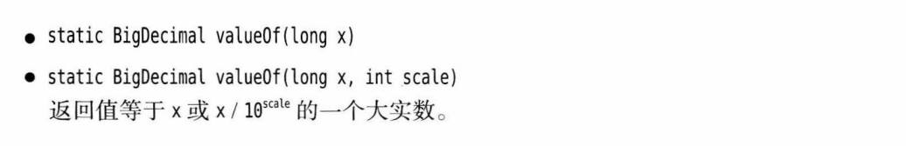
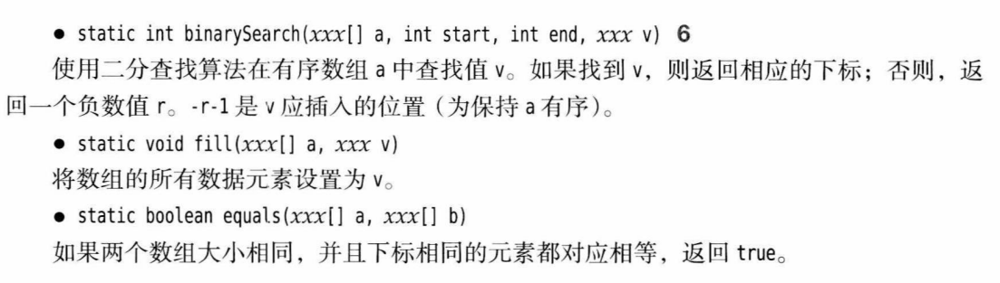

## 第3章 Java的基本程序设计结构

> [3.6 字符串](#3.6)
>
> [3.7 输入与输出](#3.7)
>
> [3.8 控制流程](#3.8)
>
> [3.9 大数](#3.9)
>
> [3.10 数组](#3.10)

<h3 id="3.6">3.6 字符串</h3>

#### 3.6.1 子串

`String`类的`substring`方法可以从一个较大的字符串中提取出一个子串:

```java
String greeting = "Hello";
String s greeting.substring(0, 3);
```

#### 3.6.2 拼接

与绝大部分程序设计语言一样,`Java`语言允许使用`+`连接两个字符串.

```java
String expletive = "Expletive";
String PG13 = "deleted";
String message = expletive + PG13
```

### 3.6.3 不可变字符串

`String`类没有提供修改字符串的方法.如果希望将内容修改可以提取像保留的字符串,再与希望替换的字符拼接.不可变字符串有一个优点:编译器可以让字符串共享,可以想象将各种字符串存放再公共的存储池中,字符串变量指向存储池中相应的位置.如果赋值一个字符串变量,原始字符串与赋值的字符串共享相同的字符.

>C++注解:在C++中字符串定义为字符数组,
>
>即`char greeting[] = "Hello";`
>
>这种认识是错误的,Java字符串大致类似于`char *`指针,
>
>即`char * greeting = "Hello";`
>
>不过,如果对`greeting`做另外一个赋值`greeting = "Howdy";`,这样做不会产生内存泄漏,`Java` 将自动地进行垃圾回收.如果一个内存块不再使用了,系统最终将其回收.

#### 3.6.4 检测字符串是否相等

可以使用字符串的`equals`方法检测两个字符串是否相等,对于表达式:

```java
s.equals(t);
```

如果字符串相等,返回`true`;否则,返回`false`.`s`与`t`可以是字符串变量,也可以是字符串表面量.

一定不能使用`==`来检测两个字符串是否相等,这个运算符只能确定两个字符串是否放再同一个位置上.当然,两个字符串放在同一个位置上,它们必然相等.但是,完全有可能将内容相同的多个字符串副本放到不同的位置上.

#### 3.6.6 码点与代码单元

`Java`字符串由`char`值序列组成,`char`数据类型是一个采用`UTF-16`编码表示`Unicode`码点的代码单元.最常用的`Unicode`字符使用一个代码单元就可以表示,而辅助字符需要一对代码单元表示.

`length`方法将返回采用`UTf-16`编码表示给定字符串所需要的代码单元数量.

#### 3.6.5 String API

以下展示相关的`String API`:


#### 3.6.9 构建字符串

有些时候,需要构建较短的字符串,例如按键或来自文件中的单词.如果采用字符串拼接的方式来达到这个目的,效率会比较低.每次拼接字符串时,都会构建一个新的`String`对象.使用`StringBuilder`类就可以避免这个问题的发生.

如果需要用许多小段的字符串来构建一个字符串,那么应该按照下列步骤进行.首先,构建一个空的字符串构建器:

```java
StringBuilder builder = new StringBuilder();
```

当每次需要添加一部分内容时,就调用`append`方法.

在字符串构造完成时就调用`toString`方法，将可以得到一个`String`对象，其中包含了构建器中的字符序列。

以下列举常用的`API`:


<h3 id= "3.7">3.7 输入与输出
</h3>

#### 3.7.1 读取输入

要想通过控制台进行输入，首先需要构造一个与"标准输入流"`System.in`关联的`Scanner`对象。

```java
Scanner in = new Scanner(System.in);
```

例如,`nextLine`方法将读取一行输入。

```java
String name = in.nextLine();
```

想读取一个单词可以使用:

```java
String firstName = in.next();
```

想读取一个整数，可以使用：

```java
int age = in.nextInt();
```

读取一个`double`类型的数，使用：

```java
double d = in.nextDouble();
```

`Scanner`类定义再`java.util`包中，因此需要在程序最前面添加:

```java
import java.util.*;
```

常见的`API`如下：


#### 3.7.3 文件输入与输出

想要读取一个文件，需要构造一个`Scanner`对象，如下所示：

```java
Scanner in = new Scanner(Path.of("myfile.txt"), StandardCharsets.UTF_8);
```

如果文件名中包含`\`需要用`\\`代替。

> 注解：在这指定了字符编码，读取一个文本文件时，要知道它饿字符编码。如果省略字符编码，则会使用运行这个`Java`程序的机器的“默认编码”.这不是一个好主意，如果在不同的机器上运行这个程序，可能会有不用的表现。

要想写入文件，就需要构造一个`PrintWriter`对象，在构造器中，需要提供文件名和字符编码：

```java
PrintWriter out = new PrintWriter("myfile.txt", StandardCharsets.UTF_8);
```

如果文件不存在，就会创建文件。可以像输出到`System.out`一样使用`print`、`println`以及`printf`命令。

<h3 id="3.8">3.8 控制流程
</h3>

####  3.8.1 块作用域

块(即复合语句)是指由若干条`Java`语句组成的语句，并用一对大括号括起来。块确定了变量的作用域。一个块能嵌套另一个块。但是不能在嵌套的两个块中声明同名的变量。

```java
public static void main(String[] args)
{
	int n;
	{
		int n;    // ERROR !!
	}
}
```

<h3 id="3.9">3.9 大数
</h3>

在`java.math`包中两个很有用的类：`BigInteger`和`BigDecimal`.

使用静态的`valueOf`方法可以将普通的数值转换为大数：

```java
BigIntger a = BigIntger.valueOf(100);
```

对于更大的数，可以使用一个带字符串参数的构造器：

```java
BigInteger reallyBig = new BigInteger("6456464645546254");
```

另外还有一些常量：`BigInteger.ZERO`、`BigInteger.ONE`和`BigInteger.TEN`等。

遗憾的是进行运算时，需要使用大数类中的`add`和`multiply`方法：

```java
BigInteger c = a.add(b);
BigInteger d = c.multiply(b.add(BigInteger.valueOf(2)));
```

>C++注释：与`C++`不同，`Java`没有提供运算符重载功能。程序员无法重定义`+`和`*`运算符来提供运算。

以下是大数常用的`API`：




<h3 id = "3.10">3.10 数组
</h3>

#### 3.10.1 声明数组

下面声明了整型数组`a`:

```java
int[] a;
```

不过这条语句只是声明了变量`a`，并没有将`a`初始化为一个真正的数组，应该使用`new`操作符，创建数组。

```java
int[] a = new int[100];
```

还可以声明一个匿名数组：

```java
new int[] {17, 19, 20, 16}
```

这会分配一个新数组并填入大括号中提供的值。它会统计初始值的个数，并相应的设置数组大小。可以使用这种语法重新初始化一个数组而无需重建新变量。

>注解：在`Java`中，允许长度为`0`的数组。在编写一个结构为数组的方法是，如果碰巧结果为空，这样一个长度为`0`的数组就十分有用。可以如下创建长度为`0`的数组：`new elementType[0]`或`new elementType[] {}`

#### 3.10.4 数组拷贝

在`Java`中，允许将一个数组变量拷贝到另一个数组变量。这是，两个将引用同一个数组：

如果希望将一个数组的所有值拷贝到一个新的数组中去，就要使用`Arrays`类的`copyOf`方法：

```java
int copyArr = Arrays.copyOf(luckNumbers, 2 * luckNumbers.length);
```

第二个参数是新数组的长度，这个方法通常用来增加数组的大小：

如果数组元素是数值型，那么额外的数组将被赋值为`0`；如果整数元素是`Boolean`，则将赋值为`false`。相反，如果长度小于原始数组的长度，则只拷贝前面的值。

> C++注释：`Java`数组与堆栈上的`C++`数组有很大不同，但基本上与在堆上分配的数组指针一样。
>
> `int[] a = new int[100]; // java` 不同于 `int a[100];  // C++`
>
> 而等同于`int *a = new int[100];  // C++`
>
> `Java`中的`[]`运算符被预定义为会完成**越界检查**，而没有指针运算，即不能通过`a+1`得到数组中的下一个元素。 

#### 3.10.6 数组排序

要对数组进行排序，可以使用`Arrays`类中的`sort`方法：

```java
int[] a = new int[1000];
Arrays.sort(a)
```

以下是常用的`API`:




#### 3.10.8 不规则数组

`Java`实际上没有多维数组，只有一维数组。多维数组被解释为“数组的数组”。表达式`balances[i]`引用第`i`个子数组，也就是表格的第`i`行。它本身是一个数组。


由于可以单独的访问数组的某一行，所以可以让两行交换：

```java
double[] temp = balances[i];
balances[i] = balances[i + 1];
balances[i + 1] = temp;
```

