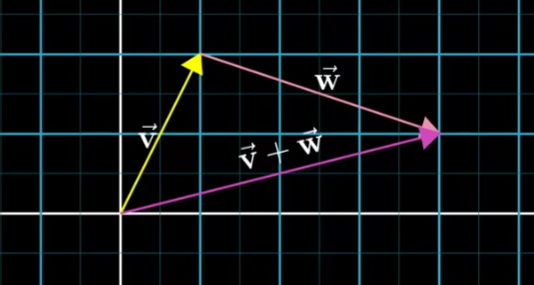
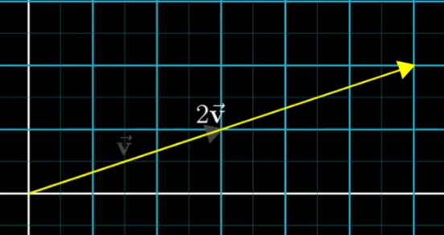

## 01 - 向量究竟是什么？

在线性代数中最基础的组成部分就是向量，一般来说，有三种看待向量的观点，看似不同却有关联。

* 从物理专业学生看来，一个向量是一个空间中的箭头。
* 从CS专业看来，向量是有序的数字列表。
* 从数学家的角度，向量可以是任何东西，只要保证两个向量相加以及数字与向量相乘是有意义的即可。

因此向量加法和向量数乘贯穿整个线性代数，二者是线性代数的核心。两者计算方式也很直接。 

## 01.1 向量相加

为了把它们相加，我们平移第二个向量，使它的起点与第一个向量的终点重合。最终的和就是紫色箭头。

顺便一提，这个向量加法的定义差不多是线性代数中唯一允许向量离开原点的情形。

至于计算方式，总的来说，在“向量是有序的数字列表”观点里。向量就是把对应的元素相加。
$$
\left[ \begin{array}{c}
	a\\
	b\\
\end{array} \right] +\left[ \begin{array}{c}
	c\\
	d\\
\end{array} \right] =\left[ \begin{array}{c}
	a+c\\
	b+d\\
\end{array} \right]
$$

## 01.2 向量数乘

举个例子，给定一个数字`2`，把它与一个给定向量相乘，意味着你把这个向量拉长为原向量的`2`倍。

这种拉伸或压缩，有时会让向量反向的过程称作“缩放”(Scaling)。对于上述的数字`2`，它们用于缩放向量，被称为"标量"（Scalars），它们在线性代数中主要作用就是缩放向量。

---

实际上，无论你怎么看待向量都无所谓，或把向量看作空间中的箭头。看成矩阵表示的观点恰好有漂亮的数值表示与之对应。或把向量当作数字列表，这种观点恰好有漂亮的几何意义与之对应。