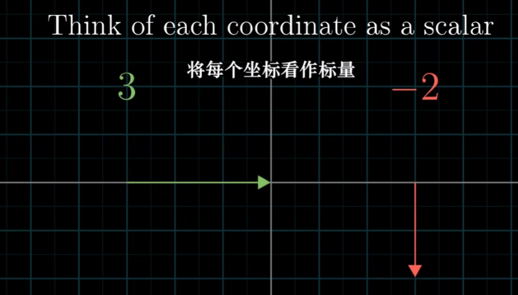
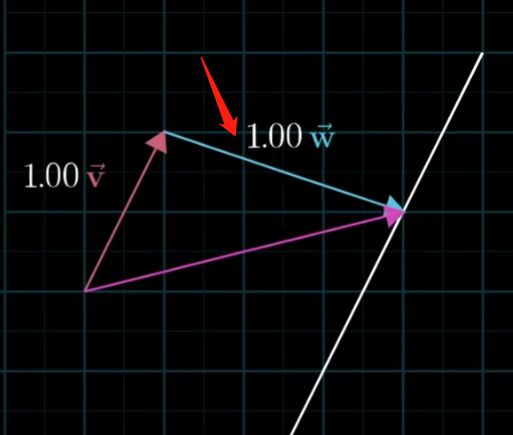
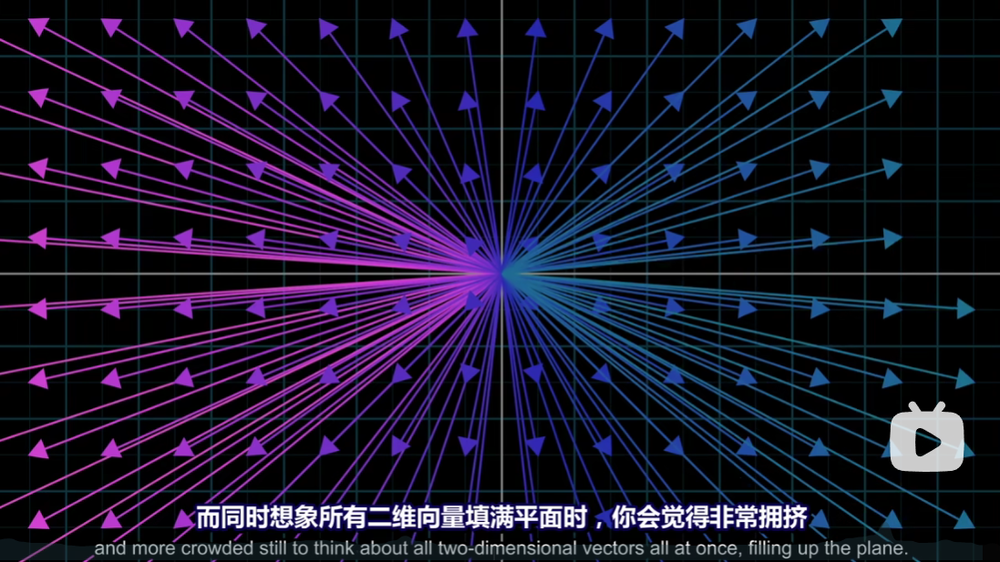

## 02 - 线性组合、张成的空间与基

有一种有趣的方式来看待向量坐标，它对线性代数非常重要。当你看到一对描述向量的数时，比如$(3, -2)$，可以把它每个坐标看作一个标量。也就是说它们如何拉伸或压缩一个向量。

在直角坐标系中，有两个非常特别的向量。分别是$(0,1)$和$(1,0)$，通常叫前者为 $\hat{i}$ 或 $x$ 方向的单位向量。叫后者为 $\hat{j}$ 或 $y$ 方向的单位向量。从这个角度上来看，$(3, -2)$其实是两个经过缩放的向量的和。“缩放向量并且相加”这一概念至关重要。另外，上面两个向量合起来被称为坐标系的基。也就是说，把坐标看作标量时，其实就是基坐标的缩放的对象。

我们根据这两个特殊的向量构建坐标系时，也浮现一个有趣而微妙的问题。如果选择不同的基向量，获得一个合理的新的坐标系。任意取两个不共线的向量作为基底，就能组合成任意二维空间中的向量。

两个数乘向量的和被成为这两个向量的线性组合:
$$
a \vec{v} + v \vec{w}
$$
"线性"从何而来？可以这样来看。如果固定其中一个标量，让另一个标量自由变化，所产生的向量的终点会描出一条直线。（固定箭头向量）

但是，如果当两个初始向量都恰好共线时，所产生的向量的终点被限制在一条过原点的直线上。

实际上还有第三种可能：两个向量都是零向量。那么就只能待在原点上了。

以下还有一些术语，所有可以表示为给定向量线性组合的向量的集合，称作给定向量张成的空间（span）。

通常我们可以将向量看作点，想象一个空间中充满了向量时，会觉的十分拥挤。

通常可以用向量的终点代表该向量。实际上，就不必考虑所有的箭头了，只需要考虑无限大的二维平面本身即可。考虑一个向量时，将它看成箭头，考虑好几个向量，将它们看成点，那么两个共线的向量，它们张成的空间就是一条直线；非共线，它们张成的空间就是一整个二维平面。

我们可以用一些术语来描述它们，即一组向量中至少有一个多余的，没有对张成空间做出任何贡献，我们称它们时“线性相关”的。也就是其中一个向量可以被其他向量的线性组合所表示，因为这个向量已经落在其他向量张成的空间之中。另一方面。如果所有向量都给张成的空间添加了新的维度，它们就被成为是”线性无关“的。

