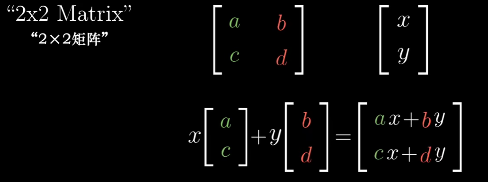
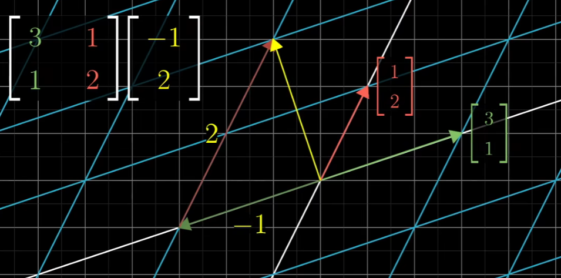
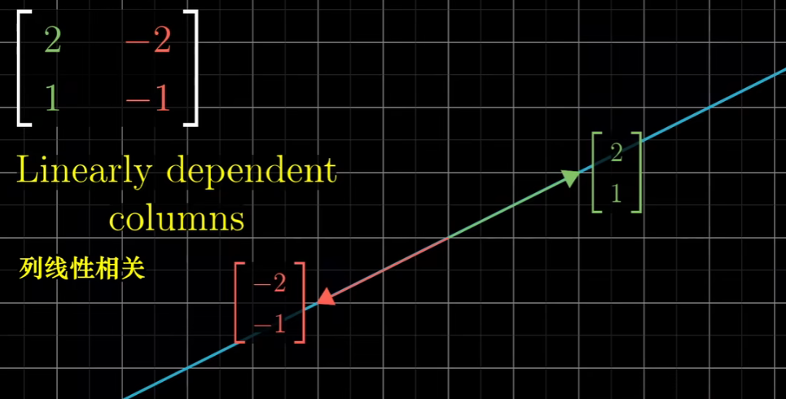

## 03 - 矩阵与线性变换

>很遗憾，矩阵是什么是说不清的。你必须得自己亲眼看看。 -- 墨菲斯

线性变换(Linear transformations)的概念以及它和矩阵的关系，不仅让线性代数的其他内容一目了然，又经常被初次学习线性代数的人忽略。

这一节主要讲解，这些变化在二维空间中长什么样，以及它们如何与矩阵向量乘法关联。

线性变换中的”变换“其实就是”函数“的一种花哨的说法。我们考虑介绍一个向量并且输出一个向量的变换。那么为何还需要用变换来代替函数的说法，因为使用”变换“其实就是在暗示可以使用特定的方法来可视化输入与输出的关系。

如果输入一个向量，然后输出一个向量，我们可以想象输入向量到输出向量的位置。

接下来要理解整个变换，我们可以想象每个输入向量都移动到对应输出向量的位置。

为了体会整个空间形状上的变化，以下会以无限网格上的所有点同时做变换。

线性变换有两条性质，如果满足就称它是线性的。

* 一是直线在变换后仍然保持直线，不能有所弯曲。
* 二是原点保持不变。

总的来说，你应该把线性变换看作是”保持网格线平行且等距分布“的变换。

如何用数值描述线性变换？实际结果是，你只需要记录两个基向量 $\hat{i}$ 和 $\hat{j}$ 向量变换后的位置。其他的向量也会随它们变化。 

比如说，考虑坐标为 $(-1, 2)$ 的向量 $v$，这个向量就是 $-1$ 与 $\hat{i}$ 乘积和 $-2$ 与 $\hat{y}$ 乘积的和。如果使用一些变换，并且跟随着三个向量的运动。”保持网格线平行且等距分布“这一性质有个重要的推论，变换后的向量满足下式:

也就是变换后的向量 $v$ 也是变换后 $\hat{i}$ 与 $\hat{j}$ 同样的线性组合。这意味着，你可以只根据变换后的基底，推断出变换后的 $v$。

可以看到变换后的 $\hat{i}$ 到了 $(1, -2)$， $\hat{j}$ 到了 $(3, 0)$， 那么变换后的 $v = -1\ (1, -2) + 2\ (3, 0)= (5 ,2)$

运用上述公式，就能计算出任何变换后的向量。这也说明一个二维线性变换仅由四个数字完全确定，即变换后的 $\hat{i}$ 的两个坐标与变换后 $\hat{j}$ 的两个坐标。

更一般的情况下，我们来看矩阵 $[[a, b], [c, d]]$ 时会发生什么，记住矩阵只是一个记号，它含有描述一个线性变换的信息。把第一列向量看作变换后的第一个基向量，第二列看作是变换后的第二个基向量。那么此时将这个矩阵作用在一个向量上，就会得到如下结果：

我们甚至可以把它定义为矩阵向量乘法，当然如果直接记住公式是十分简单的事情，但是如果把矩阵乘法看作它们的线性组合，这样的想法就会更加的直观。

如果变换后的 $\hat{i}$ 和变换后的 $\hat{j}$ 是线性相关的，这意味着一个向量是另一个向量的倍数，那么这个线性变换将整个二维空间挤压到它们所在的一条直线上。

最重要的一点就是，每当你看到一个矩阵时，你都可以把它理解为对空间的一种特定变换。