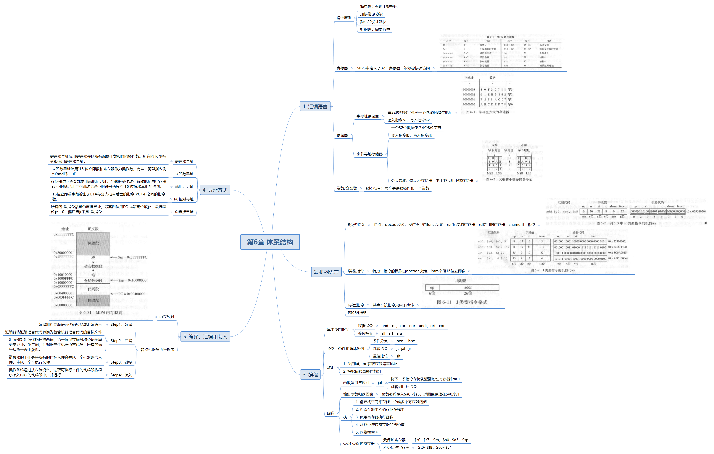

# 数字设计和计算机体系结构

本项目记录数字设计和计算机体系结构第五章开始的内容，并附上思维导图以及习题。

## 目录

* [第5章 常见数字模块](./第5章%20常见数字模块)
* [第6章 体系结构](./第6章%20体系结构)
* [第7章 微体系结构](./第7章%20微体系结构)

## 习题

* [第5章 常见数字模块(习题)](./习题/Part5)
* [第6章 体系结构(习题)](./习题/Part6)

## 思维导图

### 第5章 常见数字模块

### 第6章 体系结构

