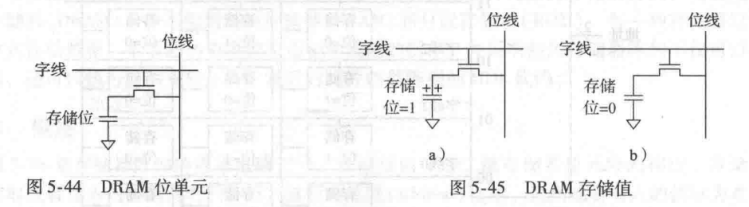
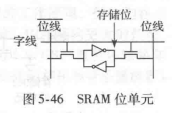
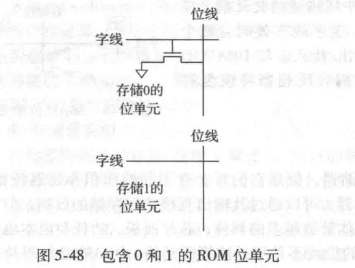
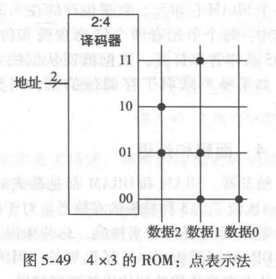

## 第5章 常见数字模块

>[5.2 算术电路](#5.2)
>
>[5.3 数制](#5.3)
>
>[5.4 时序电路模块](#5.4)
>
>[5.5 存储器阵列](#5.5)
>
>[5.6 逻辑阵列](#5.6)
>
>[5.7 总结](#5.7)
>
>[5.8 习题](#5.8)

<h3 id = "5.2">
5.2 算术电路
</h3>

#### 5.2.1 加法

1. 半加器 (half adder)

**半加法器**有两个输入`A`和`B`,两个输入`S`和`Cout`。`S`表示`A`和`B`之和。但是`2`不能用二进制表示，因此用另一输入`Cout`来表示。

元器件图与增值表如下所示：

2. 全加器 (full adder)

**全加器**在半加器的基础上接收进位`Cin`。元器件与增值表如下所示：

3. 进位传播加法器 (carry propagate adder)

一个`N`位的加法器将两个`N`位输入和一位进位`Cin`相加，产生一个`N`位结果`S`和一个输出进位`Cout`。因为进位将会传播到下一位中，这种加法器通常称为进位传播加法器。三种常见的`CPA`实现分别是**行波进位加法器**，**先行进位加法器**和**前缀加法器**。

4. 行波进位加法器 (Ripple-Carry Adder)

构造`N`位进位传播加法器最简单方法就是把`N`个全加器串联起来。行波进位加法器中一级的`Cout`就是下一级的`Cin`。这是模块化和规整化的一个应用范例：全加器模块在一个更大的系统中被多次重用。行波进位加法器有以恶搞缺点，当`N`比较大时，运行速度就会减慢。加法器的延迟$t_{ripple}$直接随位数的增长而增长，如下$t_{FA}$是全加器的延迟。

$$
t_{ripple} = Nt_{FA}
$$

4. 先行进位加法器（Carry-Lookahend Adder）

先行进位加法器是另一种类型的进位传播加法器，它解决进位问题的方法是：把加法器分解成若干块，同时额外增加电路在每块一得到输入进位时就快速算出此块的输出进位。因此它不需要等待进位通过一块内的所有加法器单元，而是直接先行通过每个单元。

先行进位加法器用`G`和`P`两个信号描述一列或者一块如何确定进位输入。在不考虑进位输入的情况下，如果加法器的第`i`列必然产生一个输出进位，则称为产生进位`G`。一个加法器的第`i`列在$A_i$和$B_i$都为`1`是，必产生进位`Ci`。因此第`i`列的产生信号`Gi`可以这样计算:

$$
G_i = A_i B_i
$$

如果在有进位输入时，第`i`列产生一个进位输出，那么称为传播进位。如果`Ai`和`Bi`为`1`，第`i`列就会传播一个进位输入`Ci-1`：

$$
P_i = A_i + B_i
$$

利用这些定义，可以为加法器的特定列重写进位逻辑。如过加法器的第`i`列会产生一个进位$G_i$或者传播进位输入$P_iC_{i-1}$，它就会产生进位输出`Ci`,表达式如下：

$$
C_i=A_iB_i+(A_i + B_i)C_{i-1} = G_i+P_iC_{i-1}
$$

产生和传播的定义可以拓展到多位构成的块。如果一个块在不考虑进位输入的情况下也能产生进位输入，称其产生进位。如果一个块在有进位输入时候产生进位，称其为传播进位。定义$G_{i:j}$和$P_{i:j}$为从第`i`位到第`j`位块的产生和传播信号。

一个块产生一个进位信号的条件时：最高位列产生一个进位，或入股最高列传播进位而且之前的列产生了进位，例如，一个`3`列到第`0`列块产生的逻辑如下：

$$
G_{3:0}=G_3+P_3(G_2 + P_2(G_1 + P_1G_0))
$$

一个块传播进位的条件：块中所有的列都能传播进位，传播逻辑如下：

$$
P_{3:0}=P_3P_2P_1P_0
$$

使用块的产生和传播信号，可以根据块的进位输入$C_j$快速计算除块的进位输出$C_i$

$$
C_i = G_{i:j} + P_{i:j}C_j
$$

所有的`CLA`单元同时地计算一位并产生块的生成和传播信号。关键路径从首个`ClA`块中计算$G_0$和$G_{3:0}$开始。接着$C_{in}$直接通过每块中的门电路向前传输，直到最后。在大型的加法器中，这会比等待所有的进位波式通过每一个加法器快很多。最后，关键路径通过最后一个块中包含的短行波进位加法器。因此，一个分解成`k`位块的`N`位加法器延迟为：

$$
t_{CLA}=t_{pg}+t_{pg\_\ block}+(\frac{N}{k}-1)t_{AND \_\ OR}+kt_{FA}
$$

表达式详解：

* $t_{pg}$：表示每个全加器生成产生信号与传播信号，这个过程只会用到一个逻辑门。
* $t_{pg\_\ block}$:表示在$k$位快中的产生信号。这个过程会用到$2k$个逻辑门。
* $t_{AND\_\ OR}$：表示单个快产生进位信号的时间，此时这个需要$2$个逻辑门。从最低位块，向最高位块需要传播的$\frac{N}{k} - 1$，减一表示最高位块，不急着去算进位信号。
* $t_{FA}$：表示每个小块计算需要的时间，所有小块都是并行计算的，所以计算的是一个小块中传播的时间。

5. 前缀加法器（prefix adder）

前缀加法器能更能快的进行加法的运算，采用倍增的思想，分块计算，它们首先以两列一组计算`G`和`P`，之后是`4`位，再是`8`，以此类推，知道产生每一列的产生信号。从这些产生信号中计算和。

#### 5.2.2 减法

减法非常简单，改变减数的符号，然后做加法。改变二进制补码的符号就是反转所有的位，然后加`1`。

为了计算 $Y=A-B$，首先创建$B$的二进制补码。反转$B$的所有位得到$\bar{B}$,然后加`1`得到$-B=\bar{B}+1$。把这个值与被减数`A`相加，得到$Y=A+\bar{B}+1=A-B$。可以通过进位传播加法器得到和，其中设置$C_{in} = 1$，加数和被加数分别为$A$和$\bar{B}$。如图为减法器的符号以及实现。

#### 5.2.3 比较器

比较器的作用时判断两个二进制是否相等，或者一个比另一个大还是小。比较器的输入为两个$N$为而二进制$A$和$B$。

有两种常见类型的比较器。**相等比较器**产生一个输出，说明是否相等；**量值比较器**产生一个或者多个输出，说明两者的关系值。

1. 相等比较器

相等比较器的硬件相对简单，首先通过`XNOR`门电路检查每一列的对应位是否相等。如果列的每一位都相等，则它们就相等。

2. 量值比较器

量值比较器首先计算$A-B$的值，然后检查结果的符号位（最高有效位），如果结果是负的（即符号位为1），则$A$小于$B$；否则，$A$大于或等于$B$。

#### 5.2.4 算术逻辑单元

算术逻辑单元(Arithmetic/Logical Unit, ALU)将多种算术和逻辑运算组合到一个单元内。典型的算术逻辑单元能执行加法、减法、量值比较、`AND`和`OR`运算。`ALU`是大多数计算机的核心。

给出一个具有`N`位输入和`N`位输出的算术逻辑单元的电路符号。算法逻辑单元接受说明执行哪个功能的控制信号`F`。如下列出了`ALU`可以执行的典型功能。

该`ALU`包含一个`N`位加法器和`N`个`2`输入`AND`和`OR`门；反相器；当$F_2$控制信号有效时反转输入`B`的复用器。`4:1`复用器根据$F_{1:0}$控制信号选择所需要的功能。

`ALU`中的算术和逻辑单元对`A`和`BB`进行运算。`BB`是$B$和$\bar B$，取决于$F_2$。如果$F_{1:0}=00$，则输出复用器就选择`AND`。如果$F_{1:0}=01$，则输出复用器就选择`OR`。如果$F_{1:0}=10$，则算术逻辑单元就执行加法或减法。做加法还是减法取决于$F_2$。

当$F_{2:0}=111$时，算术逻辑单元就执行小于则置位，当$A < B$时，$Y = 1$；否则，$Y = 0$。

通过计算$S=A-B$实现$SLT$。如果$S$是负数，则$A<B$。*零扩展单元*通过将它的`1`位输入与高位的`0`连接起来产生`N`位输出。`S`的符号位（第N-1位）是零扩展单元的输入。

#### 5.2.5 移位器和循环移位器

*移位器*和*循环移位器*用于移动位并完成`2的幂次`的乘法或除法。

* *逻辑移位器*：左移（LSL）或者右移（LSR）数，以`0`填充空位。 例：$11001\ LSR\ 2 = 00110;\ 11001\ LSL\ 2 = 00100$

* *算术移位器*：与逻辑移位器一样，但**算术右移**时会把原来数据的最高有效位填充在新数据的最高有效位上，这对于有符号数的乘法或者除法很有用。**算术左移**与逻辑左移一致。

* *循环移位器*：循环移动数字，这样从一端一走的位重新填充到另一端的空位上。

一个`N`位移位器可以用`N`个$N:1$复用器构成。根据$log_2N$位选择线的值，输入从位`0`移动到位`N-1`。

#### 5.2.6 乘法

#### 5.2.7 除法

<h3 id = "5.3">
5.3 数制
</h3>

定点数与十进制类似，有些位表示整数部分，其余位表示小数部分。浮点数和科学计数法相似，包括尾数和阶码。

#### 5.3.1 定点数

*定点表示法*(fixed-pointnotation)有一个位于整数和小数位之间的隐含的二进制小数点，类·似于通常在十进制中整数和小数点之间的十进制小数点。例如，给出了一个有`4`个整数位和`4`个小数位的定点数。如下图所示，给出了一个有`4`个整数位和`4`个小数位的定点数。把隐含的二进制小数点以灰色标识出来，标识其十进制数值。

有符号定点数可以用二进制补码或者带符号的原码表示，给出了`-2.375`的定点数表示法，其中包括了`4`个整数位和`4`个小数位。为了便于阅读，隐含的二进制小数点以灰色标注出来。在带符号的原码中，最高有效位用于表示符号。而二进制补码表示是将数的绝对值取反加一。

除非给除这些数的解释，否则无法知道是否存在隐含的二进制小数点。

#### 5.3.2 浮点数

浮点数包含*符号(sign)*、*尾数（mantissa）*、*基数（base）*和*阶码（exponent）*如下图所示。

例：32位浮点数表示十进制数`228`的浮点数。

首先将十进制数转换为二进制数：$228_{10} = 11100100_2=1.11001 \times 2 ^7$。在尾数部分第一位总是为`1`，因此不需要存储它。它成为*隐含前导 1*。由于阶码需要表示正数和负数阶码，为了能达到这一目的，浮点数使用了*偏置阶码*，它是原始阶码加上一个常数偏置。`32`为浮点数使用的偏置是`127`。因此上述表示的最终结果如下：

1. 特殊情况：0、$\pm \infty $ 和 $NaN$

2. 单精度和双精度格式

32为浮点数。这种格式称为*单精度浮点数*。`IEEE 754` 标准还定义了`64位`*双精度浮点数*以便提供更搞精度和更大的取值范围。

正常的单精度数的取值范围是$\pm 1.175494 \times 10^{-38} - \pm3.402824 \times10^{38}$。它们有`7`位有效的十进制数字(因为$2^{-24}=10^{-7}$)。类似，双精度数的取值范围，精度为`15`位有效十进制数字。

3. 舍入

舍入模式有：1）向上舍；2）向下舍；3）向零舍；4）向最近端舍。默认的舍入模式就是第四种。如果在第四种模式下，两端的距离一样，则选择小数部分最低有效位为`0`的那个数。

4. 浮点数加法

同符号的浮点数加法的步骤如下：

1） 提取阶码和小数位
2） 加上前导1，形成尾数
3） 比较阶码
4） 如果需要，对较小的尾数位移
5） 尾数相加
6） 规范化尾数，并在需要时调整阶码
7） 舍入结果
8） 把阶码和小数组成浮点数

<h3 id = "5.4">
5.4 时序电路模块
</h3>

#### 5.4.1 计数器

`N`位二进制计数器包含带有时钟和复位输入、`N`位输出`Q`的时序算术电路。*复位*(Reset)将输出初始化位`0`。然后，计数器在每个时钟的上升沿递增`1`，以二进制顺序输出所有$2^N$种可能的值。

#### 5.4.2 移位寄存器

*移位寄存器*包括时钟、串行输入$S_{in}$、串行输入$S_{out}$和$N$位并行输出$Q_{N-1:0}$。在时钟的每个一个上升沿，从$S_{in}$移入一个新的位，所有后续内容都向前移动，移位寄存器的最后一位在$S_{out}$中。移位寄存器可以看错串行导并行转换器。输入由$S_{in}$以串行方式提供一次一位。`N`周期后可以在`Q`中并行访问。

一个相关的电路时*并行*到*串行*的转换器。并行加载`N`位，然后一次移出一位。

<h3 id = "5.5">
5.5 存储器阵列
</h3>
数字系统还*存储器(memory)*用来存储电路使用过的数据和生成的数据。用触发器组成的寄存器是一种存储少量数据的存储器。本节介绍可以有效存储大量数据的*存储器阵列（memory array）*。

以下介绍三种类型的存储器阵列：*动态随机访问存储器（DRAM）*，*静态随机访问存储器（SRAM）*和*只读存储器（ROM）*。每一种存储器以不同的方式存储数据。

#### 5.5.1 概述

存储器阵列的通用电路符号。存储器由一个二维存储器单元阵列构成。存储器可以读取或者写入内容到阵列的一行。这行由地址指定。读出或者写入值称为*数据*。一个由$N$为地址$M$位数据的阵列有$2^{N}$行和$M$列，每行数据称为一个*字*，因此，阵列包含了$2^{N}$个$M$位字。

下图是一个有$2$位地址和$3$位数据的存储器阵列。$2$位地址指明阵列中$4$行的一行（数据字）。每一个数据字有$3$位宽。

阵列的深度是行数，宽度是列数，也称为字大小。阵列的大小就是$深度 \times 宽度$。

1. 位单元

存储器阵列由位单元的阵列组成，其中每个位单元存储`1`位数据，说明每一个位单元与一个*字线*和一个*位线*相连。对于每一个地址位的组合，存储器将字线设置为高电平，并激活此行中位单元。当字线为高电平时，就从位线传出或传入要存储的位，否则，位线就与位单元断开。存储位的单元因存储器类型的不同而不同。

为了读位单元，位线初始化位浮空。然后，字线打开为高电平，允许存储的值驱动位线为$0$或者$1$。为了写位单元，子线强制驱动为期望要的值。然后子线打开为高电平，将位线连接存储位。强制驱动使的位线将改写位单元的内容，将期望的值写入存储位。

2. 存储器结构

实际的存储器会很大，但大型的阵列行为和小型阵列相似。

读取数据时，一条字线设置为高电平，位单元的相应行驱动位线为高电平或者低电平。写存储器时，首先位线驱动为待存入值，然后字线设置为高电平，允许危险的值写入相应行中。

3. 存储器端口

所有的存储器都有一个或者多个端口。每一个端口提供对一个存储器的地址的读写访问。前面的例子都是单端口访问。多端口访问可以同时访问多个地址。

4. 存储器类型

最广泛的分类时随机访问存储器和只读存储器。$RAM$是易失的；$ROM$是非易失的。

#### 5.5.2 动态随机访问存储器

$DRAM$以电容的充电和放电来存储位。位值存储在电容中。nMOS晶体管作为开关，决定是不是从位线连接电容。当字线有效时，nMOS晶体管导通，存储位的值就可以在位线上传入和传出。当电容充电到$V_{dd}$时，存储位为$1$；当放电到$GND$时存储位为$0$。电容结点是动态的。

当读入时，数据值从电容传送到位线。当写时，数据值从位线传送到电容。读破坏存储在电容中的位值，所以每次读后需要恢复数据。即使当$DRAM$没有被读时，电容的电压也会慢慢泄露，其内容也必须几毫秒内刷新。

#### 5.5.3 静态随机访问存储器

*静态随机访问存储器*称为静态的，因为不需要刷新存储位，数据位存储在所描述的交叉耦合反相器中。每个单元有两个输出位线和位线，当字线有效时，两个晶体管都打开，数据值就从位线传出/传入。如果噪声减弱了存储位的值，则交叉耦合反相器将恢复存储值。

#### 5.5.4 面积和延迟

| 存储器类型 | 每个位单元的晶体管数 | 延迟 |
| :--------: | :------------------: | :--: |
|   触发器   |         ~20          |  快  |
|    SRAM    |          6           | 中等 |
|    DRAM    |          1           |  慢  |

总的来说，晶体管数越多的器件，芯片面积、功耗和成本也更高。DRAM延迟比SRAM延迟更长，因为它的位线不是用晶体管驱动的。DRAM必须等待充电。从电容将值移动到位线的速度较慢。DRAM吞吐量基本上也比SRAM的低，因为它必须周期性地读取之后进行刷新。

#### 5.5.5 寄存器文件

数字系统通常使用一组寄存器来存放临时变量。这组寄存器称为*寄存器文件*，它通常由小型多端口SRAM阵列组成，因为它比触发器阵列更紧凑。

#### 5.5.6 只读存储器

只读存储器以晶体管来存在与否来存储一位。一个`ROM`位单元简化表示如下：

读这个单元，位线被缓慢地拉至高电平。随后打开字线。如果晶体管存在，它将使位线为低电平。如果它不存在，位线将保持高电平。

ROM的内容可以用点表示法来描述，在行（字线）和列（位线）交叉的点表示此数据位为$1$，如下图所示，地址`11`对应的数据字为`010`。

#### 5.5.7 使用存储器阵列的逻辑

数据是两个输入的`NAND`。一个$2^N$字x$M$位存储器可以实现任何$N$输入$M$输出的组合逻辑功能。

用于执行逻辑的存储整列称为*查找表*。

<h3 id = "5.6">
5.6 逻辑阵列
</h3>
