## 第6章 体系结构

>[6.2 汇编语言](#6.2)
>
>[6.3 机器语言](#6.3)
>
>[6.4 编程](#6.4)

<h3 id = "6.2">
6.2 汇编语言
</h3>

汇编语言是计算机机器语言的人类可阅读表示。每条汇编语言指令都指明了需要完成的操作和操作所处理的操作数。简单介绍的计算指令并说明，如何用汇编语言编写这些操作。然后定义$MIPS$指令操作数：寄存器、存储器和常数。

#### 6.2.1 指令

最常见的计算操作是加法。以下展示汇编代码的加法与减法。

```assembly
add a, b, c   # a = b + c;
sub a, b, c   # a = b - c;
```

汇编指令的第一部分`add`是助记符，它指明需要执行的操作。该操作基于源操作数$b$和$c$，将结果写入目标的操作数。

减法指令类似于加法，除了操作码`sub`以外，指令格式完全与加法指令相同，这种一致的指令格式很好地证明了第一个设计准则：

*设计准则1：简单设计有助于规整化。*

指明中包含固定数目的操作数将将易于编码和硬件处理。更加复杂的高级语言代码可以转换为多条指令。使用多条汇编指令执行复杂的操作体现了计算机体系结构的第二个设计准则：

*设计准则2：加快常见功能。*

#### 6.2.2 操作数：寄存器、存储器和常数

一条指令的操作需要基于操作数。上述中的变量都是操作数。但是计算机只能处理二进制，而不能处理变量名。指令需要从一个物理位置中取出二进制数据。操作数可以存放在寄存器或存储器中，也可以作为常数存储在指令自身中。计算机使用不同的位置存放操作数以便优化性能和存储容量。访问存放在指令中的常数或者寄存器中的操作数非常快，但是它们只能包含少量数据。更多的数据是从存储器中得到的，但访问速度相较于寄存器较慢。

1. 寄存器

只有快速访问操作数，指令才能快速执行，但是存放在存储器中的操作数需要较长时间才能访问到。因此，体系结构定义了几个寄存器用于存放常用的操作数。`MIPS`体系结构有`32`个寄存器，称为寄存器集或寄存器文件。寄存器越少访问速度越快。这体现第三个设计准则：

*设计准则3：越小的设计越快。*

`MIPS`寄存器名由`$`符号开始。变量`a`、`b`和`c`存放到`$s0`、`$s1`和`$s2`中。`MIPS`有32个寄存器，其中使用18个寄存器存储变量`$s0~$s7`和`$t0~$t9`。由`$s`开头的寄存器称为保存寄存器。指令示例：

```assembly
# a = b + c;
# $s0 = a, $s1 = b, $s2 = c
add $s0, $s1, $s2
```

```assembly
# a = b + c - d;
# $s0 = a, $s1 = b, $s2 = c, $s3 = d
sub $t0, $s2, $s3
add $s0, $s1, $t1
```

2. 寄存器集

`MIPS`定义了32个寄存器。每个寄存器都有一个名字和编号。`$0`始终为`0`，因为常数`0`经常在计算机程序中使用。

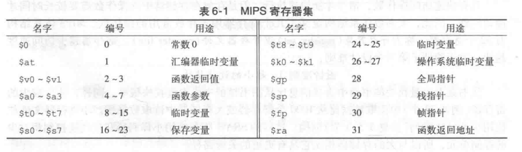

3.存储器

与寄存器文件相比，存储器可以存储更多数据，但是访问数据的时间就更长。寄存器容量小且速度快，而存储器容量大且速度慢。$MIPS$体系结构采用$32$位存储器地址和$32$位数据字长。

首先讲解**字寻址存储器**，然后再讲述$MIPS$的**字节寻址存储器**。

*字寻址存储器*就是每$32$位数据字对应一个唯一的$32$位地址，两者都用$16$进制来表示。例如，数据$0XF2F1AC07$存储再地址$1$中。

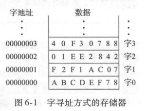

用来装入字(load word)指令`lw`将存储器中读出的数据装入寄存器中，如下表示将存储器字`1`装入`$s3`中。

```assembly
lw $s3, 1($0)
```

`lw`指令制动内存中有效地址位基地址和偏移量的和。基地址为寄存器，写在括号内。偏移量为常数，写在括号前。

用来存储字(store word)指令`sw`从寄存器向存储器写数据字。将寄存器`$s7`中的内容写入到存储器`5`中。上述都用`$0`为基地址，其实任何寄存器都能作为基地址。

```assembly
sw $s7, 5($0)
```

然而$MIPS$存储器模型是字节寻址而不是字寻址，每个数据字节都有一个唯一的地址。一个$32$位的字包含$4$个$8$位字节，所以每一个字地址都是$4$的倍数。而且，$32$位字地址和数据值都是用$16$进制表示的。

$MIPS$体系结构也提供了`lb`和`sb`指令来装入和存储单字节而不是字。

字节存储器的组织方式有大端和小端两种形式。两种形式中，最高有效字节在左边，最低有效字节在右边。在大端形式的机器中，第`0`个字节在最高有效字节，在小端形式的机器中，第`0`个字节在最低有效字节。两种格式的字地址相同，并指向相同的`4`字节。唯一不同的是一个字中字节的地址不同。

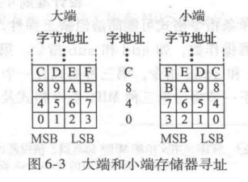

在$MIPS$中，位了简化，`lw`和`sw`的字地址必须是字对齐的，即地址必须能被`4`整除。但是装入/存储字节不需要字对齐。

4. 常数/立即数

因为常数的值可以被指令立即访问，即不需要通过访问寄存器或存储器来得到，所以这些常数叫做*立即数*。加立即数指令(addi)是一个以立即数操作的常见指令。`addi`将指令指定的立即数与某一寄存器中的值相加。

指令中指定的立即数采用`16`位补码表示，范围在`[-32768, 32767]`。减法相当于加一个负数，因此，没有`subi`指令。

<h3 id = "6.3">
6.3 机器语言
</h3>

数字电路只能理解0和1，因此要将汇编语言写的程序转换成使用0和1表示的机器语言。$MIPS$做了折中，它定义了3中指令格式：$R$、$I$和$J$类型。

#### 6.3.1 R类型指令

$R$类型是寄存器类型(register-type)的缩写。该指令有三个寄存器操作数，两个位源操作数，1个为目的操作数。32为指令分为6个字段：`op, rs, rt, rd, shamt和funct`。

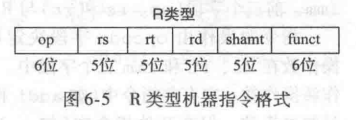

所有的R类型指令的操作码都是0，指定R类型操作由funct字段决定。例如，add指令的opcode和funct字段分别为0和32。类似地，sub指令的opcode和funct字段为0和34。

指令的操作数编码包括三个字段：rs、rt和rd。前两者是源寄存器，后者是目的寄存器。例如`$s0`为寄存器`16`。

`shamt`仅仅用于移位操作。在这些指令中存储在`5`为shamt字段中的二进制数值表示移位数。对于R类型，该值为0。

例：将汇编语言转换为机器语言

```assembly
add $t0, $s4, $s5
```

解：三个寄存器的值分别对应8，20，21。add的opcode和funct分别为0和32。因此得出机器语言指令。

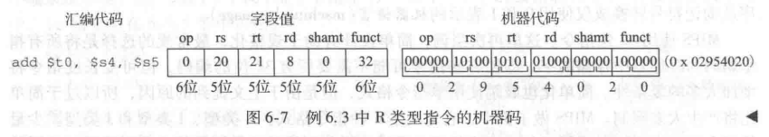

#### 6.3.2 I类型指令

$I$类型是立即数类型(immediate-type)的缩写。$I$类型指令由两个寄存器操作数和一个立即数操作数。一条32位指令由4个字段：op、rs、rt和imm。前三字段与R类型指令一样。imm字段表示一个16位立即数。

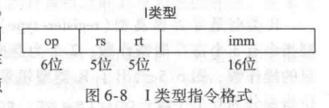

指令的操作由opcode决定，在有些指令中(如addi和lw)，rt用作目的的操作数；但在(如sw)中，rt也用作源操作数。

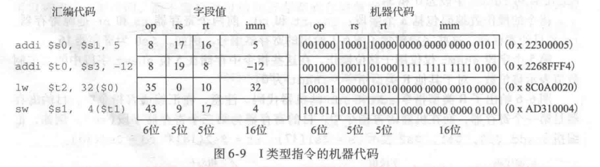

例:把I类型汇编指令转换为机器码

```assembly
ls $s3, -24($s4)
```

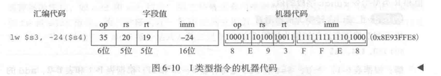

将一个16为偏移量与32位源寄存器相加。对于正立即数，前16位为全0，但对于负立即数，高16位应该为全1。它称为符号扩展，不改变它的值。

但这个规则有例外:逻辑操作（andi，ori，xori）将0放在高半字中，这成为0扩展，而不是符号扩展。

#### 6.3.3 J类型指令

$J$类型是跳转类型(jump-type)的缩写。这种格式仅用于跳转指令。

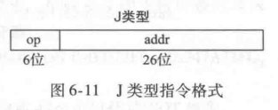

#### 6.3.4 解释机器语言代码

所有指令都以一个opcode开始，所有开始解释的最好位置首先查看opcode。如果是0，为R；否则为I或J。

#### 6.3.5 存储程序

用机器语言编写的程序是一个表示指令的一系列32位数。与其他二进制数一样，这些指令存储在存储器中。这就是存储程序的概念。存储程序中的指令从存储器中检索或取出，由处理器执行。即使大型复杂程序也可以简化为一系列存储器读和指令执行。

$MIPS$存储器地址是字节寻址，所以32位指令地址每次增加4。

为了运行或执行存储程序时，处理器从存储器中顺序地取出指令。然后，数字电路硬件解码和执行这些取出的指令。当前指令的地址存储在一个称为*程序计数器*（PC）的寄存器中。

<h3 id = "6.4">
6.4 编程
</h3>

以下讨论将高级语言结构转换为$MIPS$汇编代码。

#### 6.4.1 算术/逻辑指令

$MIPS$体系结构定义了大量的算术和逻辑指令。这些指令对实现高级语言结构是必需的。

1. 逻辑指令

逻辑操作包括`and、or、xor`和`nor`。这些R类型指令对两个源寄存器和一个目的寄存器进行按位操作。

$MIPS$中没有取非指令，但$A\ NOR \ \$ 0 = NOT\ A$。因此，不需要取非指令。

`andi、ori`和`xori`指令也可以对立即数进行逻辑操作。没有`nori`指令。可以通过`xori`再`nor $0`实现。

2. 移位指令

移位指令可以将就寄存器中的值左移或右移最多32位。指令包括逻辑左移指令(sll)、逻辑右移指令(srl)和算术右移指令(sra)。rt中存放待位移的值，rd存放移位的结果，shamt给出了移位的位数。

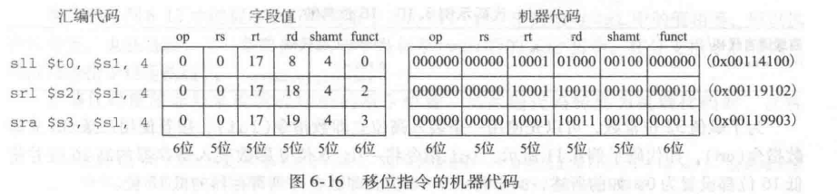

$MIPS$也提供可变移位指令：可变逻辑左移指令(sllv)、可变逻辑右移指令(srlv)和可变算术右移指令(srav)。变量位移的汇编指令是这样的格式：sllv rd、rt、rs。rt保存待移位的值。rs的低5位给出了位移的位数。位移的结果存放再rd中。

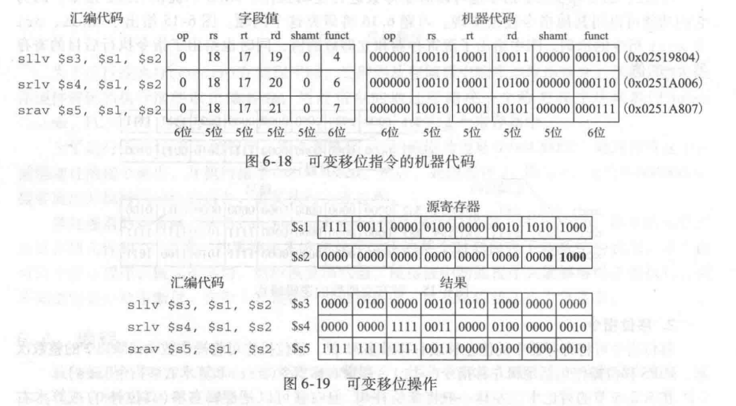

3. 生成常数

`addi`指令可用于给`16`位常数赋值。

```assembly
addi $s0, $0, 0x4fc   # int a = 0x4fc
```

为了赋值`32`位常数，可以先使用一条装入高位立即数指令(lui)，接着使用一条OR立即数指令(ori)合并到低位寄存器中。

```assembly
# int a = 0x6d5e4f3c
lui $s0, 0x6d5e
ori $s0, $s0, 0x4f3c
```

4. 乘法和除法指令

乘法指令将两个32位相乘生成一个64位乘积。两个32位数相除，产生一个32位的商和一个32位的余数。

用来存放结果的特殊寄存器位hi和lo。乘法结果的高32位存放在hi中，低32位存放在lo中。类似的，除法商放在lo中，余数放在hi中。

```assembly
mult $s0, $s1
div $s0, $s1
```

另一种乘法指令，它生成存储在一通用寄存器中的32位结果，存放在`$s1`中。

```assembly
mul $s1, $s2, $s3
```

#### 6.4.2 分支

