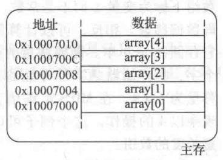
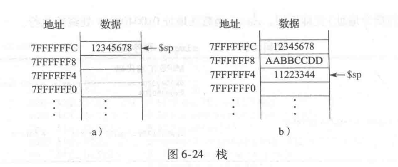
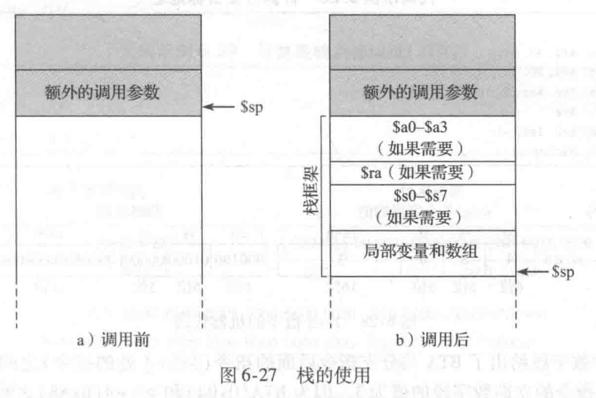
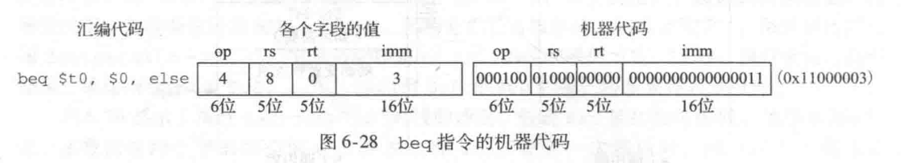
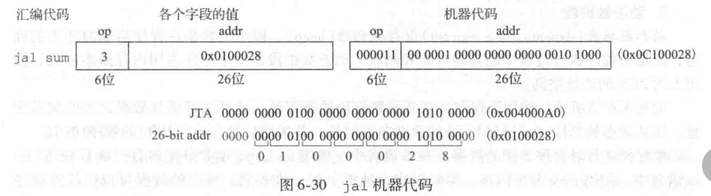
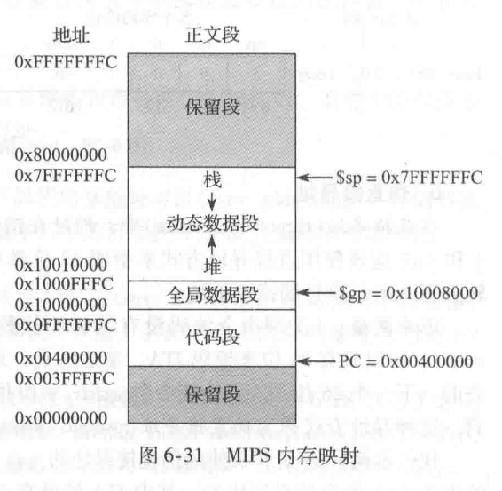
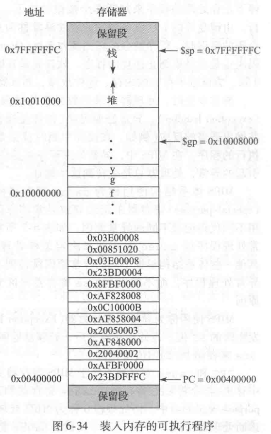

## 第6章 体系结构

>[6.2 汇编语言](#6.2)
>
>[6.3 机器语言](#6.3)
>
>[6.4 编程](#6.4)
>
>[6.5 寻址方式](#6.5)
>
>[6.6 编译、汇编和装入](#6.6)

<h3 id = "6.2">
6.2 汇编语言
</h3>

汇编语言是计算机机器语言的人类可阅读表示。每条汇编语言指令都指明了需要完成的操作和操作所处理的操作数。简单介绍的计算指令并说明，如何用汇编语言编写这些操作。然后定义$MIPS$指令操作数：寄存器、存储器和常数。

#### 6.2.1 指令

最常见的计算操作是加法。以下展示汇编代码的加法与减法。

```assembly
add a, b, c   # a = b + c;
sub a, b, c   # a = b - c;
```

汇编指令的第一部分`add`是助记符，它指明需要执行的操作。该操作基于源操作数$b$和$c$，将结果写入目标的操作数。

减法指令类似于加法，除了操作码`sub`以外，指令格式完全与加法指令相同，这种一致的指令格式很好地证明了第一个设计准则：

*设计准则1：简单设计有助于规整化。*

指明中包含固定数目的操作数将将易于编码和硬件处理。更加复杂的高级语言代码可以转换为多条指令。使用多条汇编指令执行复杂的操作体现了计算机体系结构的第二个设计准则：

*设计准则2：加快常见功能。*

#### 6.2.2 操作数：寄存器、存储器和常数

一条指令的操作需要基于操作数。上述中的变量都是操作数。但是计算机只能处理二进制，而不能处理变量名。指令需要从一个物理位置中取出二进制数据。操作数可以存放在寄存器或存储器中，也可以作为常数存储在指令自身中。计算机使用不同的位置存放操作数以便优化性能和存储容量。访问存放在指令中的常数或者寄存器中的操作数非常快，但是它们只能包含少量数据。更多的数据是从存储器中得到的，但访问速度相较于寄存器较慢。

##### 1. 寄存器

只有快速访问操作数，指令才能快速执行，但是存放在存储器中的操作数需要较长时间才能访问到。因此，体系结构定义了几个寄存器用于存放常用的操作数。`MIPS`体系结构有`32`个寄存器，称为寄存器集或寄存器文件。寄存器越少访问速度越快。这体现第三个设计准则：

*设计准则3：越小的设计越快。*

`MIPS`寄存器名由`$`符号开始。变量`a`、`b`和`c`存放到`$s0`、`$s1`和`$s2`中。`MIPS`有32个寄存器，其中使用18个寄存器存储变量`$s0~$s7`和`$t0~$t9`。由`$s`开头的寄存器称为保存寄存器。指令示例：

```assembly
# a = b + c;
# $s0 = a, $s1 = b, $s2 = c
add $s0, $s1, $s2
```

```assembly
# a = b + c - d;
# $s0 = a, $s1 = b, $s2 = c, $s3 = d
sub $t0, $s2, $s3
add $s0, $s1, $t1
```

##### 2. 寄存器集

`MIPS`定义了32个寄存器。每个寄存器都有一个名字和编号。`$0`始终为`0`，因为常数`0`经常在计算机程序中使用。


##### 3.存储器

与寄存器文件相比，存储器可以存储更多数据，但是访问数据的时间就更长。寄存器容量小且速度快，而存储器容量大且速度慢。$MIPS$体系结构采用$32$位存储器地址和$32$位数据字长。

首先讲解**字寻址存储器**，然后再讲述$MIPS$的**字节寻址存储器**。

*字寻址存储器*就是每$32$位数据字对应一个唯一的$32$位地址，两者都用$16$进制来表示。例如，数据$0XF2F1AC07$存储再地址$1$中。


用来装入字(load word)指令`lw`将存储器中读出的数据装入寄存器中，如下表示将存储器字`1`装入`$s3`中。

```assembly
lw $s3, 1($0)
```

`lw`指令制动内存中有效地址位基地址和偏移量的和。基地址为寄存器，写在括号内。偏移量为常数，写在括号前。

用来存储字(store word)指令`sw`从寄存器向存储器写数据字。将寄存器`$s7`中的内容写入到存储器`5`中。上述都用`$0`为基地址，其实任何寄存器都能作为基地址。

```assembly
sw $s7, 5($0)
```

然而$MIPS$存储器模型是字节寻址而不是字寻址，每个数据字节都有一个唯一的地址。一个$32$位的字包含$4$个$8$位字节，所以每一个字地址都是$4$的倍数。而且，$32$位字地址和数据值都是用$16$进制表示的。

$MIPS$体系结构也提供了`lb`和`sb`指令来装入和存储单字节而不是字。

字节存储器的组织方式有大端和小端两种形式。两种形式中，最高有效字节在左边，最低有效字节在右边。在大端形式的机器中，第`0`个字节在最高有效字节，在小端形式的机器中，第`0`个字节在最低有效字节。两种格式的字地址相同，并指向相同的`4`字节。唯一不同的是一个字中字节的地址不同。


在$MIPS$中，位了简化，`lw`和`sw`的字地址必须是字对齐的，即地址必须能被`4`整除。但是装入/存储字节不需要字对齐。

##### 4. 常数/立即数

因为常数的值可以被指令立即访问，即不需要通过访问寄存器或存储器来得到，所以这些常数叫做*立即数*。加立即数指令(addi)是一个以立即数操作的常见指令。`addi`将指令指定的立即数与某一寄存器中的值相加。

指令中指定的立即数采用`16`位补码表示，范围在`[-32768, 32767]`。减法相当于加一个负数，因此，没有`subi`指令。

<h3 id = "6.3">
6.3 机器语言
</h3>

数字电路只能理解0和1，因此要将汇编语言写的程序转换成使用0和1表示的机器语言。$MIPS$做了折中，它定义了3中指令格式：$R$、$I$和$J$类型。

#### 6.3.1 R类型指令

$R$类型是寄存器类型(register-type)的缩写。该指令有三个寄存器操作数，两个位源操作数，1个为目的操作数。32为指令分为6个字段：`op, rs, rt, rd, shamt和funct`。


所有的R类型指令的操作码都是0，指定R类型操作由funct字段决定。例如，add指令的opcode和funct字段分别为0和32。类似地，sub指令的opcode和funct字段为0和34。

指令的操作数编码包括三个字段：rs、rt和rd。前两者是源寄存器，后者是目的寄存器。例如`$s0`为寄存器`16`。

`shamt`仅仅用于移位操作。在这些指令中存储在`5`为shamt字段中的二进制数值表示移位数。对于R类型，该值为0。

例：将汇编语言转换为机器语言

```assembly
add $t0, $s4, $s5
```

解：三个寄存器的值分别对应8，20，21。add的opcode和funct分别为0和32。因此得出机器语言指令。


#### 6.3.2 I类型指令

$I$类型是立即数类型(immediate-type)的缩写。$I$类型指令由两个寄存器操作数和一个立即数操作数。一条32位指令由4个字段：op、rs、rt和imm。前三字段与R类型指令一样。imm字段表示一个16位立即数。


指令的操作由opcode决定，在有些指令中(如addi和lw)，rt用作目的的操作数；但在(如sw)中，rt也用作源操作数。


例:把I类型汇编指令转换为机器码

```assembly
ls $s3, -24($s4)
```


将一个16为偏移量与32位源寄存器相加。对于正立即数，前16位为全0，但对于负立即数，高16位应该为全1。它称为符号扩展，不改变它的值。

但这个规则有例外:逻辑操作（andi，ori，xori）将0放在高半字中，这成为0扩展，而不是符号扩展。

#### 6.3.3 J类型指令

$J$类型是跳转类型(jump-type)的缩写。这种格式仅用于跳转指令。


#### 6.3.4 解释机器语言代码

所有指令都以一个opcode开始，所有开始解释的最好位置首先查看opcode。如果是0，为R；否则为I或J。

#### 6.3.5 存储程序

用机器语言编写的程序是一个表示指令的一系列32位数。与其他二进制数一样，这些指令存储在存储器中。这就是存储程序的概念。存储程序中的指令从存储器中检索或取出，由处理器执行。即使大型复杂程序也可以简化为一系列存储器读和指令执行。

$MIPS$存储器地址是字节寻址，所以32位指令地址每次增加4。

为了运行或执行存储程序时，处理器从存储器中顺序地取出指令。然后，数字电路硬件解码和执行这些取出的指令。当前指令的地址存储在一个称为*程序计数器*（PC）的寄存器中。

<h3 id = "6.4">
6.4 编程
</h3>

以下讨论将高级语言结构转换为$MIPS$汇编代码。

#### 6.4.1 算术/逻辑指令

$MIPS$体系结构定义了大量的算术和逻辑指令。这些指令对实现高级语言结构是必需的。

##### 1. 逻辑指令

逻辑操作包括`and、or、xor`和`nor`。这些R类型指令对两个源寄存器和一个目的寄存器进行按位操作。

$MIPS$中没有取非指令，但$A\ NOR \ \$ 0 = NOT\ A$。因此，不需要取非指令。

`andi、ori`和`xori`指令也可以对立即数进行逻辑操作。没有`nori`指令。

##### 2. 移位指令

移位指令可以将就寄存器中的值左移或右移最多32位。指令包括逻辑左移指令(sll)、逻辑右移指令(srl)和算术右移指令(sra)。rt中存放待位移的值，rd存放移位的结果，shamt给出了移位的位数。


$MIPS$也提供可变移位指令：可变逻辑左移指令(sllv)、可变逻辑右移指令(srlv)和可变算术右移指令(srav)。变量位移的汇编指令是这样的格式：sllv rd、rt、rs。rt保存待移位的值。rs的低5位给出了位移的位数。位移的结果存放再rd中。


##### 3. 生成常数

`addi`指令可用于给`16`位常数赋值。

```assembly
addi $s0, $0, 0x4fc   # int a = 0x4fc
```

为了赋值`32`位常数，可以先使用一条装入高位立即数指令(lui)，接着使用一条OR立即数指令(ori)合并到低位寄存器中。

```assembly
# int a = 0x6d5e4f3c
lui $s0, 0x6d5e
ori $s0, $s0, 0x4f3c
```

##### 4. 乘法和除法指令

乘法指令将两个32位相乘生成一个64位乘积。两个32位数相除，产生一个32位的商和一个32位的余数。

用来存放结果的特殊寄存器位hi和lo。乘法结果的高32位存放在hi中，低32位存放在lo中。类似的，除法商放在lo中，余数放在hi中。

```assembly
mult $s0, $s1
div $s0, $s1
```

另一种乘法指令，它生成存储在一通用寄存器中的32位结果，存放在`$s1`中。

```assembly
mul $s1, $s2, $s3
```

#### 6.4.2 分支

为了顺序执行指令，程序计数器执行一条指令后递增4。分支指令改变程序计数器的值，跳过某段代码或返回到执行先前的代码。条件分支指令执行一次测试，只有当测试结果位TRUE时才执行分支语句。无条件分支指令称为跳转指令。它总执行分支语句。

##### 1. 条件分支

$MIPS$指令集有两个条件分支指令：`beq`和`bne`。当两个寄存器中值相等时，`beq`执行分支语句；当两个值不相同时，`bne`执行分支程序。说明如何使用`beq`指令。注意，分支语句写成`beq $rs, $rt, imm`，这里`$rs`为第一个源寄存器。这种顺序与大部分`I`类型指令相反。

汇编代码使用标号来说明程序中的指令位置。当汇编代码转换为机器代码时，这些标号将转换为指令地址。汇编语言标号后面紧跟一个“:”，通常为了体现标号，只缩进代码，不缩进标号。

```assembly
	addi $s0, $0, 4
	addi $s1, $0, 1
	sll $s1, $s1, 2
	bne $s0, $s1, target
	addi $s1, $s1, 1

target:
	add $s1, $s1, $s0
```


##### 2. 跳转指令

程序可以使用三种跳转指令完成无条件分支或跳转。这三种指令费别时跳转指令`(j)`、跳转和链接指令`(jal)`以及跳转寄存器指令`(jr)`。跳转指令`(j)`直接跳转到标号指定的指令。跳转和链接指令`(jal)`与`j`类似，但它保存返回地址。跳转寄存器指令，跳转到寄存器所保存的地址。

#### 6.4.3 条件语句

1. if语句

仅当满足条件时，if语句执行if块代码。

```assembly
#if (i == j) f = g + h;
#f = f - i;
# $0 = f, $s1 = g, $s2 = h, $s3 = i, $s4 = j
	bne $s3, $s4, L1
	add $s0, $s1, $s2
L1:
	sub $s0, $s0, $s3
```

与高级语言不同，汇编语言判断不相等时跳转。

##### 2. if/else语句

本质上就是if中的语句执行完毕，直接跳出判断体。

```assembly
	bne $s3, $s4, else
	add $s0, $s1, $s2
	j L1
else:
	sub $s0, $s0, $s3
L1:
```

#### 6.4.4 循环语句

循环根据某个条件重复地执行一块代码语句。for循环和while循环是高级程序语言常用的循环结构。

##### 1. while循环

与`if/else`相反当满足条件时，退出`while`循环语句。

```assembly
#int pow = 1;
#int x = 0;
#while (pow != 128) {pow = pow * 2; x = x + 1;}
# $s0 = pow, $s1 = x;
	addi $s0, $0, 1
	addi $s1, $0, 0
	addi $t0, $0, 128
while:
	beq $s0, $t0, done
	sll $s0, $s0, 1
	addi $s1, $s1, 1
	j while
done:
```

##### 2. for循环

相比于`while`循环`for`循环增加了对循环变量的支持，它跟踪执行的次数。

```assembly
#int sum = 0;
#for (int i = 0; i != 10; i ++) sum += i;
# $s0 = i, $s1 = sum
	add $s1, $0, $0
	addi $s0, $0, 0
	addi $t0, $0, 10
for:
	beq $s0, $t0, done
	add $s1, $s1, $s0
	addi $s0, $s0, 1
	j    for
done:
```

##### 3. 量值比较

$MIPS$为量值比较提供了小于设置指令`slt`，当`rs < rt`时，将`rd`设置为`1`，否则设置成`0`。

* 使用`slt`指令的循环语句

用汇编语言实现从$1$~$100$中的$2$的整数次幂求和。

```assembly
# $s0 = i, $s1 = sum
	addi $s0, $0, 1
	addi $s1, $0, 0
	addi $t0, $0, 101
loop:
	slt $t1, $s0, $t0
	beq $t1, $t0, done
	add $s1, $s1, $s0
	sll $s0, $s0, 1
	j   loop
done:
```

#### 6.4.5 数组

数组按照存储器中顺序数据地址组织。

1. 数组下标

下图中的主存中有一个包含$5$个整数的数组，下标的范围从$0$到$4$。数组存储在处理器主存中从及地址开始的连续区域中。基地址指定了第一个元素的地址。



下面的汇编代码表示将数组前两个元素乘$8$，然后再将它们存储到该数组中。

```assembly
#int array[5];
#array[0] *= 8;
#array[1] *= 8;
# $s0 = base address of array
lui $s0, 0x1000
ori $s0, 0x7000

lw $t1, 0($s0)
sll $t1, $t1, 3
sw $t1, 0($s0)

lw $t1, 4($s0)
sll $t1, $t1, 3
sw $t1, 4($s0)
```

访问的数组的方式是先将数组的基地址读入到寄存器中，使用`lui`和`ori`两个指令就能读取到一个`32`位的字地址。然后再使用`lw`和`sw`

指令读取数组位置上的数据，并修改填入。

以下使用`for`循环来访问数组，假设存储器中有一个`1000`个元素的数组，对数组中的每个元素都乘以`8`。假设数组的基地址为`0x23B8F000`。

```assembly
#int i, array[1000];
#for (int i = 0; i < 1000; i ++)
#	array[i] *= 8;
#$s0 = base address, $s1 = i
	lui $s0, 0x23B8
	ori $s0, 0xF000
	addi $s1, $0, 0
	addi $t2, $0, 1000
loop:
	slt $t0, $s1, $t2
	beq $t0, $0, done
	sll $t0, $s1, 2
	add $t0, $t0, $s0
	lw $t1, 0($t0)
	sll $t1, $t1, 3
	sw $t2, 0($t0)
	addi $s1, $s1, 1
	j   loop
done:
```

2. 字节与字符

英文字符通常用用字节表示。$MIPS$提供装入字节和存储字节指令来操作字节或字符类型的数据：装入无符号字节`lbu`，装入字节`lb`和存储字节`sb`。

`lbu`和`sb`装入指令，分别对字节进行`0`扩展和符号扩展来填充`32`位寄存器。存储字节指令将寄存器中最低有效位字节存储到指定的字节地址。

* 使用`lb`和`sb`访问字符数组。

以下的高级语言代码将大小为`10`的数组中所有的小写字母减去`32`，将其转化为大写字母。将此高级语言代码转换为汇编语言。假定`$s0`已经保存了基地址。

```assembly
#char array[10];
#for (int i = 0; i != 10; i ++)
#	array[i] -= 32;
# $s0 = base address, $s1 = i
	addi $s1, $0, 0
	addi $t0, $0, 10
loop:
	beq $t0, $s1, done
	add $t1, $s1, $s0
	lb $t2, 0($t1)
	addi $t2, $t2, -32
	sb $t2, 0($t1)
	
	addi $s1, $s1, 1
	j	loop
done:
```

#### 6.4.6 函数调用

当一个函数调用其他函数时，调用函数和被调用函数必须要在参数和返回值上保持一致。调用函数在调用前要将$4$个参数分别放到`$a0~a3`中，被调用函数在完成前将返回值放到`$v0~$v1`中。

被调用函数不能影响调用函数的功能，简单地说，这意味着被调用函数必须直到当它完成后要返回到哪里，而且不能破坏调用函数用到的寄存器和内存。调用函数将返回地址存在`$ra`中。具体说，被调用函数必须保证存储寄存器`$s0~$s7`和`$ra`以及用于存放临时变量的栈不被修改。

##### 1. 函数调用和返回

$MIPS$使用`jal`指令调用一个函数，使用`jr`指令从函数返回。

`jal`指令完成两种功能：1) 将下一条指令的地址存储到返回地址寄存器`$ra`中； 2) 跳转到目标指令。

以下面的汇编代码为例子：

```assembly
main:  
	jal simple
	....
simple:
	jr $ra
```

main函数通过执行`jal`指令调用`simple`函数，跳转到`simple`标号。同时把...对应的地址存到`$ra`寄存器中。`simple`通过执行`jr`跳转到...地址，并继续执行。

##### 2. 输出参数和返回值

```assembly
#int main()
#{
#	int y;
#   y = diff(2, 3, 4, 5);
#}
#
#int diff(int f, int g, int h, int i)
#{
#	return (f + g) - (h + i)
#}
# $s0 = y
main:
	addi $a0, $0, 2
	addi $a1, $0, 3
	addi $a2, $0, 4
	addi $a3, $0, 5
	jal diff
	add $s0, $v0, $0
	
diff:
	add $t0, $a0, $a1
	add $t1, $a2, $a3
	sub $v0, $t0, $t1
    jr $ra
```

按照惯例，调用程序将程序参数从左到右放入输入寄存器`$a0~$a3`中。被调用程序将返回值存储到返回寄存器`$v0`中。

返回`64`位值，就需要使用两个返回寄存器。当调用多于`4`个参数函数时，多出来的参数将放入栈内。

##### 3. 栈

栈是用于存储函数局部变量的存储器。当处理器需要更多空间时，栈会扩展；不需要时，栈会缩小。栈在内存空间中是向下增长的。当程序需要更多空间时，栈空间向内存中地址较低的方向扩展。如下图所示：



栈指针`$sp`是一个特定的寄存器，此寄存器指向栈顶。指针是内存地址的一个新名字。指针指向数据，给出此数据的地址。

栈的一个应用就是保存和恢复函数使用的寄存器。函数应该计算返回值，但不应该产生其他负面影响。之前设计的`diff`函数就违背了这一点。它修改了`$t1`。

为了解决这个问题，在函数修改寄存器前，它要将寄存器保存到栈中，然后在返回前从栈中恢复这些寄存器。具体说。函数将按照以下步骤执行。

1）创建栈空间来存储一个或多个寄存器的值

2）将寄存器中的值存储在栈中

3）使用寄存器执行函数

4）从栈中恢复寄存器的原始值

5）回收栈空间

以下展示修改后的`diff`函数。

```assembly
diff:
	addi $sp, $sp，-12
	sw $s0, 8($sp)
	sw $t0, 4($sp)
	sw $t1, 0($sp)
	add $t0, $a0, $a1
	add $t1, $a2, $a3
	sub $v0, $t0, $t1
	lw $t1, 0($sp)
	lw $t0, 4($sp)
	lw $s0, 8($sp)
	addi $sp, $sp, 12
	jr $ra
```

##### 4. 受保护寄存器

$MIPS$将寄存器划分为*受保护类型*和*不受保护类型*。受保护寄存器包括`$s0~$s7`，因此它们叫做保存寄存器。不受保护寄存器包括`$t0~$t9`，因此它们叫做临时寄存器。函数必须保存和恢复任何需使用的受保护寄存器，但是可以随意修改不受保护寄存器。

最后对受保护寄存器和不受保护寄存器做出分类：

**受保护寄存器**：

`$s0~$s7`:保存函数中的局部变量

`$ra`：保存函数的返回地址

`$a0~$a3`：保存函数的参数

`$sp`：栈顶指针

**不受保护寄存器**

`$t0~$t9`：保存临时变量

`$v0~$v1`：函数返回值

##### 5. 递归函数调用

使用汇编语言实现递归求阶乘函数：

```assembly
# int fact(int n)
#{
#	if (n <= 1) return 1;
#   return n * fact(n - 1);
#}
fact:
	addi $sp, $sp, -8
	sw $ra 0($sp)
	sw $a0 4($sp)
	addi $t0, $0, 2
	slt $t1, $a0, $t0
	beq $t1, $0, else
	addi $v0, $0, 1
	addi $sp, $sp, 8
	jr $ra
else:
	addi $a0, $a0, -1
	jal fact
	lw $ra 0($sp)
	lw $a0 4($sp)
	addi $sp, $sp, 8
	mul $v0, $v0, $a0
	jr $ra
```

##### 6. 附加参数和局部变量

函数可能有多于`4`个的参数和局部变量。使用栈存储这些临时数据，如果一个函数有`4`个以上的参数，则前`4`个参数像往常一样存储在参数寄存器中，额外的参数使用栈指针之上的空间保存在栈中。调用函数必须拓展栈空间来满足额外的参数。



<h3 id = "6.5">
6.5 寻址方式
</h3>

$MIPS$使用5种寻址方式：寄存器寻址，立即数寻址、基地址寻址、PC相对寻址和伪直接寻址。

#### 1. 寄存器寻址

寄存器寻址使用寄存器存储所有源操作数和目的操作数。所有的`R`型指令都使用寄存器寻址。

#### 2. 立即数寻址

立即数寻址使用`16`位立即数和寄存器作为操作数。有些`I`类型指令例如`addi`和`lui`

#### 3. 基地址寻址

存储器访问指令都使用基地址寻址。存储器操作数的有效地址由寄存器`rs`中的基地址与立即数字段中的符号拓展的`16`位偏移量相加得到。

#### 4. PC相对寻址

条件分支指令在进行分支时使用`PC`*相对寻址*来确定`PC`的新值。立即数字段中有符号偏移量与`PC`值相加得到新的`PC`值。因此，分支的目的地址与当前`PC`值相关。如下汇编代码：

```assembly
	beq $t0, $0, else
	addi $v0, $0, 1     # 1
	addi $sp, $sp 8
	jr $ra
else:                   # 1
	addi $a0, $a0, -1
	jal fact
```

`beq`指令的机器代码。如果分支执行，那么*分支目标地址*(Branch Target Address，BTA)是下一条执行指令的地址。



$16$位立即数字段给出了$BTA$与分支指令后面的指令$(PC+4)$之间的指令数。在上述代码中，立即数为$3$是因为之间有三条指令，$PC$指针只要向后走$3$条指令就能到要执行的点。处理器计算$BTA$的方法是，符号扩展$16$位立即数并乘以$4$，然后将结果与$PC+4$相加。

* 在$PC$相对寻址方法中计算立即数字段的值。

```assembly
loop: add $t1, $a0, $s0
	lb $t1, 0($t1)
	add $t2, $a1, $s0
	sb $t1, 0($t2)
	addi $s0, $s0, 1
	bne $t1, $0, loop
	lw $s0, 0($sp)
```

根据代码可知`bne`语句和`loop`相差$6$条语句，所以立即数字段的值位`-6`。

#### 5. 伪直接寻址

在直接寻址中，地址在指令中是直接给出的。在理想情况下，跳转指令`j`和`jal`应该直接使用寻址方式来指明$32$位*跳转目标地址*(Jump Target Address，JTA)以便跳转到下一条要执行的指令地址。

不幸的是，`J`类型指令编码没有足够的位数来表示`32`位的$JTA$，指令中有$6$位用于存放$opcode$,所以只有$26$位来编码$JTA$。好的是，最低两位的`JTA`总是为$0$，因为指令是字对齐的。最高的$4$位$JTA$由$PC+4$最高$4$位得到。这种方式叫做*伪直接寻址*。



所有的$J$型指令都是伪直接寻址。注意的是`jr`不是$J$型，而是$R$型指令。

<h3 id = "6.6">
6.6 编译、汇编和装入
</h3>

本节将介绍如何编译和汇编一个完整的高级语言程序，以及如何将程序装入存储器中执行。

#### 6.6.1 内存映射

$MIPS$地址宽度为$32$位，所以$MIPS$地址空间为$2^{32}$字节$=4G$，所以字地址的范围为`0~0xFFFFFFFC`。该体系结构将内存地址分为4部分：代码段、全局数据段。动态数据段和保留段。



##### 1. 代码段

代码段存储机器语言程序。它足够可以容纳约$256MB$的代码。注意，代码空间中的最高位都为$0$，因此$J$指令可以直接跳转到程序中的任意位置。

##### 2. 全局数据段

全局数据段用来存储全局变量。与局部变量不同，整个程序均可房屋内全局变量。全局变量在程序执行前启动定义。全局变量由`$gp`指针来访问。

##### 3. 动态数据段

动态数据段存放堆栈中的数据。段中数据在程序启动时还不能确定，因此需要动态的去分配和回收空间。

##### 4. 保留段

保留段用于操作系统，不能直接被程序所使用。

#### 6.6.2 转换成二进制代码和开始执行程序

下图是程序从高级语言转换成机器语言代码并开始执行的主要步骤。首先，将高级语言代码编译为汇编代码，汇编代码汇编为目标文件中的机器代码。链接程序将机器代码和来自库和其他文件的机器代码链接在一起产生一个完整的可执行文件。大部分编译器都执行编译、汇编和链接这三步。最后，装入程序将可执行代码装入内存中并开始执行。

##### 1. 步骤1：编译

编译器将高级语言代码转换成汇编语言。关键字`.data`和`.text`是指明数据段和代码段开始位置的*汇编器指令*。它们的存储位置将由汇编器决定。

##### 2. 步骤2：汇编

汇编器将汇编语言代码换为包含机器语言代码的目标文件。汇编器对汇编代码扫描两遍。汇编器分配指令地址，并寻找所有的符号。

符号的名字和地址保存在符号表中。第一遍扫描后，如果标号地址以及确定，就填充对应的符号地址。在内存的全局数据段中给全局变量分配存储位置，起始地址为`0x10000000`。第二遍扫描中，汇编器产生机器语言代码。全局变量和标号的地址可以从符号表中获得。机器语言代码和符号表存储在目标文件中。

##### 3. 步骤3：链接

链接器的工作是将所有的目标文件合并成一个机器语言文件，该文件称为可执行文件(.exe)。链接器重新定位目标文件中的数据段和指令段使它们不再彼此相接。它使用符号表中的信息来调整重新定位后的全局变量和标号地址。

一个可执行文件中包含$3$部分：可执行文件头、代码段和数据段。可执行文件头包含文件大小(代码大小)和数据大小(全局声明的数据数量)，两者均用字节表示。代码段包含指令序列和相应的存储地址。

##### 4. 步骤4：装入

操作系统通过从存储设备一般是硬盘，读取可执行文件的代码段将程序装入内存的代码段中。操作系统将`$gp`设置为全局数据段的中间位置，将`$sp`设为动态数据段的顶部，然后执行`jal 0x00400000`跳转到程序的开头。  


