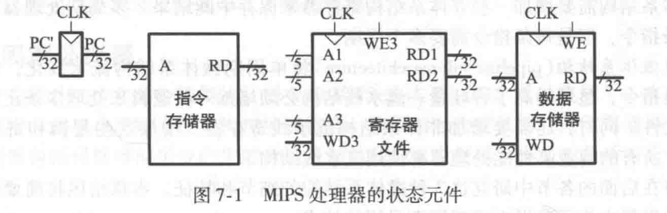

## 第7章 微体系结构

> [7.1 引言](#7.1)
>
> [7.2 性能分析](#7.2)
>
> [7.3 单周期处理器](#7.3)

<h3 id = "7.1">
7.1 引言
</h3>

本章学习如何构建一个$MIPS$微处理器，并有三种不同的实现方案。本章主要介绍用于连接逻辑和体系结构的微体系结构。微体系结构是将寄存器、ALU、有限状态机、存储器和其他逻辑模块等组合在一起，实现一种体系结构。

#### 7.1.1 体系结构状态和指令集

计算机体系结构包括指令集和体系结构状态。$MIPS$处理器的体系结构状态包括程序计数器和32个寄存器。任何一个$MIPS$微体系结构都必须包含所有这些状态。基于当前体系结构状态，处理器执行一条具有特定数据集的特定指令，将产生一个新的体系结构状态。有些为体系结构包含附加的非体系结构状态以简化逻辑或提升性能。

#### 7.1.2 设计过程

微体系结构分为两个相互作用的部分：*数据路径*和*控制*。数据路径对数据字进行操作，包含存储器、寄存器、ALU和复用器等结构。控制单元从数据路径接收当前指令，并控制数据路径如何执行这条指令。

设计复杂系统时，一种好方法就是从包含状态元件的硬件开始。这些元件包含存储器和体系结构状态。然后，这些存储组件之间增加组合逻辑计算新状态。下图给出了具有四个状态元件（程序计数器、寄存器文件、指令存储器和数据存储器）。

*程序计数器*：一个普通的32位寄存器，它的输入PC指向当前指令，它的输入表示下一条指令的地址。

*指令存储器*：有一个读端口，包含32位的指令地址输入$A$，它从这个地址读$32$位数据或指令并传送到读数据输入$RD$上。

*寄存器文件*：有两个读端口和一个写端口。读端口具有$5$位地址输入$A1$和$A2$，每个用于指定$32$个寄存器中的一个作为源操作数。它们可以读$32$位寄存器的值并分别传送到$RD1$和$RD2$上。写端口具有$5$位地址输入$A3$，$32$位数据输入$WD$，写入使能$WE3$和时钟信号。如果写入使能为$1$，则寄存器文件将在时钟的上升沿将数据写入特定寄存器中。

*数据存储器*：有一个读/写端口。如果写使能$WE$为$1$，则在时钟的上升沿将数据$WD$写入地址$A$。如果写使能为$0$，则从地址$A$将数据读到$RD$。

指令存储器、寄存器文件和数据存储器在读出过程中都呈现组合逻辑特征。也就是如果地址发生改变，新的数据在多个传播延迟后出现$RD$上，而不需要时钟参与。

由于状态元件仅在时钟的上升沿改变它们的状态，所以它们是同步时序电路。微处理器由时钟驱动的状态元件和组合逻辑构成，因此它也是同步时序电路。处理器可以看作一个巨大的有限状态机，或者多个见到那相互作用的状态机的组合。

#### 7.1.3 MIPS微体系结构

微体系结构有三种分别是：单周期、多周期和流水线。它们的区别在于状态元件的连接方式和非体系结构状态的数量。

*单周期微体系结构*：在一个周期中执行一条完整的指令。该结构易于解释且控制单元简单。由于它在一个周期内完成操作，所以它不需要其他非体系结构状态。然而，时钟周期由最慢的指令决定。

*多周期微体系结构*：利用多个较短的周期执行一条指令。简单指令的执行周期数较少。而多周期微体系结构可以通过对加法器和存储器等昂贵硬件部件复用减少硬件成本。例如同一个加法器可以在一条指令的不同时钟周期中用于不同目的。多周期处理器在任意时刻仅执行一条指令，但是每条指令需要多个周期。

*流水线微体系结构*：将单周期微体系结构流水线化，使得可以同时执行多条指令，显著提高了吞吐量。流水线结构必须增加一些罗i就来处理多条正在执行指令之间的相关性。同时，还需要增加非体系结构流水线寄存器。增加这些逻辑和寄存器是值得的。

<h3 id = "7.2">
7.2 性能分析
</h3>

一个程序的执行时间有下式给出：
$$
指令执行时间 = 指令数 \times \frac{周期数}{指令} \times \frac{秒}{周期数}
$$
每条指令的周期数(CPI)是执行一条平均指令所需要的时钟周期数。它是吞吐量(每周期的指令)的倒数。不同的微体系结构有不同的CPI值。

每个周期所需要的时间为时钟周期$T_e$。时钟周期由处理器中通过逻辑的关键路径决定。不同的微体系结构有不同的时钟周期。逻辑和电路设计也在很大程度上影响着时钟周期。逻辑和电路设计也很大程度影响着时钟周期。

<h3 id = "7.3">
7.3 单周期处理器
</h3>

