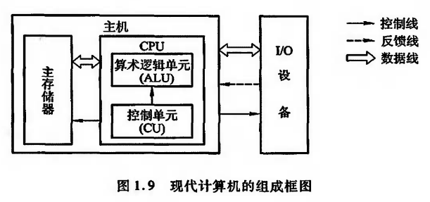

## 第1章 计算机系统概论

>[1.1 计算机系统简介](#1.1)
>
>[1.2 计算机的基本组成](#1.2)

<h3>
1.1 计算机系统简介
</h3>

#### 1.1.1 计算机的软硬件简介

计算机系统由`硬件`和`软件`两大部分组成。

* 硬件是计算机的实体，如主机、外设等。

* 软件由具有各类特殊功能的信息程序组成

计算机的软件通常分为系统软件、应用软件。

* 系统软件：用来管理整个计算机系统。例如语言处理程序，操作系统，服务性程序，数据库管理系统，网络软件。
* 应用软件：用户根据任务需要所编制的各种程序。

#### 1.1.2 计算机系统的层次结构

从计算机系统的多级层次结构来看，可以将硬件研究的主要对象归结为传统机器`M1`和微程序机器`M0`。软件的研究对象主要是操作系统级以上的各级虚拟机。

#### 1.1.3 计算机组成和计算机体系结构

* 计算机体系结构：程序员所见到的计算机系统的属性概念性的结构与功能特性（指令系统、数据类型、寻址技术、I/O机理）
* 计算机组成：实现计算机体系结构所体现的属性

<h3 id="1.2">1.2 计算机的基本组成</h3>

#### 1.2.1 冯诺伊曼计算机的特点

##### `1945`年，冯诺依曼在研究`EDVAC`机提出了`存储程序`的概念。它的特定如下：

* 计算机由运算器、存储器、控制器、输入设备和输出设备五大部件。
* 指令和数据以同等地位放在存储器中，并可按地址寻访。
* 指令与数据均用二进制表示。
* 指令由操作码和地址码组成，操作码用来表示操作的性质，地址码用来表示操作数在存储器中的位置。

* 指令在存储器内按照顺序存放。通常，是顺序执行的。
* 机器以运算器为中心，输入输出设备与存储器间的数据传送通过运算器完成。

#### 1.2.2 计算机的硬件框架

典型的冯诺依曼是以运算器为中心的：

现代计算机已转化为存储器为中心：

图中各个部件的功能如下：

* 运算器用来完成算术运算和逻辑运算，并将运算的中间结果暂存在运算器内。
* 存储器用来存放数据和程序。
* 控制器用来控制、指挥程序和数据的输入、运行以及处理运算结果。
* 输入设备用来将人们熟悉的信息形式妆化为机器能识别的信息形式。
* 输出设备可将机器运行结果转换为人们熟悉的信息形式。

由于运算器和控制器在逻辑关系和电路结构上十分紧密，这两大不见往往集成在同一芯片上，因此，通常将它们和起来统称为中央处理器(`CPU`)。把输入设备与输出设备简称为`I/O`设备。

这样，现代计算机可认为由三大部分组成:`CPU`,`I/O`设备及主储存器。`CPU`和主存储器合起来称为主机，`I/O`设备又可称为外部设备。

主存储器是存储器子系统中的一类，用来存放程序和数据，可以直接与`CPU`交换信息。另一类称为辅助存储器，简称辅存，又称外存。

算术逻辑单元，简称算逻部件(`Arithmetic Logic Unit ALU`)，用来完成算术逻辑运算。控制单元(`Control Unit CU`)用来解释存储器中的指令，并发出各种操作命令来执行指令.`ALU`和`CU`是`CPU`的核心部件。

`I/O`收`CU`控制，来完成对应的输入，输出操作。

P5